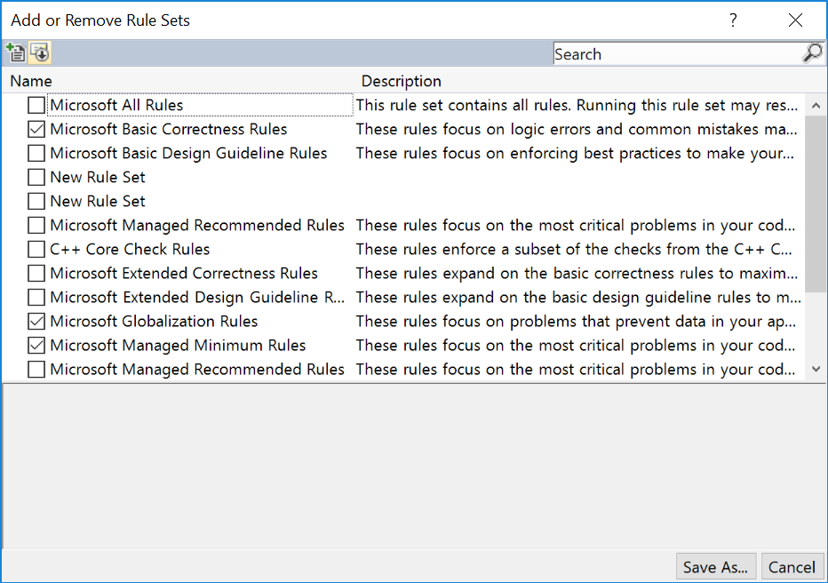

# Custom rule sets

You can create a custom *rule set* to meet specific project needs for code analysis.

## Create a custom rule set

To create a custom rule set, you can open a built-in rule set in the **rule set editor**. From there, you can add or remove specific rules, and you can change the action that occurs when a rule is violated&mdash;for example, show a warning or an error.

1. In **Solution Explorer**, right-click the project and then select **Properties**.

2. On the **Properties** pages, select the **Code Analysis** tab.

3. In the **Run this rule set** drop-down list, do one of the following:

    - Select the rule set that you want to customize.

     \- or -

    - Select **\<Browse...>** to specify an existing rule set that is not in the list.

4. Select **Open** to display the rules in the rule set editor.

You can also create a new rule set file from the **New File** dialog:

1. Select **File** > **New** > **File**, or press **Ctrl**+**N**.

2. In the **New File** dialog box, select the **General** category on the left, and then select **Code Analysis Rule Set**.

3. Select **Open**.

   The new *.ruleset* file opens in the rule set editor.

### Create a custom rule set from multiple rule sets

1. In Solution Explorer, right-click the project and then select **Properties**.

2. On the **Properties** pages, select the **Code Analysis** tab.

3. Select **\<Choose multiple rule sets...>** from **Run this rule set**.

4. In the **Add or Remove Rule Sets** dialog box, select the rule sets you want to include in your new rule set.

   

5. Select **Save As**, enter a name for the *.ruleset* file, and then select **Save**.

   The new rule set is selected in the **Run this rule set** list.

6. Select **Open** to open the new rule set in the rule set editor.

## Name and description

To change the display name of a rule set that's open in the editor, open the **Properties** window by selecting **View** > **Properties Window** on the menu bar. Enter the display name in the **Name** box. You can also enter a description for the rule set.

## Next steps

Now that you have a rule set, the next step is to customize the rules by adding or removing rules, or modifying the severity of rule violations.

> [!div class="nextstepaction"]
> [Modify rules in the rule set editor](../code-quality/working-in-the-code-analysis-rule-set-editor.md)

## See also

- [How to: Configure Code Analysis for a Managed Code Project](../code-quality/how-to-configure-code-analysis-for-a-managed-code-project.md)
- [Code analysis rule set reference](../code-quality/rule-set-reference.md)