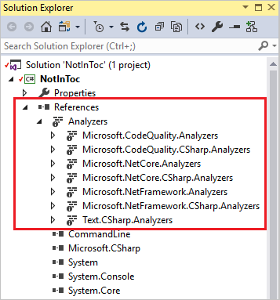
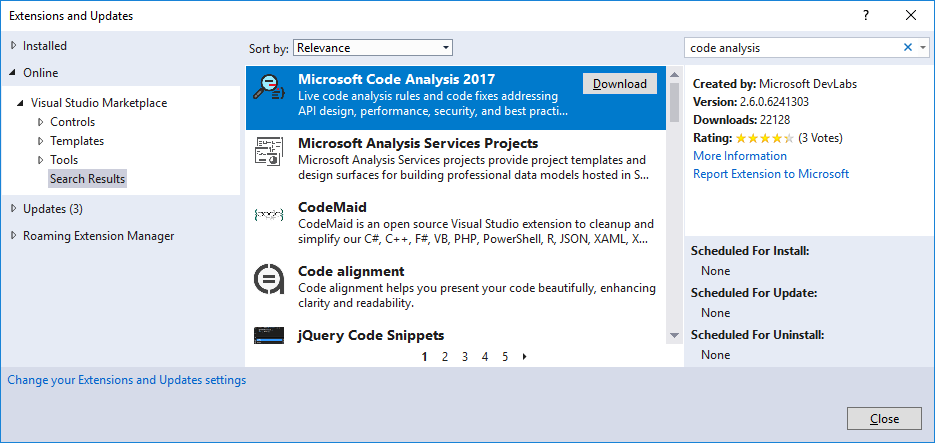

# Overview of .NET Compiler Platform analyzers for code analysis

Visual Studio 2017 includes a built-in set of analyzers that analyze your C# or Visual Basic code as you type. If rule violations are found by an analyzer, they are reported both in the code editor as a *squiggly*, and in the **Error List**. In addition to the built-in analyzers, you can install additional analyzers, either as a NuGet package, or as a Visual Studio extension.

Many analyzer rules have an associated *code fix* that you can apply to correct the problem. The analyzers that are built into Visual Studio all have an associated code fix. For information about these code fixes, see [Common Quick Actions](../ide/common-quick-actions.md).

## Roslyn analyzers vs. static code analysis

.NET Compiler Platform ("Roslyn") analyzers will eventually replace [static code analysis](../code-quality/code-analysis-for-managed-code-overview.md) for managed code. Many of the static code analysis rules have already been rewritten as Roslyn analyzer diagnostics.

Like static code analysis rule violations, Roslyn analyzer violations appear in the **Error List**. In addition, Roslyn analyzer violations also show up in the code editor as *squigglies* under the offending code.

Roslyn analyzers analyze code at build time, like static code analysis if it's enabled, but also as you type. Roslyn analyzers can provide live analysis of code files that aren't open in the editor, if you enable [full solution analysis](../code-quality/how-to-enable-and-disable-full-solution-analysis-for-managed-code.md#to-toggle-full-solution-analysis).

Not only do Roslyn analyzers report the same types of problems that static code analysis does, but they make it easy for you to fix one, or all, occurrences of the violation in your file or project. These actions are called *code fixes*. Code fixes are IDE-specific; in Visual Studio, they are implemented as [Quick Actions](../ide/quick-actions.md). Not all analyzer diagnostics have an associated code fix.

> [!NOTE]
> The menu option **Analyze** > **Run Code Analysis**, and the **Enable Code Analysis on Build** checkbox on a project's **Code Analysis** property page, only apply to static code analysis. They have no effect on Roslyn analyzers.

## Install analyzers

Visual Studio 2017 includes a core set of Roslyn analyzers. These analyzers are always on. You can install additional analyzers either as NuGet packages, or as Visual Studio extensions in *VSIX* files.

### To install NuGet package analyzers

1. [Determine which analyzer package version](https://github.com/dotnet/roslyn-analyzers#recommended-version-of-analyzer-packages) to install, based on your version of Visual Studio.

1. Install the package in Visual Studio, using either the [Package Manager Console](/nuget/quickstart/install-and-use-a-package-in-visual-studio#package-manager-console) or the [Package Manager UI](/nuget/quickstart/install-and-use-a-package-in-visual-studio#package-manager-console).

   > [!NOTE]
   > The nuget.org page for each analyzer package shows you the command to paste into the **Package Manager Console**. There's even a handy button to copy the text to the clipboard.
   >
   > 

   The analyzer assemblies are installed and appear in **Solution Explorer** under **References** > **Analyzers**.

   

### To install VSIX analyzers

1. In Visual Studio, select **Tools** > **Extensions and Updates**.

   The **Extensions and Updates** dialog box opens.

   > [!NOTE]
   > Alternatively, download the extension directly from [Visual Studio Marketplace](https://marketplace.visualstudio.com/items?itemName=VisualStudioPlatformTeam.MicrosoftCodeAnalysis2017).

1. Expand **Online** in the left pane, and then select **Visual Studio Marketplace**.

1. In the search box, type "code analysis", and look for the **Microsoft Code Analysis 2017** extension.

   

1. Select **Download**.

   The extension is downloaded.

1. Select **OK** to close the dialog box, and then close all instances of Visual Studio to launch the **VSIX Installer**.

   The **VSIX Installer** dialog box opens.

   

1. Select **Modify** to start the installation.

1. After a minute or two, the installation completes. Select **Close**.

1. Open Visual Studio again.

## NuGet package vs. extension

### Scope

If you install the analyzers as an extension, they apply at the solution level, to all instances of Visual Studio. If you install the analyzers as a NuGet package, which is the preferred method, the apply only to the project where the NuGet package was installed.

### Build errors

To have rules enforced at build time, either through the command line or as part of a continuous integration (CI) build, install the analyzers as a NuGet package.  Extensions cannot affect build, so analyzer warnings and errors don't show up in the build report if you installed them as an extension. Additionally, if you build your project from the command line, you won't see any analyzer violations.

### Rule severity

You cannot set the severity of a rules that were installed as a Visual Studio extension. To configure rule severity, install the analyzers as a NuGet package.

## Next steps

- [Use Roslyn analyzers in Visual Studio](../code-quality/use-roslyn-analyzers.md)

## See also

- [Quick Actions in Visual Studio](../ide/quick-actions.md)
- [Write your own Roslyn analyzer](../extensibility/getting-started-with-roslyn-analyzers.md)
- [.NET Compiler Platform SDK](/dotnet/csharp/roslyn-sdk/)