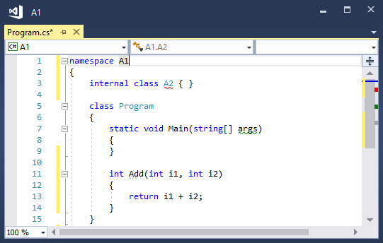

# Configure and use Roslyn analyzer rules

## Analyzers in Solution Explorer

If you [install analyzers](../code-quality/install-roslyn-analyzers.md) as a NuGet package, an **Analyzers** node appears under the **References** node in **Solution Explorer**. If you expand **Analyzers**, and then expand one of the analyzer assemblies, you see all the diagnostics in the assembly.

You can view the properties of a diagnostic, including its description and default severity, in the **Properties** window. To view the properties, right-click on the rule and select **Properties**, or select the rule and then press **Alt**+**Enter**.

## Rule sets

## Rule severity

You can configure the severity of analyzer rules, or *diagnostics*, if you [install the analyzers](../code-quality/install-roslyn-analyzers.md) as a NuGet package. The following table shows the severity options for diagnostics:

|Severity|Build-time behavior|Editor behavior|
|-|-|-|
|Error|Violations appear as *Errors* in the **Error List** and in command-line build output, and cause builds to fail.|Offending code is underlined with a red squiggly, and marked by a small red box in the scroll bar.|
|Warning|Violations appear as *Warnings* in the **Error List** and in command-line build output, but do not cause builds to fail.|Offending code is underlined with a green squiggly, and marked by a small green box in the scroll bar.|
|Info|Violations appear as *Messages* in the **Error List**, and not at all in command-line builds.|Offending code is underlined with a gray squiggly, and marked by a small gray box in the scroll bar.|
|Hidden|Non-visible.|Non-visible.|
|None|Suppressed completely.|Suppressed completely.|

In addition, you can "re-set" a rule's severity by setting it to **Default**.

The following screenshot shows three different diagnostic violations in the code editor, with three different severities. Notice the color of the squiggly, as well as the small box in the scroll bar on the right.

The following screenshot shows the same three violations as they appear in the **Error List**:

You can change the severity of a rule from **Solution Explorer**, or within the *\<projectname>.ruleset* file that is added to the solution after you change the severity of a rule in **Solution Explorer**.

### To set rule severity from Solution Explorer

### To set rule severity in the rule set file

## Supress violations

## See also

- [Overview of Roslyn analyzers in Visual Studio](../code-quality/roslyn-analyzers-overview.md)