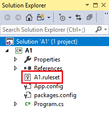
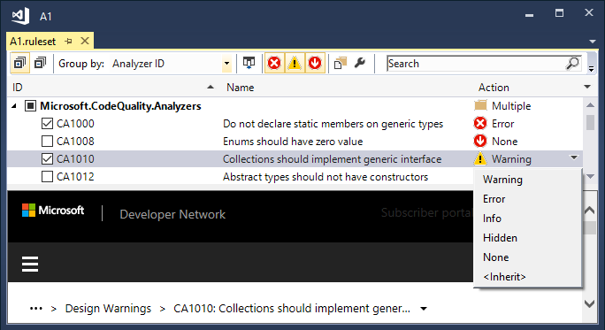

# Configure and use Roslyn analyzer rules

## Analyzers in Solution Explorer

You can configure the severity of analyzer rules, or *diagnostics*, if you install the analyzers as a NuGet package. After you install the analyzer package, a new **Analyzers** node appears under the **References** node in **Solution Explorer**. If you expand **Analyzers**, and then expand one of the analyzer assemblies, you see all the diagnostics in the assembly.

You can view the properties of a diagnostic, including its description and default severity, in the **Properties** window. To view the properties, right-click on the rule and select **Properties**, or select the rule and then press **Alt**+**Enter**.

### Set rule severity

You can set the severity of a rule to one of the following options:

|Severity|Description|
|-|-|
|Default||
|Error||
|Warning||
|Info||
|Hidden||
|None||

You can change the severity of a rule from **Solution Explorer**, or within the *\<projectname>.ruleset* file that is added to the solution after you change the severity of a rule in **Solution Explorer**.

## See also

- [Overview of Roslyn analyzers in Visual Studio](../code-quality/roslyn-analyzers-overview.md)