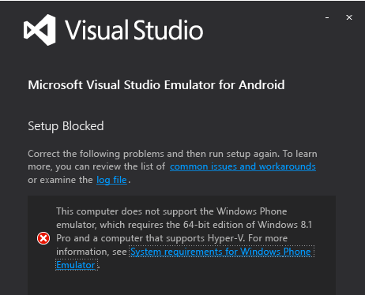
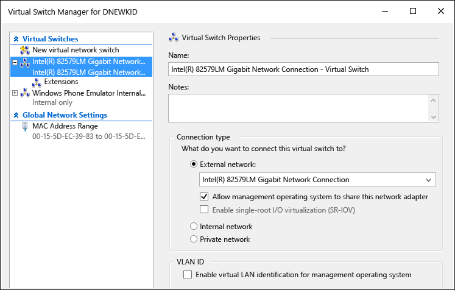
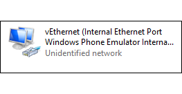
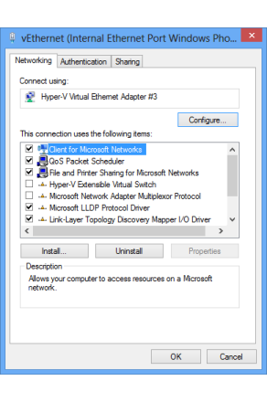
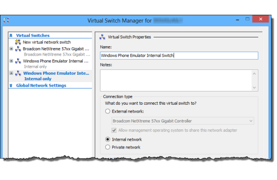

# Troubleshooting the Visual Studio Emulator for Android
This topic contains information to help you resolve issues that you may experience when you're using the Visual Studio Emulator for Android.  
  
> [!WARNING]
>  When the emulator is installed, the setup program checks the prerequisites for running the software. It displays warnings if the prerequisites are not present, but it does not require them for installation.  
  
 This topic contains the following sections.  
  
-   [Before you start](#BeforeYouStart)  
  
-   [Emulator fails to install](#NoInstall)  
  
-   [Cannot connect to network destinations on a domain or corporate network](#DomainNetwork)  
  
-   [Cannot connect to network destinations when network settings require manual configuration](#ManualNetworkConfig)  
  
-   [Emulator starts slowly, fails to start due to a timeout, or app deployment fails](#SlowStart)  
  
-   [Emulator fails to start](#NoStart2)  
  
-   [Emulator fails to start (first use)](#NoStart)  
  
-   [Computer fails to boot after installing the Emulator](#NoBoot)  
  
-   [Visual Studio gets stuck trying to deploy the app to the emulator or the emulator does not appear as a debug target in other IDEs](#ADB)  
  
-   [Emulator hangs because it couldn't set up the UDP port](#XamarinPlayer)  
  
-   [Cannot attach debugger to a Xamarin project](#Skylake)  
  
-   [Emulator fails to run app that uses Google Play Services](#GooglePlay)  
  
-   [Drag and Drop of a file, APK, or flashable zip file does not work](#DragAndDrop)  
  
-   [Resolution of screenshot is incorrect](#Resolution)  
  
-   [Emulator fails to render OpenGL content](#OpenGL)  
  
-   [Emulator does not respond to multi-touch gestures](#Multitouch)  
  
-   [Support Resources](#Support)  
  
##   Before you start  
 Before you begin troubleshooting, it may be useful to review the following topics:  
  
-   [System Requirements for the Visual Studio Emulator for Android](../cross-platform/system-requirements-for-the-visual-studio-emulator-for-android.md)  
  
##   Emulator fails to install  
 If you don't have Hyper-V installed, you will see the following message when you try to install the emulator. You must have a machine that supports HyperV and it must be enabled.  
  
   
  
> [!NOTE]
>  This message applies both to the Visual Studio Emulator for Android and the Windows Phone Emulator. Windows 8.1 and Windows 10 support the emulator.  
  
 If you see this message, check the [System Requirements for the Visual Studio Emulator for Android](../cross-platform/system-requirements-for-the-visual-studio-emulator-for-android.md) to see whether you can run the emulator.  
  
##   Cannot connect to network destinations on a domain or corporate network  
 The Visual Studio Emulator for Android appears on the network as a separate device with its own IP address. It is not joined to a Windows domain and it does not share domain or workgroup credentials with the host computer.  
  
 If your network requires domain or workgroup authorization for basic network and Internet connectivity, contact your IT administrator for an exception. This exception allows your development computer to serve as a boundary machine and to accept connections from non-domain-joined network devices like the emulator.  
  
 The Visual Studio Emulator for Android also uses its own set of MAC addresses. If you can't access network or Internet resources from the emulator, check with your IT administrator to make sure that the emulator's MAC addresses have been authorized on your network.  
  
#### To view the emulator's MAC addresses  
  
1.  Launch the emulator.  
  
2.  On the emulator toolbar, click the chevron button (>>) to open the Additional Tools window.  
  
3.  In the Additional Tools window, click the Network tab.  
  
4.  On the Network page, locate the Physical address entries.  
  
##   Cannot connect to network destinations when network settings require manual configuration  
 To connect to network destinations from the emulator, your network must meet the following requirements:  
  
-   DHCP. The emulator requires DHCP because it configures itself as a separate device on the network with its own IP address.  
  
-   Automatically configured DNS and gateway settings. It's not possible to configure DNS and gateway settings manually for the emulator.  
  
 If your network requires manually configured settings, check with your IT administrator to determine how you can enable network connectivity for the emulator.  
  
##   Emulator starts slowly, fails to start due to a timeout, or app deployment fails  
 Under certain conditions, the emulator takes several minutes to start or fails to start due to a timeout. When the emulator fails to start, you see the following message: `App deployment failed. Please try again`. The following conditions can result in this error.  
  
-   Running the Visual Studio Emulator for Android from a bootable VHD. This configuration is not supported.  
  
-   A faulty hard drive. Consider running the chkdsk program.  
  
-   A hard drive that needs to be defragmented. Consider defragmenting the drive.  
  
-   A hard drive that is almost full. Check the space available on the drive.  
  
-   Not enough memory is available because of other running applications. Reduce the number of applications that are consuming memory or increase the amount of memory.  
  
-   Generally, any factor that is contributing to poor performance on the system. Begin troubleshooting with the component that has the lowest subscore in the Windows Experience Index, which you can find on the Performance Information and Tools page of Control Panel.  
  
##   Emulator fails to start  
 If the emulator was working previously, but does not work now, go through the following tasks. If you are using the emulator for the first time, see [Emulator fails to start (first use)](#NoStart) before you try these steps.  
  
-   Remove any other Hyper-V instances of the emulator.  
  
    1.  Close Visual Studio.  
  
    2.  Open Hyper-V Manager and stop any Hyper-V instances of the Emulator (Virtual Machines) that are already running and possibly in a corrupt state.  
  
    3.  In Hyper-V Manager, delete any other emulator VMs.  
  
    4.  Reboot your machine.  
  
-   Make sure you have at least 4GB system memory and that it is not being consumed by other resource-intensive programs and processes (for example, try closing any browser windows).  
  
-   In Hyper-V Manager, open the Virtual Switch Manager and check to see that you have two network switches; verify that the first one is the internal switch and the second is external.  
  
       
  
     If the setup is incorrect and you are using Windows 10, you might try  to [Reinstall network devices using netcfg -d command](http://windows.microsoft.com/en-us/windows-10/fix-network-connection-issues) (section 6).  
  
-   If these steps do not resolve the issue, see [Emulator fails to start (first use)](#NoStart) for information on 3rd party software that may be interfering with the emulator.  
  
##   Emulator fails to start (first use)  
 If the emulator does not start, go through the following tasks to identify and fix the issue.  
  
-   Make sure that minimum hardware requirements are fulfilled and that BIOS settings are correct.  
  
     The Emulator and Windows 8 Hyper-V require a 64-bit processor with Second Level Address Translation (SLAT). For Intel, you essentially need a Core i3, i5 or i7 processor (or one of many Xeons). A list of AMD chips is available [here](http://support.amd.com/en-us).  
  
    1.  Make sure your computer meets the [system requirements](../cross-platform/system-requirements-for-the-visual-studio-emulator-for-android.md).  
  
    2.  Verify that the [SLAT tool](https://slatstatuscheck.codeplex.com/) reports that your computer is SLAT capable.  
  
    3.  Within the BIOS settings of your computer, make sure that all virtualization technology is enabled. The exact BIOS descriptions may vary for each hardware manufacturer. In general, enable features related to:  
  
        -   SLAT (Second Level Address Translation)  
  
        -   EPT (Extended Page Tables) (Intel)  
  
        -   NPT (Nested Page Tables) (AMD)  
  
        -   RVI (Rapid Virtualization Indexing) (AMD)  
  
        -   VMX (an Intel acronym indicating hardware assisted virtualization support)  
  
        -   SVM (an AMD acronym indicating hardware assisted virtualization support)  
  
        -   XD (Execute Disable) (Intel); this must be enabled  
  
        -   NX (No Execute)(AMD); this must be enabled.  
  
    4.  If the following options are present in the BIOS, disable them.  
  
        -   Disable Intel VT-d  
  
        -   Disable Trusted Execution  
  
         For more information, see this article: Technet: Hyper-V: How to Fix BIOS Errors Enabling Hyper-V  
  
    5.  Make sure you have at least 4GB system memory and that it is not being consumed by other resource-intensive programs and processes.  
  
    6.  Make sure you are running Windows 8 Professional or better (Windows Server 2008 is not supported). Windows Server 2012 is supported, but you must enable Desktop Experience.  
  
     You can inspect the Event Viewer to see if there are any Hypervisor errors. To do this, open Event Viewer (Start key + R, then type `eventvwr`) and then select **Windows Logs**, **System**. Then filter the log by event source, setting the source to **Hyper-V-Hypervisor**. Check for errors to help identify root cause.  
  
     If your processor meets the minimum requirements but hypervisor is still failing, consider finding out if there is a BIOS upgrade available for your computer. If there is one, and you choose to upgrade, be sure to observe all precautions from the manufacturer when upgrading the BIOS (such as making sure the BIOS firmware upgrade is not interrupted by a power loss, which may permanently corrupt the BIOS).  
  
-   Make sure you have at least 4GB system memory and that it is not being consumed by other resource-intensive programs and processes.  
  
-   Remove/Disable third party drivers or software that may be interfering with virtual networking.  
  
     There are some known issues with some 3rd party products installed under Windows 8 such as networking drivers/protocols that are not fully compatible with the Hyper-V networking stack.  
  
     In general, it will be up to the developers of those products to update their software to be compatible with Windows 8 and Hyper-V.  
  
     The following products may require upgrading for Windows 8 compliance: VirtualBox, Virtual PC 7, VMWare, some VPN clients, software firewalls, some versions of the Cisco VPN clients, and other virtualization systems. Work with the developer of the questionable virtualization software to encourage them to upgrade the software to make it compatible with Windows 8 and Hyper-V.  
  
     As a **Workaround**, you can disable all third party drivers and applications which may be interfering with the virtual network used by the Emulator to communicate with Visual Studio. These applications may include:  
  
    -   Antivirus applications (which hook into the network stack)  
  
    -   Network monitoring tools  
  
    -   Network logging tools  
  
    -   Other system monitoring software  
  
     Another possible workaround, short of uninstalling the product(s) in question (and requesting the product developer to release an updated version), is to take the following steps.  
  
    1.  Start the Network Connections manager (from the Start screen, type `View Network Connections` and select this option to view the network connections.)  
  
    2.  For the vEthernet (Internal Ethernet Port Windows Phone Emulator Internal Switch) adapter, choose **Properties** from the context menu.  
  
           
  
         The adapter properties are shown here.  
  
           
  
    3.  For this adapter, the only items that should be selected under **This connection uses the following items** should be the following:  
  
        -   Client for Microsoft Networks  
  
        -   QoS Packet Scheduler  
  
        -   File and Printer Sharing for Microsoft Networks  
  
        -   Microsoft LLDP Protocol Driver  
  
        -   Link-Layer Topology Discovery Mapper I/O Driver  
  
        -   Link-Layer Topology Discovery Responder  
  
        -   Internet Protocol Version 6 (TCP/IPv6)  
  
        -   Internet Protocol Version 4 (TCP/IPv4)  
  
    4.  Deselect any other items.  
  
     The downside to using this technique is that any time a new 3rd party product installs unsupported drivers, or any time the emulator is installed, these steps will need to be repeated.  
  
     After uninstalling third party products you may need to restore the Windows Phone Emulator Internal Switch. To do that:  
  
    -   Open Hyper V and go into the Virtual Switch Manager. Create a virtual switch named "Windows Phone Emulator Internal Switch" and set its connection type to **Internal network**.  
  
           
  
     Now launch the emulator. It should work.  
  
##   Computer fails to boot after installing the Emulator  
 This problem can occur when the following conditions are true:  
  
-   Your computer has a Gigabyte motherboard.  
  
-   USB3 is enabled on the motherboard.  
  
 To solve this problem, disable USB3 in the BIOS settings of the motherboard and reboot the computer. Then check whether Gigabyte has released an update for your motherboard's BIOS.  
  
 For more info, see the following Knowledge Base article: [Boot failure after installation of Hyper-V role on Gigabyte systems](https://support.microsoft.com/en-us/kb/2693144).  
  
##   Visual Studio gets stuck trying to deploy the app to the emulator or the emulator does not appear as a debug target in other IDEs  
 If the emulator is running, but it does not appear to be connected to ADB (Android Debug Bridge) or it does not appear in Android tools that make use of ADB (for example, Android Studio or Eclipse), you may need to adjust where the emulator looks for ADB. The emulator uses a registry key to identify the base location of your Android SDK, and looks for the \platform-tools\adb.exe file under that directory. To modify the Android SDK path used by the emulator:  
  
-   Open Registry Editor by selecting **Run** from the Start buttons context menu, typing `regedit` in the dialog box, and choosing **OK**.  
  
-   Navigate to HKEY_LOCAL_MACHINE\SOFTWARE\Wow6432Node\Android SDK Tools in the folder tree on the left.  
  
-   Modify the **Path** registry variable to match the path to your Android SDK.  
  
 Restart the emulator and you should now be able to see the emulator connected to ADB and associated Android tools.  
  
##   Emulator hangs because it couldn't set up the UDP port  
 You may experience this issue due to incompatibility with Xamarin Player. If the emulator appears to hang or if you see this error message, "The emulator is unable to connect to the device operating system: Couldn't set up the UDP port.  Some functionality might be disabled", you may be experiencing this issue. Take the following steps.  
  
1.  Uninstall Xamarin Player.  
  
2.  Verify that virtual box has been removed (Xamarin Player runs on top of virtual box).  
  
3.  Go to device manager, select the option to show hidden devices, and then delete everything except the physical network cards.  
  
4.  You can try uninstalling/reinstalling Hyper-V after removing any non-physical network adapters.  
  
##   Cannot attach debugger to a Xamarin project  
 If you are running Windows 10 with Intel Skylake processors,  Xamarin apps might fail to run in the emulator or the Visual Studio debugger might not attach to them. This is due to an issue with Hyper-V and Skylake processors. Take the following steps as a workaround.  
  
1.  Open Hyper-V Manager and select the VM for the emulator profile that your are using.  
  
2.  Select **Delete Saved State** (lower right).  
  
3.  Choose **Settings...**  
  
4.  Expand the processor node and choose **Compatibility**.  
  
5.  Enable **Migrate to a physical computer with a different processor version**.  
  
6.  Restart the service (under **Actions**) and try again.  
  
##   Emulator fails to run app that uses Google Play Services  
 The emulator does not ship with the libraries for Google Play Services. However, the emulator does support drag-and-drop installation of flashable zip files.  
  
##   Drag and Drop of a file, APK, or flashable zip file does not work  
 The emulator uses ADB.exe to facilitate file transfer when you drag and drop a file onto the screen. If you encounter an error when you try to drag and drop a file, this probably indicates that the emulator is not connected to ADB.exe. To resolve, follow steps in [Visual Studio gets stuck trying to deploy the app to the emulator or the emulator does not appear as a debug target in other IDEs](#ADB).  
  
##   Resolution of screenshot is incorrect  
 If you take a screenshot using the Screenshot tab in the **Additional Tools** window and the resulting image is of an unexpected size, you may need to adjust the zoom level of the screen before choosing **Capture**. The emulator takes screenshots at the resolution of the screen on your host PC monitor.  
  
##   Emulator fails to render OpenGL content  
 The emulator renders OpenGL content using your host machine's GPU and uses the ANGLE project to convert these calls to and from DirectX. If your application renders correctly on a device but incorrectly on the emulator, it is likely that the device is mitigating an incorrect OpenGL call (for example, using shader variables that do not match).  
  
##   Emulator does not respond to multi-touch gestures  
 In some cases, the emulator will start and not respond to multi-touch either through direct interaction from your touch-enabled display or using the Multi-Touch Tool on the emulator toolbar. If this is the case, choose the **Rotate** button on the emulator toolbar and attempt to use multi-touch again. If the issue persists, read the [Emulator fails to render OpenGL content](#OpenGL) issue.  
  
##   Support Resources  
 If your host computer meets the system requirements and you encounter an issue not covered in this troubleshooting guide:  
  
-   Ask a question on StackOverflow using the [android-emulator](http://stackoverflow.com/questions/tagged/android-emulator) and visual-studio tags.  
  
-   Report an issue using the Send a Smile tool in Visual Studio or in the Emulator Manager.