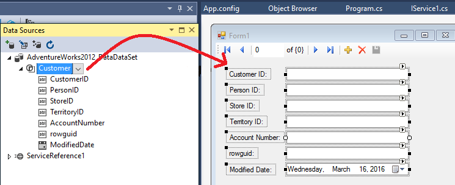

# Bind Windows Forms controls to data in Visual Studio
You can display data to users of your application by binding data to Windows Forms. To create these data-bound controls, you can drag items from the **Data Sources** window onto the Windows Forms Designer in Visual Studio. This topic describes some of the most common tasks, tools, and classes involved in creating data-bound Windows Forms applications.  
  
   
  
 For general information about how to create data-bound controls in Visual Studio, see [Bind controls to data in Visual Studio](../data-tools/bind-controls-to-data-in-visual-studio.md). For more information about data binding in Windows Forms, see [Windows Forms Data Binding](/dotnet/framework/winforms/windows-forms-data-binding).  
  
## In this section  
  
-   [Bind Windows Forms controls to data](../data-tools/bind-windows-forms-controls-to-data.md)  
  
-   [Commit in-process edits on data-bound controls before saving data](../data-tools/commit-in-process-edits-on-data-bound-controls-before-saving-data.md)  
  
-   [Create lookup tables in Windows Forms applications](../data-tools/create-lookup-tables-in-windows-forms-applications.md)  
  
-   [Create a Windows Form to search data](../data-tools/create-a-windows-form-to-search-data.md)  
  
-   [Create a Windows Forms user control that supports simple data binding](../data-tools/create-a-windows-forms-user-control-that-supports-simple-data-binding.md)  
  
-   [Create a Windows Forms user control that supports complex data binding](../data-tools/create-a-windows-forms-user-control-that-supports-complex-data-binding.md)  
  
-   [Create a Windows Forms user control that supports lookup data binding](../data-tools/create-a-windows-forms-user-control-that-supports-lookup-data-binding.md)  
  
-   [Pass data between forms](../data-tools/pass-data-between-forms.md)  
  
## BindingSource component  
 The <xref:System.Windows.Forms.BindingSource> component serves two purposes. First, it provides a layer of abstraction when binding the controls on your form to data. Controls on the form are bound to the <xref:System.Windows.Forms.BindingSource> component (instead of being bound directly to a data source).  
  
 Second, it can manage a collection of objects. Adding a type to the <xref:System.Windows.Forms.BindingSource> creates a list of that type.  
  
 For more information about the <xref:System.Windows.Forms.BindingSource> component, see:  
  
-   [BindingSource Component](/dotnet/framework/winforms/controls/bindingsource-component)  
  
-   [BindingSource Component Overview](/dotnet/framework/winforms/controls/bindingsource-component-overview)  
  
-   [BindingSource Component Architecture](/dotnet/framework/winforms/controls/bindingsource-component-architecture)  
  
## BindingNavigator control  
 This component provides a user interface for navigating through data displayed by a Windows application. For more information, see [BindingNavigator Control](/dotnet/framework/winforms/controls/bindingnavigator-control-windows-forms).  
  
## DataGridView control  
 To display and edit tabular data from many different kinds of data sources, use the <xref:System.Windows.Forms.DataGridView> control. You can bind data to a <xref:System.Windows.Forms.DataGridView> by using the <xref:System.Windows.Forms.DataGridView.DataSource%2A> property. For more information, see [DataGridView Control Overview](/dotnet/framework/winforms/controls/datagridview-control-overview-windows-forms).  
  
## See Also  
 [Bind controls to data in Visual Studio](../data-tools/bind-controls-to-data-in-visual-studio.md)