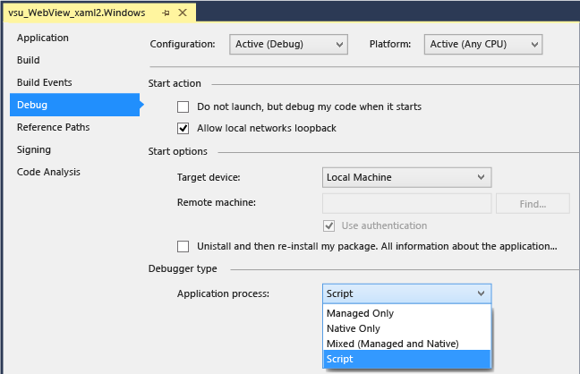

# Debug a WebView control in a Windows Store App
  
  
 To inspect and debug `WebView` controls in a Windows Runtime app, you can configure Visual Studio to attach the script debugger when you start your app. Starting with Visual Studio 2013 Update 2, you have two ways to interact with `WebView` controls using the debugger:  
  
-   Open the [DOM Explorer](../debugger/quickstart-debug-html-and-css.md) for a `WebView` instance, and inspect DOM elements, investigate CSS style issues, and test dynamically rendered changes to styles.  
  
-   Select the webpage or `iFrame` displayed in the `WebView` instance as a target in the [JavaScript Console](../debugger/javascript-console-commands.md) window, and then interact with the webpage using console commands. The console provides access to the current script execution context.  
  
### Attach the debugger (C#, Visual Basic, C++)  
  
1.  In Visual Studio, add a `WebView` control to your Windows Runtime app.  
  
2.  In Solution Explorer, open the properties for the project by choosing **Properties** from the shortcut menu for the project.  
  
3.  Choose **Debug**. In the **Application process** list, choose **Script**.  
  
       
  
4.  (Optional) For non-Express versions of Visual Studio, disable just-in-time (JIT) debugging by choosing **Tools > Options > Debugging > Just-In-Time**, and then disabling JIT debugging for Script.  
  
    > [!NOTE]
    >  By disabling JIT debugging, you can hide dialog boxes for unhandled exceptions that occur on some webpages. In Visual Studio Express, JIT debugging is always disabled.  
  
5.  Press F5 to start debugging.  
  
### Use the DOM Explorer to inspect and debug a WebView control  
  
1.  (C#, Visual Basic, C++) Attach the script debugger to your app. See the first section for instructions.  
  
2.  If you haven't already, add a `WebView` control to your app and press F5 to start debugging.  
  
3.  Navigate to the page containing the `Webview` control(s).  
  
4.  Open the DOM Explorer window for the `WebView` control by choosing **Debug**, **Windows**, **DOM Explorer**, and then choose the URL of the `WebView` that you want to inspect.  
  
       
  
     The DOM Explorer associated with the `WebView` appears as a new tab in Visual Studio.  
  
5.  View and modify live DOM elements and CSS styles as described in [Debug CSS styles using DOM Explorer](../debugger/debug-css-styles-using-dom-explorer.md).  
  
### Use the JavaScript Console window to inspect and debug a WebView control  
  
1.  (C#, Visual Basic, C++) Attach the script debugger to your app. See the first section for instructions.  
  
2.  If you haven't already, add a `WebView` control to your app and press F5 to start debugging.  
  
3.  Open the JavaScript Console window for the `WebView` control by choosing **Debug**, **Windows**, **JavaScript Console**.  
  
     The JavaScript Console window appears.  
  
4.  Navigate to the page containing the `Webview` control(s).  
  
5.  In the Console window, select the webpage or an `iFrame` displayed by the `WebView` control in the **Target** list.  
  
       
  
    > [!NOTE]
    >  Using the console, you can interact with a single `WebView`, `iFrame`, share contract, or web worker at a time. Each element requires a separate instance of the web platform host (WWAHost.exe). You can interact with one host at a time.  
  
6.  View and modify variables in your app or use console commands, as described in [QuickStart: Debug JavaScript](../debugger/quickstart-debug-javascript-using-the-console.md) and [JavaScript Console commands](../debugger/javascript-console-commands.md).  
  
## See Also  
 [Quickstart: Debug HTML and CSS](../debugger/quickstart-debug-html-and-css.md)