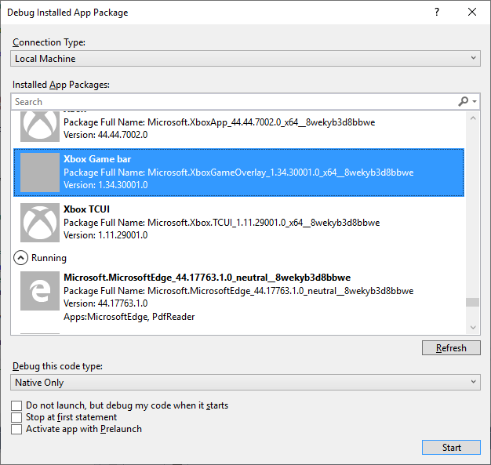
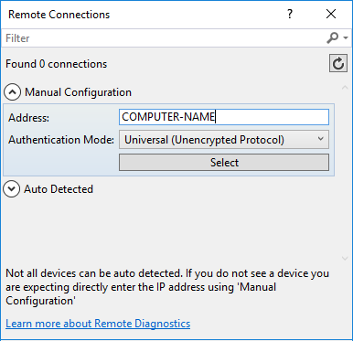

# Debug an Installed App Package in Visual Studio (UWP)

You can debug any installed app package by selecting **Debug**, **Other Debug Targets**, and then **Debug Installed App Package**. This debugging method is available for Universal Windows Apps (UWP) on these devices:

* Windows 10 (not supported on phones)
* XBox
* HoloLens
* IoT

For more information about these features, see the blog post on updates for [debugging installed app packages](https://blogs.msdn.microsoft.com/visualstudioalm/2016/03/30/updates-for-debugging-installed-app-packages-in-visual-studio-2015-update-2/) and the post on [building Universal Windows Apps (UWP)](https://blogs.msdn.microsoft.com/visualstudio/2016/08/02/universal-windows-apps-targeting-windows-10-anniversary-sdk/).

## Debug an Installed App Package or Running App on a Local Machine or Device

1. Select **Debug**, **Other Debug Targets**, and then **Debug Installed App Package**.

2. Select either **Local Machine** or **Device**.

     If you choose **Device**, your computer must be physically connected to a Windows 10 device.

     

     Currently running installed app packages show up under the **Running** node. Installed app packages that aren't running show up under **Not Running**.

3. Select the name of the app you want to debug under **Running** or **Not Running** and choose **Start** or, if the app is already running, choose **Attach**.

     If you select **Do not launch, but debug my code when it starts**, this will cause the Visual Studio debugger to attach to your app when you launch it at a custom time. This is an effective way to debug control paths from [different launch methods](https://msdn.microsoft.com/en-us/windows/uwp/xbox-apps/automate-launching-uwp-apps), such as protocol activation with custom parameters.

> [!NOTE]
> Visual Studio can also attach to any running UWP app process by selecting **Debug**, and then **Attach to Process**. Attaching to a running process doesn’t require the original Visual Studio project, but loading the process's symbols will help significantly when debugging a process that you don't have the original code for.
  
## Debug an Installed or Running App on a Remote Computer 

When you debug an installed app package on a remote computer for the first time, Visual Studio installs the correct version of the remote tools for your target device. Your target device must be a Windows 10 computer, XBox, HoloLens, or IoT device.

1. If you are connecting to a remote Windows 10 desktop computer, first manually [install and start the remote debugger](../debugger/remote-debugging.md).

     For an XBox, HoloLens, or IoT device, you don't need to manually install the remote debugger.

2. Select **Debug**, **Other Debug Targets**, and then **Debug Installed App Package**.

3. From the first drop-down list, choose **Remote Machine**.

4. Type in the name or IP address of the computer you want to attach to.

     

     If you can't attach using computer name (after you choose **Start**), use the IP address instead. Use the IP address for XBox, HoloLens, or IoT devices.

5. Choose how to authenticate by selecting an option in **Authentication Mode**.

    For most apps, keep the default value, **Universal (Unencrypted Protocol)**.

6. Select the name of the app you want to debug under **Running** or **Not Running** and choose **Start** or (for running apps) **Attach**.

     If you select **Do not launch, but debug my code when it starts**, this will cause the Visual Studio debugger to attach to your app package when you launch it at a custom time. This is an effective way to debug control paths from [different launch methods](https://msdn.microsoft.com/en-us/windows/uwp/xbox-apps/automate-launching-uwp-apps), such as protocol activation with custom parameters.

     When you debug an installed app package on a connected XBox, HoloLens, or IoT device for the first time, Visual Studio installs the correct version of the remote debugger for your target device. This may take a little bit of time and you will see a message ``Starting remote debugger`` while this is happening.

     > [!NOTE]
> At present, an XBox or HoloLens device will restart the app with the debugger attached if it is already running.

> [!NOTE]
> UWP apps can be developed and compiled on Windows 8.1 or later, but require Windows 10 to run. If you are developing a UWP app on a Windows 8.1 PC, you can remotely debug a UWP app running on another Windows 10 device, provided that both the host and target computer are on the same LAN. To do this, download and install the Remote Tools for Visual Studio on both machines. The installed version must match the existing version of Visual Studio that you have installed, and the architecture you select (x86, x64) must also match that of your target app.
  
## See Also  
 [Debugging in Visual Studio](../debugger/debugging-in-visual-studio.md)  
 [Remote Debugging](../debugger/remote-debugging.md)  
 [Configure the Windows Firewall for Remote Debugging](../debugger/configure-the-windows-firewall-for-remote-debugging.md)  
 [Remote Debugger Port Assignments](../debugger/remote-debugger-port-assignments.md)  
 [Remote Debugging Errors and Troubleshooting](../debugger/remote-debugging-errors-and-troubleshooting.md)