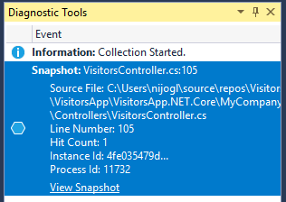
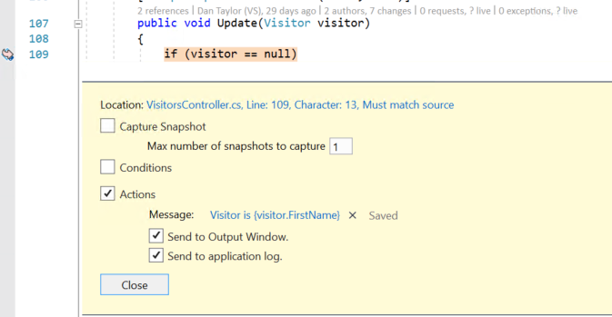

# Debug live ASP.NET apps using snappoints and logpoints

The Snapshot Debugger takes a snapshot of your in-production apps when code that you are interested in executes. To instruct the debugger to take a snapshot, you set snappoints and logpoints in your code. The debugger lets you see exactly what went wrong, without impacting traffic of your production application. The Snapshot Debugger can help you dramatically reduce the time it takes to resolve issues that occur in production environments.

Snapshot collection is available for the following web apps running in Azure App Service:

- ASP.NET applications running on .NET Framework 4.6.1 or later.
- ASP.NET Core applications running on .NET Core 2.0 or later on Windows.

Additionally, the Snapshot Debugger is only available for **Visual Studio 2017 Enterprise (15.5+)**. 

> [!NOTE]
> With some additional configuration, Application Insights can automatically capture snapshots when your app hits an exception. For more information, see [Debug snapshots on exceptions in .NET apps](/azure/application-insights/app-insights-snapshot-debugger). Application Insights supports Service Fabric apps in addition to Azure App Service.

## Start the Snapshot Debugger

1. Install the [Visual Studio Enterprise 15.5 Preview](https://www.visualstudio.com/en-us/news/releasenotes/vs2017-preview-relnotes) or later.

2. Open the project you would like to snapshot debug. 

    > [!NOTE] 
    > In order to snapshot debug, you need to open the **same version of source code** that is published to your Azure Azure App Service. 

3. In the Cloud Explorer, right click the Azure App Service your project is deployed to and select **Attach Snapshot Debugger** to start the Snapshot Debugger.

    

    > [!NOTE] 
    > The first time you select **Attach Snapshot Debugger**, you will be prompted to install the Snapshot Debugger on your Azure App Service. This installation requires a restart of your Azure App Service. 

   Visual Studio is now in snapshot debugging mode.

    

   The **Modules** window shows you when all the modules have loaded for the Azure App Service (choose **Debug / Windows / Modules** to open this window).

    

## Set a snappoint

1. In the code editor, click the left gutter next to a line of code you are interested in to set a snappoint (make sure it is code that you know will execute).

    

    > [!NOTE]
    > Unlike breakpoints, snappoints do not halt the application when hit. Typically, capturing a snapshot at a snappoint takes 10-20 milliseconds. 

2. Click **Start Collection** to turn on the snappoint.  

    

    > [!TIP]
    > You cannot step when viewing a snapshot, but you can place multiple snappoints in your code to follow execution at different lines of code. If you have multiple snappoints in your code, the Snapshot Debugger ensures that the corresponding snapshots are from the same end user session, even if there are multiple users hitting your app.

## Take a snapshot

When a snappoint is turned on, it will capture a snapshot whenever the line of code where the snappoint is placed is executed. This execution can be caused by a real request on your server. To force your snappoint to hit, you can also go to the browser view of your web site and take any actions required that will cause your snappoint to be hit.

## Inspect snapshot data

1. When the snappoint is hit, a snapshot appears in the Diagnostic Tools window (choose **Debug / Windows / Show Diagnostic Tools** to open this window).

    

2. Double-click the snappoint to open the snapshot in the code editor.

    

    From this view, you can hover over variables to view DataTips, use the **Locals**, **Watches**, and **Call Stack** windows, and also evaluate expressions.

    > [!NOTE]
    > The website itself is still live and end users are not impacted.

Only one snapshot is captured per snappoint by default: after a snapshot is captured the snappoint turns off. If you want to capture another snapshot at the snappoint, you can turn the snappoint back on by clicking **Update Collection**. 

You can also add more snappoints to your app and turn them on with the **Update Collection** button. 

## Set a conditional snappoint

If it is difficult to recreate a particular state in your app, consider whether the use of a conditional snappoint can help. You can use conditional snappoints to avoid taking a snapshot until the app enters a desired state (such as a state in which a variable has a particular value you're interested in). You can set conditions using expressions, filters, or hit counts.

#### To create a conditional snappoint

1. Right-click a snappoint icon (the hollow ball) and choose **Settings**.

    

2. In the snappoint settings window, type an expression.

    

    In the preceding illustration, the snapshot will only be taken for the snappoint when `visitor.FirstName == "Dan"`.

## Set a logpoint

In addition to taking a snapshot when a snappoint is hit, you can also configure a snappoint to log a message (that is, create a logpoint). You can set logpoints without having to redploy your app. Logpoints are virtually executed and cause no impact or side effects to your running application.

#### To create a logpoint

.1. Right-click a snappoint icon (the blue hexagon) and choose **Settings**.

2. In the snappoint settings window, select **Actions**.

    

3. In the Message field, you can enter the new log message you want to log. You can also evaluate variables in your log message by placing them inside curly braces.

    If you choose **Send to Output Window**, when the logpoint is hit, the message will appear in the Diagnostic Tools window.

    

    If you choose **Send to application log**, when the logpoint is hit, the message will appear anywhere that you can see messages from `System.Diagnostics.Trace` (or `ILogger` in .NET Core), such as [App Insights](/azure/application-insights/app-insights-asp-net-trace-logs).

## Frequently Asked Questions

#### What is the performance cost of taking a snapshot? 
When the Snapshot Debugger captures a snapshot of your app, it is forking the app's process and suspending the forked copy. When you debug a snapshot, you are debugging against the forked copy of the process. This process takes only 10-20 milliseconds but does not copy the full heap of the app; instead, it copies only the page table and sets pages to copy on write. If some of your app's objects on the heap change, their respective pages are then copied. Each snapshot therefore has a very small in-memory cost (on the order of hundreds of kilobytes for most apps). 

#### What happens if I have a scaled-out Azure App Service (multiple instances of my app)?
When you have multiple instances of your app, snappoints get applied to every single instance. Only the first snappoint to hit with the condtions specified will create a snapshot. If you have multiple snappoints, subsequent snapshots will come from the same instance that created the first snapshot. Logpoints sent to the output window will only show messages from one instance, while logpoints sent to application logs will send messages from every instance. 

#### How does the Snapshot Debugger load symbols?
The Snapshot Debugger requires you to have the correct symbols corresponding to your application either locally or deployed to your Azure App Service (embedded PDBs are currently not supported). The Snapshot Debugger will automatically download symbols from your Azure App Service. As of Visual Studio 2017 (version 15.2), deploying to Azure App Service will also deploy your app's symbols.

#### Does the Snapshot Debugger work against release builds of my application?
Yes - the Snapshot Debugger is intended to work against release builds. When a snappoint is placed in a function, we temporarily recompile that function back to a debug version and making it debuggable. When you stop the Snapshot Debugger, the functions are returned to their release build. 

#### Can logpoints cause side effects in my production application?
No - any log messages you add to your app are evaluated virtually. They cannot cause any side effects in your application. However, some native properties may not be accessible with logpoints. 

#### Does the Snapshot Debugger work if my server is under load?
Yes, snapshot debugging can work for servers under load. The Snapshot Debugger will throttle and not capture snapshots in situations where there is a low amount of free memory on your server.

#### How do I uninstall the Snapshot Debugger?
You can uninstall the Snapshot Debugger from Visual Studio by uninstalling it from **Tools / Extension and Updates**. Uninstalling the Snapshot Debugger site extension from your App Service currently must be done manually. You can uninstall the Snapshot Debuggger site extension on your App Service with the following steps:
1. Navigate to your App Service's Kudu site (ie yourappservice.**scm**.azurewebsites.net and navigate to the **Debug console**.
2. Navigate to D:/home/SiteExtensions/Microsoft.VisualStudio.SnapshotDebugger.AzureAppServices.Standalone and delete the applicationHost.xdt.
3. Navigate to the **Process explorer** in Kudu and kill all w3wp.exe processes (note that this will restart your site).
4. Navigate to the **Debug console** and delete the Microsoft.VisualStudio.SnapshotDebugger.AzureAppServices.Standalone folder from D:/home/SiteExtensions and D:/home/site/siteextensions.

## Known Issues

* Snapshot debugging with multiple Visual Studio clients against the same App Service is not currently supported.
* Roslyn IL Optimizations are not fully supported in ASP.NET Core projects. For some ASP.NET Core projects, you may not be able to see some variables or use some variables in conditional statements. 
* Special variables, ie *$FUNCTION* or *$CALLER*, cannot be evaluated in conditional statements or logpoints for ASP.NET Core projects.
* Snapshot debugging does not work on App Services which have [Local Caching](https://docs.microsoft.com/en-us/azure/app-service/app-service-local-cache) turned on.

## See Also  
 [Debug Azure apps](../debugger/debug-azure-apps.md)
