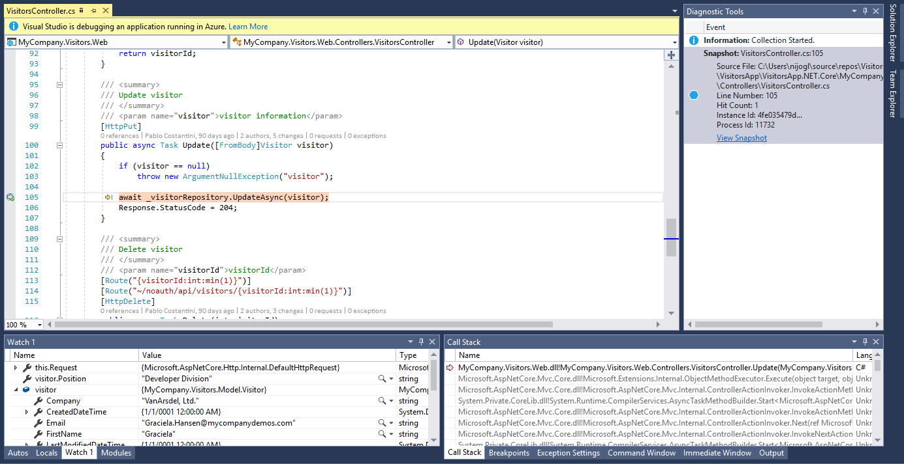

# Debug live ASP.NET apps running in Azure App Service

The Snapshot Debugger takes a snapshot of your in-production Azure App Service when code that you are interested in executes. To instruct the debugger to take a snapshot, you set snappoints and logpoints in your code. The debugger lets you see exactly what went wrong, without impacting traffic of your production application. The Snapshot Debugger can help you to dramatically reduce the time it takes to resolve issues that occur in production environments.

Snapshot collection is available for the following web aps running in Azure App Service:

- .NET Framework and ASP.NET applications running .NET Framework 4.5 or later.
- .NET Core 2.0 and ASP.NET Core 2.0 applications running on Windows.

> [!NOTE]
> With some additional configuration, Application Insights can automatically capture snapshots when your app hits an exception. For more information, see [Debug snapshots on exceptions in .NET apps](/azure/application-insights/app-insights-snapshot-debugger.md). Application Insights supports Service Fabric apps in addition to App Service.

## Start the Snapshot Debugger

1. Install the [Visual Studio 15.4 Preview](microsoft.com) or later.

2. Install the [Snapshot Debugger extension](https://aka.ms/snapshotdebugger).

3. Open the project you would like to snapshot debug. 

> [!NOTE] 
> In order to snapshot debug, you need to open the same version of source code that is published to Azure App Services. 

4. In the Cloud Explorer, right click the App Service your project is deployed to and select **Attach Snapshot Debugger** to start the Snapshot Debugger.

    

   Visual Studio is now in snapshot debugging mode.

    

   The **Modules** window shows you when all the modules have loaded for the App Service (choose **Debug / Windows / Modules** to open this window).

    

## Set a snappoint

1. In the code editor, click a line of code in the left gutter to set a snappoint (make sure it is code that you know will execute).

    

    > [!NOTE]
    > Unlike breakpoints, snappoints do not halt the application when hit. Typically, a snapshot taken from a snappoint only increases overhead by 10-20 ms. A shadow copy is created and debugging occurs against the shadow copy.

2. Click **Start Collection** to turn on the snappoint.  

    

    > [!TIP]
    > You can place multiple snappoints in the same method. When snapshots are captured on a server under load, all snappoints are captured from the same user session.

## Take a snapshot

When a snappoint is turned on, it will capture a snapshot whenever the line of code where the snappoint is placed is executed. This execution can be caused by a real request on your server. To force the code where you set the snappoint to run, you can also go to the browser view of your web site and take any actions required that will cause your snappoint to be hit.

## Inspect snapshot data

1. When the snappoint is hit, a snapshot appears in the Diagnostic Tools window (choose **Debug / Windows / Show Diagnostic Tools** to open this window).

    

2. Double-click the snappoint to open the snapshot in the code editor.

    

    From this view, you can hover over variables to view DataTips, use the **Locals** and **Watches** windows, and also evaluate expressions.

    > [!NOTE]
    > The website itself is still live and end users are not impacted.

## Set a conditional snappoint

If it is difficult to recreate a particular state in your app, consider whether the use of a conditional snappoint can help. You can use conditional snappoints to avoid taking a snapshot until the app enters a desired state (such as a state in which a variable is storing bad data). You can set conditions using expressions, filters, hit counts, and so on.

#### To create a conditional snappoint

1. Right-click a snappoint icon (the hollow ball) and choose **Settings**.

    

2. In the snappoint settings window, type an expression.

    

    In the preceding illustration, the snapshot will only be taken for the snappoint when `visitor.FirstName == "Dan"`.

## Set a logpoint

In addition to taking a snapshot when a snappoint is hit, you can also configure a snappoint to log a message (that is, create a logpoint). You can set logpoints without having to redploy your app. Logpoints are virtually executed and cause no impact and no side effects to your running application.

#### To create a logpoint

1. Right-click a snappoint icon (the hollow ball) and choose **Settings**.

2. In the snappoint settings window, select **Actions**.

    

3. Select options for output, including the messsage string (which can include variables).

    If you choose **Send to Output Window**, when the logpoint is hit the message will appear in the Diagnostic Tools window.

    

    If you choose **Send to application log**, when the logpoint is hit the message will appear anywhere that you can see see messages from `System.Diagnostics.Trace` (or `ILogger` in .NET Core), such as [App Insights](/azure/application-insights/app-insights-asp-net-trace-logs.md).

## See Also  
 [Debug Azure apps](../debugger/debug-azure-apps.md)
