# Diagnose problems after deployment using IntelliTrace

To diagnose issues in your ASP.NET web app after deployment by using IntelliTrace, include build information with your release to let Visual Studio automatically find the correct source files and symbol files that are required to debug the IntelliTrace log.

 If you are using Microsoft Monitoring Agent to control IntelliTrace, you also need to set up set up application performance monitoring on your web server. This records diagnostic events while your app runs and saves the events to an IntelliTrace log file. You can then look at the events in Visual Studio Enterprise (but not Professional or Community editions), go to the code where an event happened, look at the recorded values at that point in time, and move forwards or backwards through the code that ran. After you find and fix the problem, repeat the cycle to build, release, and monitor your release so you can resolve future potential problems earlier and faster.

 

 **You'll need:**

-   Visual Studio, Azure DevOps, or Team Foundation Server 2017, 2015, 2013, 2012, or 2010 to set up your build

-   Microsoft Monitoring Agent to monitor your app and record diagnostic data

-   Visual Studio Enterprise (but not Professional or Community editions) to review diagnostic data and debug your code with IntelliTrace

##  <a name="SetUpBuild"></a> Step 1: Include build information with your release
 Set up your build process to create a build manifest (*BuildInfo.config* file) for your web project and include this manifest with your release. This manifest contains information about the project, source control, and build system that were used to create a specific build. This information helps Visual Studio find the matching source and symbols after you open the IntelliTrace log to review the recorded events.

###  <a name="AutomatedBuild"></a> Create the build manifest for an automated build using Team Foundation Server

 Follow these steps whether you use Team Foundation Version Control or Git.

####  <a name="TFS2017"></a> Azure DevOps and Team Foundation Server 2017

Visual Studio 2017 does not include the *BuildInfo.config* file, which was deprecated and then removed. To debug ASP.NET web apps after deployment, use one of the following methods:

* For deployment to Azure, use [Application Insights](https://docs.microsoft.com/azure/application-insights/).

* If you need to use IntelliTrace, open the project in Visual Studio and load the symbol files from the matching build. You can load symbol files from the **Modules** window or by configuring symbols in **Tools** > **Options** > **Debugging** > **Symbols**.


####  <a name="TFS2013"></a> Team Foundation Server 2013
 Set up your build pipeline to add the locations of your source, build, and symbols to the build manifest (BuildInfo.config file). Team Foundation Build automatically creates this file and puts it in your project's output folder.

1.  [Edit your build pipeline or create a new build pipeline.](/azure/devops/pipelines/get-started-designer?view=vsts)

     

2.  Choose the default template (TfvcTemplate.12.xaml) or your own custom template.

     

3.  Specify where to save the symbols (PDB) file so that your source is indexed automatically.

     If you use a custom template, make sure the template has an activity to index your source. You'll later add an MSBuild argument to specify where to save the symbols files.

     

     For more about symbols, see [Publish symbol data](/azure/devops/pipelines/tasks/build/index-sources-publish-symbols?view=vsts).

4.  Add this MSBuild argument to include your TFS and symbols locations in the build manifest file:

     **/p:IncludeServerNameInBuildInfo=True**

     Anyone who can access your web server can see these locations in the build manifest. Make sure that your source server is secure.

5.  If you use a custom template, add this MSBuild argument to specify where to save the symbols file:

     **/p:BuildSymbolStorePath=**\<*path to symbols*>

     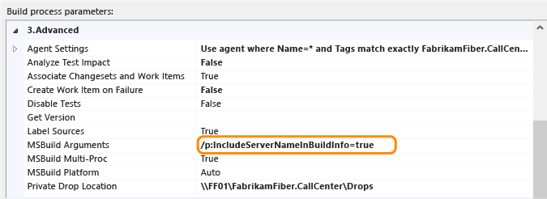

     And add these lines to your web project file (.csproj, .vbproj):

    ```xml
    <!-- Import the targets file. Change the folder location as necessary. -->
       <Import Project=""$(MSBuildExtensionsPath)\Microsoft\VisualStudio\v$(VisualStudioVersion)\BuildInfo\Microsoft.VisualStudio.ReleaseManagement.BuildInfo.targets" />

    ```

     Anyone who can access your web server can see these locations in the build manifest. Make sure that your source server is secure.

6.  Run a new build.

    Go to [Step 2: Release your app](#DeployRelease)

####  <a name="TFS2012_2010"></a> Team Foundation Server 2012 or 2010
 Follow these steps to automatically create the build manifest (BuildInfo.config file) for your project and put the file in your project's output folder. The file appears as "*ProjectName*.BuildInfo.config" in the output folder but is renamed "BuildInfo.config" in the deployment folder after you publish your app.

1.  Install Visual Studio 2013 (any edition) on your Team Foundation build server.

2.  In your build pipeline, specify where to save the symbols so that your source is indexed automatically.

     If you use a custom template, make sure that the template has an activity to index your source.

3.  Add these MSBuild arguments to your build pipeline:

    -   **/p:VisualStudioVersion=12.0**

    -   **/p:MSBuildAssemblyVersion=12.0**

    -   **/tv:12.0**

    -   **/p:IncludeServerNameInBuildInfo=True**

    -   **/p:BuildSymbolStorePath=**\<*path to symbols*>

4.  Run a new build.

    Go to [Step 2: Release your app](#DeployRelease)

###  <a name="ManualBuild"></a> Create the build manifest for a manual build using Visual Studio
 Follow these steps to automatically create the build manifest (BuildInfo.config file) for your project and put the file in your project's output folder. The file appears as "*ProjectName*.BuildInfo.config" in the output folder but is renamed "BuildInfo.config" in the deployment folder after you publish your app.

1.  In **Solution Explorer**, unload your web project.

2.  Open the project file (.csproj, .vbproj). Add these lines:

    ```xml
    <!-- **************************************************** -->
    <!-- Build info -->
    <PropertyGroup>
       <!-- Generate the BuildInfo.config file -->
       <GenerateBuildInfoConfigFile>True</GenerateBuildInfoConfigFile>
       <!-- Include server name in build info -->
       <IncludeServerNameInBuildInfo>True</IncludeServerNameInBuildInfo>
       <!-- Include the symbols path so Visual Studio can find the matching deployed code when you start debugging. -->
       <BuildSymbolStorePath><path to symbols></BuildSymbolStorePath>
    </PropertyGroup>
    <!-- **************************************************** -->
    ```

3.  Check in the updated project file.

4.  Run a new build.

    Go to [Step 2: Release your app](#DeployRelease)

###  <a name="MSBuild"></a> Create the build manifest for a manual build using MSBuild.exe
 Add these build arguments when you run a build:

 **/p:GenerateBuildInfoConfigFile=True**

 **/p:IncludeServerNameInBuildInfo=True**

 **/p:BuildSymbolStorePath=**\<*path to symbols*>

##  <a name="DeployRelease"></a> Step 2: Release your app
 If you use the [Web.Deploy package](https://msdn.microsoft.com/library/dd394698.aspx) that was created by your build process to deploy your app, the build manifest is automatically renamed from "*ProjectName*.BuildInfo.config" to "BuildInfo.config" and is put in the same folder with your app's Web.config file on your web server.

 If you use other methods to deploy your app, make sure that the build manifest is renamed from "*ProjectName*.BuildInfo.config" to "BuildInfo.config" and is put in the same folder with your app's Web.config file on the web server.

## Step 3: Monitor your app
 Set up application performance monitoring on your web server so that you can monitor your app for problems, record diagnostic events, and save those events to an IntelliTrace log file. See [Monitor your release for deployment problems](../debugger/using-the-intellitrace-stand-alone-collector.md).

##  <a name="InvestigateEvents"></a> Step 4: Find the problem
 You'll need Visual Studio Enterprise on your development computer or another computer to review the recorded events and debug your code using IntelliTrace. You can also use tools like CodeLens, debugger maps, and code maps to help you diagnose the problem.

### Open the IntelliTrace log and matching solution

1.  Open the IntelliTrace log (.iTrace file) from Visual Studio Enterprise. Or just double-click the file if you have Visual Studio Enterprise on the same computer.

2.  Choose **Open solution** to have Visual Studio automatically open the matching solution or project, if the project wasn't built as part of a solution. [Q: The IntelliTrace log is missing information about my deployed app. Why did this happen? What do I do?](#InvalidConfigFile)

     Visual Studio automatically shelves any pending changes when it opens the matching solution or project. To get more details about this shelveset, look in the **Output** window or **Team Explorer**.

     Before you make any changes, confirm that you have the correct source. If you use branching, you might be working in a different branch than where Visual Studio finds the matching source, like your release branch.

     

     If you have an existing workspace mapped to this solution or project, Visual Studio selects that workspace to put the source that it found.

     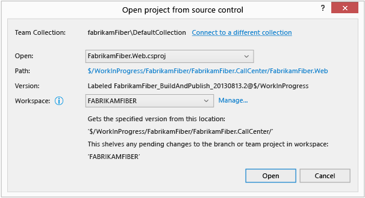

     Otherwise, choose another workspace or create a new workspace. Visual Studio will map the entire branch to this workspace.

     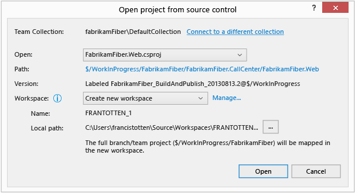

     To create a workspace with specific mappings or a name that's not your computer name, choose **Manage**.

     [Q: Why does Visual Studio say my selected workspace is ineligible?](#IneligibleWorkspace)

     [Q: Why can't I continue until I choose a team collection or a different collection?](#ChooseTeamProject)

### Diagnose a performance problem

1.  Under **Performance Violations**, review the recorded performance events, their total execution times, and other event information. Then dig deeper into the methods that were called during a specific performance event.

     

     You can also just double-click the event.

2.  On the event page, review the execution times for these calls. Find a slow call in the execution tree.

     The slowest calls appear in their own section when you have multiple calls, nested or otherwise.

     Expand that call to review any nested calls and values that were recorded at that point in time. Then start debugging from that call.

     

     You can also just double-click the call.

     If the method is in your application code, Visual Studio goes to that method.

     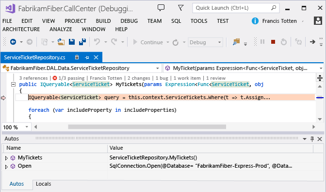

     Now you can review other recorded values, the call stack, step through your code, or use the **IntelliTrace** window to [move backwards or forwards "in time" between other methods](../debugger/intellitrace.md) that were called during this performance event.

    - [What's all these other events and information in the IntelliTrace log?](../debugger/using-saved-intellitrace-data.md)
    - [What else can I do from here?](#WhatElse)
    - [Want more information about performance events?](https://blogs.msdn.microsoft.com/devops/2013/09/20/performance-details-in-intellitrace/)

### Diagnose an exception

1.  Under **Exception Data**, review the recorded exception events, their types, messages, and when the exceptions happened. To dig deeper into the code, start debugging from the most recent event in a group of exceptions.

     

     You can also just double-click the event.

     If the exception happened in your application code, Visual Studio goes to where the exception happened.

     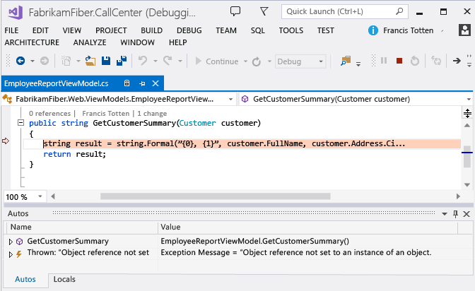

     Now you can review other recorded values, the call stack, or use the **IntelliTrace** window to [move backwards or forwards "in time" between other recorded events](../debugger/intellitrace.md), related code, and the values recorded at those points in time.

     [What's all these other events and information in the IntelliTrace log?](../debugger/using-saved-intellitrace-data.md)

###  <a name="WhatElse"></a> What else can I do from here?

-   [Get more information about this code](../ide/find-code-changes-and-other-history-with-codelens.md). To find references to this code, its change history, related bugs, work items, code reviews, or unit tests - all without leaving the editor - use the CodeLens indicators in the editor.

     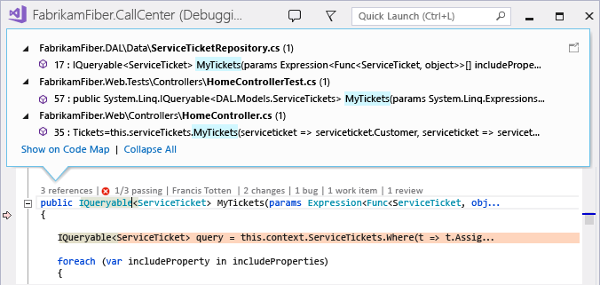

     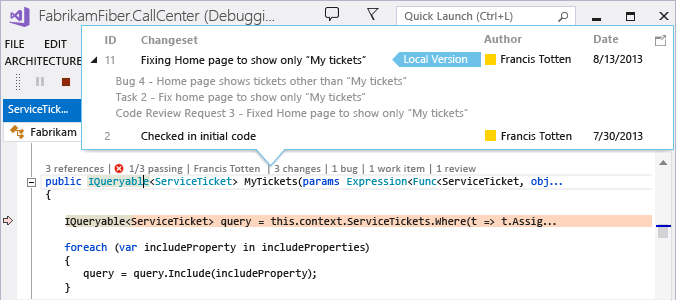

-   [Map your place in the code while you're debugging.](../debugger/map-methods-on-the-call-stack-while-debugging-in-visual-studio.md) To visually track the methods that were called during your debugging session, map the call stack.

     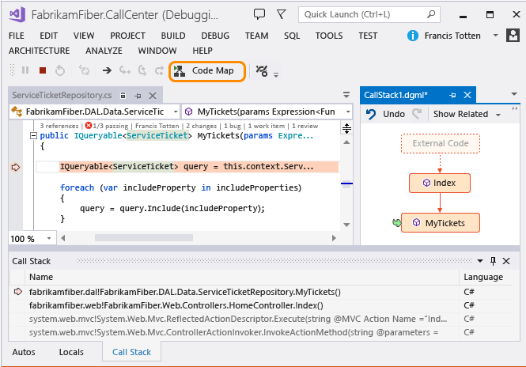

###  <a name="FAQ"></a> Q & A

####  <a name="WhyInclude"></a> Q: Why include information about my project, source control, build, and symbols with my release?
 Visual Studio uses this information to find the matching solution and source for the release that you're trying to debug. After you open the IntelliTrace log and select an event to start debugging, Visual Studio uses symbols to find and show you the code where the event happened. You can then look at the values that were recorded and move forwards or backwards through your code's execution.

 If you're using TFS and this information isn't in the build manifest (BuildInfo.config file), Visual Studio looks for the matching source and symbols on your currently connected TFS. If Visual Studio can't find the correct TFS or matching source, you're prompted to choose a different TFS.

####  <a name="InvalidConfigFile"></a> Q: The IntelliTrace log is missing information about my deployed app. Why did this happen? What do I do?
 This might happen when you deploy from your development computer or you're not connected to TFS during deployment.

1.  Go to your project's deployment folder.

2.  Find and open the build manifest (BuildInfo.config file).

3.  Make sure the file has the required information:

- **ProjectName**

   The name of your project in Visual Studio. For example:

  ```xml
  <ProjectName>FabrikamFiber.Extranet.Web</ProjectName>
  ```

- **SourceControl**

- Information about your source control system and these required properties:

  - **TFS**

    - **ProjectCollectionUri**: The URI for your Team Foundation Server and project collection

    - **ProjectItemSpec**: The path to your app's project file (.csproj or .vbproj)

    - **ProjectVersionSpec**: The version for your project

      For example:

    ```xml
    <SourceControl type="TFS">
       <TfsSourceControl>
          <ProjectCollectionUri>http://fabrikamfiber:8080/tfs/FabrikamFiber</ProjectCollectionUri>
          <ProjectItemSpec>$/WorkInProgress/FabrikamFiber/FabrikamFiber.CallCenter/FabrikamFiber.Web/FabrikamFiber.Web.csproj</ProjectItemSpec>
          <ProjectVersionSpec>LFabrikamFiber_BuildAndPublish_20130813@$/WorkInProgress</ProjectVersionSpec>
       </TfsSourceControl>
    </SourceControl>
    ```

  - **Git**

    - **GitSourceControl**: The location of the **GitSourceControl** schema

    - **RepositoryUrl**: The URI for your Team Foundation Server, project collection, and Git repository

    - **ProjectPath**: The path to your app's project file (.csproj or .vbproj)

    - **CommitId**: The id for your commit

      For example:

    ```xml
    <SourceControl type="Git">
       <GitSourceControl xmlns="http://schemas.microsoft.com/visualstudio/deploymentevent_git/2013/09">
          <RepositoryUrl>http://gittf:8080/tfs/defaultcollection/_git/FabrikamFiber</RepositoryUrl>
          <ProjectPath>/FabrikamFiber.CallCenter/FabrikamFiber.Web/FabrikamFiber.Web.csproj</ProjectPath>
          <CommitId>50662c96502dddaae5cd5ced962d9f14ec5bc64d</CommitId>
       </GitSourceControl>
    </SourceControl>
    ```

- **Build**

   Information about your build system, either `"TeamBuild"` or `"MSBuild"`, and these required properties:

  - **BuildLabel** (for TeamBuild): The build name and number. This label is also used as the name of the deployment event. For more info about build numbers, see [Use build numbers to give meaningful names to completed builds](/azure/devops/pipelines/build/options?view=vsts).

  - **SymbolPath** (Recommended): The list of URIs for your symbols (PDB file) locations separated by semi-colons. These URIs can be URLs or UNCs. This makes it easier for Visual Studio to find the matching symbols to help you with debugging.

  - **BuildReportUrl** (for TeamBuild): The location of the build report in TFS

  - **BuildId** (for TeamBuild): The URI for the build details in TFS. This URI is also used as the ID of the deployment event. This must id must be unique if you're not using TeamBuild.

  - **BuiltSolution**: The path to the solution file that Visual Studio uses to find and open the matching solution. This is the contents of the **SolutionPath** MsBuild property.

    For example:

  - **TFS**

    ```xml
    <Build type="TeamBuild">
       <MsBuild>
          <BuildLabel kind="label">FabrikamFiber_BuildAndPublish_20130813.1</BuildLabel>
          <SymbolPath>\\fabrikamfiber\FabrikamFiber.CallCenter\Symbols</SymbolPath>
          <BuildReportUrl kind="informative, url" url="http://fabrikamfiber:8080/tfs/FabrikamFiber/_releasePipeline/FindRelease?buildUri=fabrikamfiber%3a%2f%2f%2fBuild%2fBuild%2f448">Build Report Url</BuildReportUrl>
          <BuildId kind="id">1c4444d2-518d-4673-a590-dce2773c7744,fabrikamfiber:///Build/Build/448</BuildId>
          <BuiltSolution>$/WorkInProgress/FabrikamFiber/FabrikamFiber.CallCenter/FabrikamFiber.CallCenter.sln</BuiltSolution>
       </MsBuild>
    </Build>
    ```

  - **Git**

    ```xml
    <Build type="MSBuild">
       <MSBuild>
          <SymbolPath>\\gittf\FabrikamFiber.CallCenter\Symbols</SymbolPath>
          <BuiltSolution>/FabrikamFiber.CallCenter/FabrikamFiber.CallCenter.sln</BuiltSolution>
       </MSBuild>
    </Build>
    ```

####  <a name="IneligibleWorkspace"></a> Q: Why does Visual Studio say my selected workspace is ineligible?
 **A:** The selected workspace doesn't have any mappings between the source control folder and a local folder. To create a mapping for this workspace, choose **Manage**. Otherwise, choose an already mapped workspace or create a new workspace.

 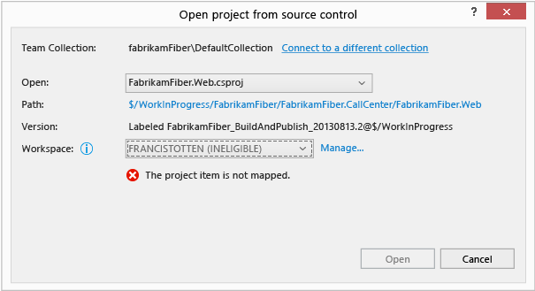

####  <a name="ChooseTeamProject"></a> Q: Why can't I continue until I choose a team collection or a different collection?
 **A:** This might happen for any of these reasons:

-   Visual Studio isn't connected to TFS.

     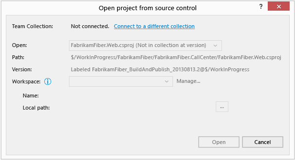

-   Visual Studio didn't find the solution or project in your current team collection.

     When the build manifest file (\<*ProjectName*>.BuildInfo.config) doesn't specify where Visual Studio can find the matching source, Visual Studio uses your currently connected TFS to find the matching solution or project. If your current team collection doesn't have the matching source, Visual Studio prompts you to connect to a different team collection.

-   Visual Studio didn't find the solution or project in the collection specified by the build manifest file (\<*ProjectName*>.BuildInfo.config).

     The specified TFS might not have the matching source anymore or even exist, maybe because you migrated to a new TFS. If the specified TFS doesn't exist, Visual Studio might time out after a minute or so, and then prompt you to connect to a different collection. To continue, connect to the correct TFS server.

     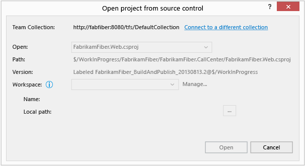

####  <a name="WhatWorkspace"></a> Q: What's a workspace?
 **A:** Your [workspace stores a copy of the source](/azure/devops/repos/tfvc/create-work-workspaces?view=vsts) so you can develop and test it separately before you check in your work. If you don't have already have a workspace that's specifically mapped to the found solution or project, then Visual Studio prompts you to choose an available workspace or create a new workspace with your computer name as the default workspace name.

####  <a name="UntrustedSymbols"></a> Q: Why do I get this message about untrusted symbols?
 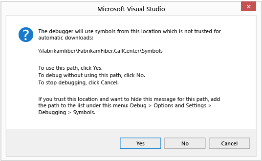

 **A:** This message appears when the symbols path in the build manifest file (\<*ProjectName*>.BuildInfo.config) isn't included in the list of trusted symbol paths. You can add the path to the symbols path list in the debugger options.
