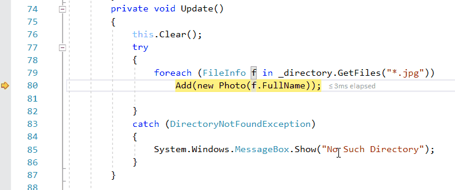
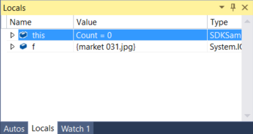
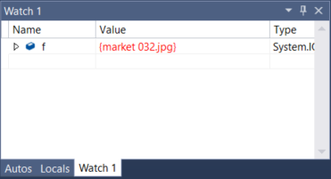

# Get started with the debugger

This topic introduces the features of the Visual Studio debugger in an step-by-step walkthrough. If you want a higher-level view of the debugger features, see [Debugger Feature Tour](../debugger/debugger-feature-tour.md).

You can either read along to see the features of the debugger or you can download the complete sample used in the feature tour and follow the step-by-step instructions yourself. To download the sample and follow along, go to [Photo Viewer Demo](https://code.msdn.microsoft.com/windowsdesktop/WPF-Photo-Viewer-Demo-be75662a).

Although the demo app is C#, the features are applicable to C++, Visual Basic, JavaScript, and other languages supported by Visual Studio (except where noted).

## Start the debugger!

1. To follow along these steps in Visual Studio, download the sample [on this page](https://code.msdn.microsoft.com/windowsdesktop/WPF-Photo-Viewer-Demo-be75662a).

    > [!IMPORTANT]
    > You need to install Visual Studio with the .NET Desktop Development workload to run the app we're using in the demo.

2. Unzip the project.

3. Open Visual Studio and select the **File / Open** menu command, then choose **Project/Solution**, and then open the folder where you downloaded the project.

     

3. Open the WPF Photo Viewer Demo / C# folder, choose the photoapp.sln file, and select **Open**.

     The project opens in Visual Studio. Solution Explorer in the right pane shows you all the project files.

    

4. Press F5 (**Debug / Start Debugging** or the **Start Debugging** button  in the Debug Toolbar).

     

     F5 starts the app with the debugger attached to the app process, but right now we haven't added any breakpoints or done anything special to examine the code. So the app just loads and you see the photo images.

     In this tour, we'll take a closer look at this app using the debugger and get a look at the debugger features.

5. Stop the debugger by pressing the red stop  button.

## Set a breakpoint and start the debugger

To debug, you need to start your app with the debugger attached to the app process.

1. In the `MainWindow` constructor of MainWindow.xaml.cs, set a breakpoint by clicking in the margin to the left of the first line of code.

     

6. Press F5 or the **Start Debugging** button, the app starts, and the debugger runs to the line of code where you set the breakpoint.

    The yellow arrow represents the statement on which the debugger paused, which also suspends app execution at the same point (this statement has not yet executed).

    F5 either continues running the app to the next breakpoint or, if the app is not yet running, it starts the debugger and stops at the first breakpoint.

    Breakpoints are a really useful feature when you know the line of code or the section of code that you want to examine in detail.

## Restart your app quickly

1. Click the **Restart**  button in the Debug Toolbar (Ctrl + Shift +F5).

    When you press **Restart**, it saves time versus stopping the app and restarting the debugger. The debugger pauses at the first breakpoint that is hit by executing code, similar to pressing F5 (if the code isn't executed, you won't hit the breakpoint).

    The debugger will stop again at the breakpoint you just set, in the `MainWindow` constructor.

## Navigate code in the debugger using step commands

Mostly, we will use the keyboard shortcuts here, because it's a good way to get fast at executing your app in the debugger (equivalent commands such as menu commands are shown in parentheses).

1. Press F11 (**Debug / Step Into**) twice to advance the execution of the app to the `InitializeComponent()` function.

     

     F11 is the **Step Into** command and advances the app execution one statement at a time. F11 is a good way to examine the execution flow in the most detail. (To move faster through code, we will show you some other options also.) By default, the debugger skips over non-user code (if you want more details, see [Just My Code](../debugger/just-my-code.md)).

     >[!NOTE]
     > In managed code, you will see a dialog box asking if you want to be notified when you automatically step over properties and operators (default behavior). If you want to change the setting later, disable **Step over properties and operators** setting in the **Tools / Options** menu under **Debugging**.

2. Press F10 (**Debug / Step Over**) a few times until the debugger stops on the first line of code in the `OnApplicationStartup` event handler.

     

     F10 advances the debugger without stepping into functions or methods in your app code (the code still executes). By pressing F10 on the `InitializeComponent` method call (instead of F11), we skipped over the implementation code for `InitializeComponent` (which maybe we're not interested in right now).

## Step into a property

1. With the debugger paused on this line of code:

    ````
    mainWindow.Photos.Path = Environment.CurrentDirectory + "\\images";
    ````

    Right-click on the line of code and choose **Step Into Specific**, then **SDKSamples.ImageSample.PhotoCollection.Path.set**

     

    As mentioned earlier, by default the debugger skips over managed properties and fields, but the **Step Into Specific** command allows you to override this behavior. For now, we want to look what happens when the `Path.set` property setter runs. **Step Into Specific** gets us to the `Path.set` code here.

     

     The `Update` method in this code looks like it could be interesting, so lets use the debugger to examine that code up close.

5. Hover over the `Update` method until the green **Run execution to here** button  appears on the left.

     

    >  [!NOTE] 
    > The **Run execution to here** button is new in [!include[vs_dev15](../misc/includes/vs_dev15_md.md)]. If you don't see the green arrow button, use F11 in this example instead to advance the debugger.

6. Click the **Run execution to here** button .

    Using this button is similar to setting a temporary breakpoint, which is also handy for getting around quickly within a visible region of app code (you can click in any open file).

    The debugger advances to the `Update` method implementation.

7. Press F11 to step into the `Update` method.

     

    Here, we find some more code that looks interesting; it appears the app is getting all *.jpg files residing in a particular directory, and then creating a new Photo object for each file. This gives us a good opportunity to start inspecting your app state (variables) with the debugger.

    Features that allow you to inspect variables are one of the most useful features of the debugger, and there are different ways to do it. Often, when trying to debug an issue, you will be attempting to find out whether variables are storing the values that you expect them to have at a particular point of execution.

## Inspect variables with data tips

1. Hover over the `Add` method call and click the **Run execution to here** button  to pause the debugger on the `Add` method call.

2. Now, hover over the File object (`f`) and you will see its default property value, the file name `market 031.jpg`.

     

3. Expland the object to see all its properties, such as the `FullPath` property.

    Often, when debugging, you will want a quick way to check property values on objects, and the data tips are a good way to do it.

    > [!TIP]
    > In most supported languages, you can edit code in the middle of a debugger session if you find something you want to change. For more info, see [Edit and Continue](../debugger/edit-and-continue.md). To use that feature in this app, we would first need to update the app's version of the .NET Framework.

## Inspect variables with the Autos and Locals windows

1. Take a look at the **Autos** window at the bottom of the code editor.

     

    In the **Autos** window, you see variables and their current value. The **Autos** window shows all variables used on the current line or the preceding line (In C++, the window shows variables in the preceding three lines of code. Check documentation for language-specific behavior).

    > [!NOTE]
    > In JavaScript, the **Locals** window is supported but not the **Autos** window.

2. Next, take a look at the **Locals** window.

    The **Locals** window shows you the variables that are in the current scope.

    

    Currently, the `this` object and the File object (`f`) are in the current scope. For more info, see [Inspect Variables in the Autos and Locals Windows](../debugger/autos-and-locals-windows.md).

## Set a watch

1. In the main code editor window, right-click the File object (`f`) and choose **Add Watch**.

    You can use a **Watch** window to specify a variable (or an expression) that you want to keep an eye on.

    Now, you have a watch set on the `File` object, and you can see it's value change as you move through the debugger. Unlike the other variable windows, the **Watch** window always shows the variables that you are watching (they're grayed out when out of scope).
    
    > [!TIP]
    > If you need to track the value of the variable even when it's out of scope, in C# you can right-click in the **Watch** windows and choose [Create an Object ID](../debugger/watch-and-quickwatch-windows#bkmk_objectIds).

2. On the `Add` method, click the green  button again (or press F11 a few times) to advance through the `foreach` loop.

    

    You might also see the first picture get added to the main window of the running sample app, but this happens on the UI thread, so images may not be visible yet.

    For more info, see [Set a Watch using the Watch and QuickWatch Windows](../debugger/watch-and-quickwatch-windows.md)

## Examine the call stack

1. Click the **Call Stack** window, which is by default open in the lower right pane.

     

    The **Call Stack** window shows the order in which methods and functions are getting called. The top line shows the current function (the `Update` method in the tour app). The second line shows that `Update` was called from the `Path.set` property, and so on.

    >  [!NOTE]
    > The **Call Stack** window is similar to the Debug perspective in some IDEs like Eclipse.

    The call stack is a good way to examine and understand the execution flow of an app.

    You can double-click a line of code to go look at that source code (without advancing the debugger) and that also changes the current scope being inspected by the debugger.

    You can also use right-click menus from the **Call Stack** window to do things like insert breakpoints into specified functions, restart your app using **Run to Cursor**, and to go examine source code. See [How to: Examine the Call Stack](../debugger/how-to-use-the-call-stack-window.md)

## Change the execution flow

1. With the debugger paused on the `Add` method call, use the mouse to grab the yellow arrow pointer on the left and move the yellow arrow pointer up one line to the `foreach` loop.

     

    By changing the execution flow, you can do things like test different code execution paths or simply re-run code without restarting the debugger.

2. Now, press F5.

    You can see the images added to the app window. Because you are re-running code in the `foreach` loop, some of the images have been added twice!
    
    > [!WARNING]
    > Often you need to be careful with this feature, and you see a warning in the tooltip. You may see other warnings, too. Moving the pointer does not undo any changes to the state of your application.

## Run to cursor

1. Choose the **Stop Debugging** red button  or Shift + F5.

2. In the `Update` method, right-click the `Add` method call and choose **Run to Cursor**. This command starts debugging and sets a temporary breakpoint on the current line of code.

     

    You should be paused on the breakpoint in `OnApplicationStartup` (since that is the first breakpoint.

3. Press F5 to advance to the `Add` method where you selected **Run to Cursor**.

    This command is useful when you are editing code and want to quickly set a temporary breakpoint and start the debugger.

## Step out

Let's say that you are done examining the `Update` method in Data.cs, then you might want to step out of the function using the **Step Out** command.

1. Press Shift + F11 (or **Debug / Step Out**).

     This resumes app execution (and advances the debugger) until the current function returns.

     You should be back in the `Update` method call in Data.cs.

2. Press Shift + F11 again, and the debugger goes up the call stack back to the `OnApplicationStartup` event handler.

3. Press F5 to continue.

## Examine an exception

1. In the running app window, delete the text in the **Path** input box and select the **Change** button.

     

     The app throws an exception, and the debugger takes you to the line of code that threw the exception.
     
     

     Here, the **Exception Helper** shows you a `System.Argument` exception and an error message that says that the path is not a legal form. So, we know the error occurred on a method or function argument.

     In this example, the `DirectoryInfo` call gave the error on the empty string stored in the `value` variable. (Hover over `value` to see the empty string.)

     The Exception Helper is a great feature that can help you debug errors. You can also do things like view error details and add a watch from the Exception Helper. Or, if needed, you can change conditions for throwing the particular exception.

    >  [!NOTE] 
    > The Exception Helper replaces the Exception Assistant in [!include[vs_dev15](../misc/includes/vs_dev15_md.md)].

2. Expand the **Exception Settings** node to see more options on how to handle this exception type, but you don't need to change anything for this tour!

3. Press F5 to continue the app.

## See Also  
 [Debugging in Visual Studio](../debugger/debugging-in-visual-studio.md)