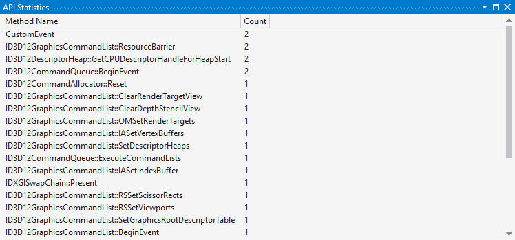

# Graphics API and Memory Statistics
<!-- VERSIONLESS -->
Visual Studio 2017 and greater support the Graphics API Statistics and Memory Statistics tools.  These two tools let you view various bits of information on Direct3D API usage as well as GPU memory consumption of various resources.

## Graphics API Statistics
The Graphics API Statistics in Visual Studio Graphics Diagnostics lets you view all of the Direct3D calls that were made, and the count of each call.  To view the window, select the **View > API Statistics** menu item.

This tool can be handy in discovering DirectX calls you may not realize you're making, or calls you are making too often.

You can right-click in the window to Copy All data as CSV, which can be pasted into something like Excel for further analysis.

## Memory Statistics
This tool will display how much memory the graphics driver is allocating for the resources you create in a frame.  To view this window, select the **View > Memory Statistics** menu item.

The **GPU Allocation** column displays the amount of memory used by the event displayed in the **Event** column.  You can also select the watch icon  to view the [Resource History](graphics-event-list.md#resource-history) for the selected event.

As with the API Statistics tool, you can right-click in the window to Copy All data as CSV, which can be pasted into something like Excel for further analysis.

## See Also  
[Graphics Diagnostics (Debugging DirectX Graphics)](visual-studio-graphics-diagnostics.md)   
[Resource History](graphics-event-list.md#resource-history)
<!-- /VERSIONLESS -->