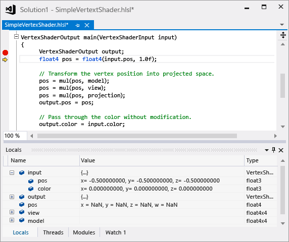

# HLSL Shader Debugger
The HLSL debugger in Visual Studio Graphics Analyzer helps you understand how your HLSL shader code operates under real conditions of your app.  
  
 This is the HLSL debugger:  
  
   
  
## Understanding the HLSL debugger  
 The HLSL debugger can help you understand problems that arise in your shader code. Debugging HLSL code in [!INCLUDE[vsprvs](../../code-quality/includes/vsprvs_md.md)] resembles debugging code that's written in other languages—for example, C++, C#, or Visual Basic. You can inspect the contents of variables, set break points, step through code, and walk up the call-stack, just like you can when you debug other languages.  
  
 However, because GPUs achieve high performance by running shader code on hundreds of threads simultaneously, the HLSL debugger is designed to work together with the other Graphics Analyzer tools to present all of this information in a way that helps you make sense of it. Graphics Analyzer recreates captured frames by using information that was recorded in a graphics log; the HLSL debugger does not monitor GPU execution in real time as it runs shader code. Because a graphics log contains enough information to recreate any part of the output, and because Graphics Analysis provides tools that can help you pinpoint the exact pixel and event where an error occurs, the HLSL debugger only has to simulate the exact shader thread that you are interested in. This means that the work of the shader can be simulated on the CPU, where its inner workings are in full view. This is what gives the HLSL debugger a CPU-like debugging experience.  
  
 However, the HLSL debugger is currently limited in the following ways:  
  
-   The HLSL debugger doesn't support edit-and-continue, but you can make changes to your shaders and then regenerate the frame to see the results.  
  
-   It's not possible to debug an app and its shader code at the same time. However, you can alternate between them.  
  
-   You can add variables and registers to the Watch window, but expressions are not supported.  
  
 Nevertheless, the HLSL debugger provides a better, more CPU-like debugging experience than would be possible otherwise.  
  
## HLSL Shader Edit & Apply  
 The HLSL shader debugger doesn't support Edit & Continue in the same way that the CPU debugger does because the GPU execution model doesn't allow shader state to be undone. Instead, the HLSL debugger supports Edit & Apply, which allows you to edit HLSL source files and then choose **Apply** to regenerate the frame to see the effect of your changes. Your modified shader code is stored in a separate file to preserve the integrity of your project's original HLSL source file, but when you're satisfied with your changes you can choose **Copy to...** to copy the changes into your project. Using this feature, you can quickly iterate on shader code that contains errors and eliminate costly rebuild and capture steps from your HLSL debugging workflow.  
  
## HLSL Disassembly  
 The HLSL shader debugger provides a listing of HLSL shader assembly to the right of the HLSL source code listing.  
  
## Debugging HLSL code  
 You can access the HLSL debugger from the Pipeline Stages or Pixel History windows.  
  
#### To start the HLSL debugger from the Graphics Pipeline Stages window  
  
1.  In the **Graphics Pipeline Stages** window, locate the pipeline stage that's associated with the shader that you want to debug.  
  
2.  Below the title of the pipeline stage, choose **Start Debugging**, which appears as a small green arrow.  
  
    > [!NOTE]
    >  This entry point into the HLSL debugger debugs only the first shader thread for the corresponding stage—that is, the first vertex or pixel that is processed. You can use Pixel History to access other threads of these shader stages.  
  
#### To start the HLSL debugger from the Graphics Pixel History  
  
1.  In the **Graphics Pixel History** window, expand the draw call that's associated with the shader that you want to debug. Each draw call can correspond to multiple primitives.  
  
2.  In the draw call details, expand a primitive whose resulting color contribution suggests a bug in its shader code. If multiple primitives suggest a bug, choose the first primitive that suggests it so that you can avoid an accumulation of errors that can make diagnosis of the problem more difficult.  
  
3.  In the primitive details, choose whether to debug the **Vertex Shader** or the **Pixel Shader**. Debug the vertex shader when you suspect that the pixel shader is correct but is generating an incorrect color contribution because the vertex shader is passing incorrect constants to it. Otherwise, debug the pixel shader.  
  
     To the right of the chosen shader, choose **Start Debugging**, which appears as a small green arrow.  
  
    > [!NOTE]
    >  This entry point into the HLSL debugger debugs either the pixel shader thread that corresponds to the chosen draw call, primitive, and pixel that you have chosen, or to the vertex shader threads whose results are interpolated by the draw call, primitive, and pixel that you have chosen. In the case of vertex shaders, you can further refine the entry point to a specific vertex by expanding the vertex shader details.  
  
 For examples about how to use the HLSL Debugger to debug shader errors, see [Examples](graphics-diagnostics-examples.md) or the walkthroughs linked to in the See Also section.  
  
## See Also  
 [Walkthrough: Missing Objects Due to Vertex Shading](walkthrough-missing-objects-due-to-vertex-shading.md)   
 [Walkthrough: Debugging Rendering Errors Due to Shading](walkthrough-debugging-rendering-errors-due-to-shading.md)   
 [Walkthrough: Using Graphics Diagnostics to Debug a Compute Shader](walkthrough-using-graphics-diagnostics-to-debug-a-compute-shader.md)