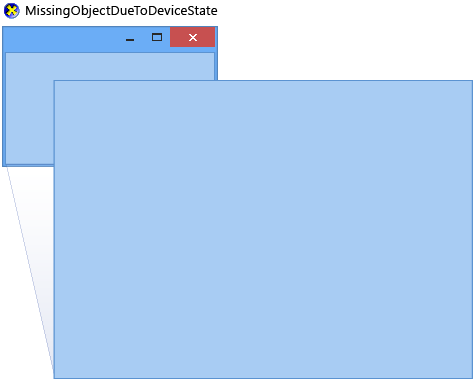
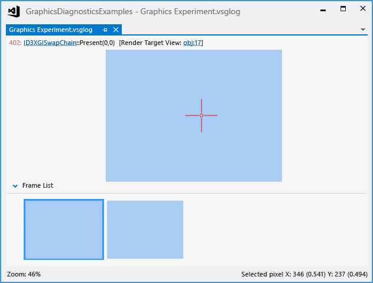
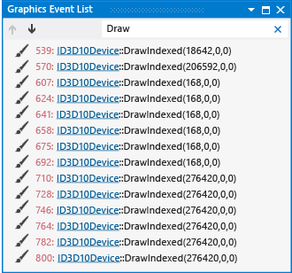
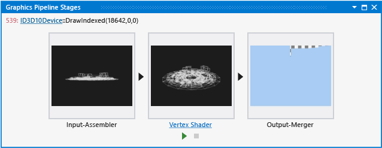
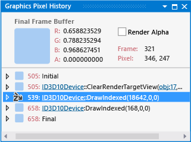
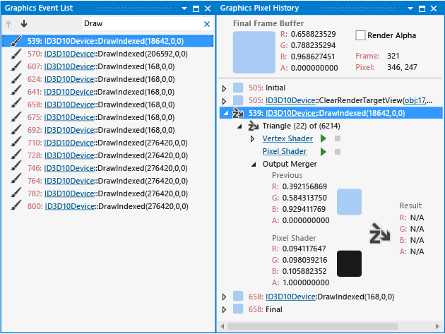
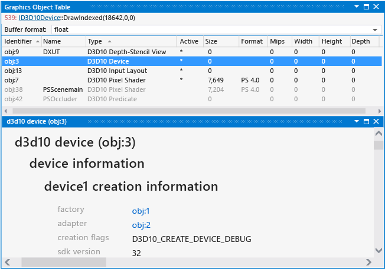
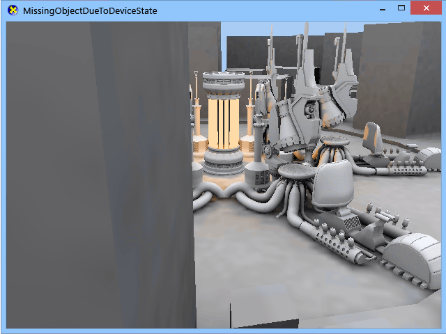

# Walkthrough: Missing Objects Due to Device State
This walkthrough demonstrates how to use [!INCLUDE[vsprvs](../../code-quality/includes/vsprvs_md.md)] Graphics Diagnostics to investigate an object that is missing due to misconfigured device state.  
  
 This walkthrough demonstrates how to:  
  
-   Use the **Graphics Event List** to locate potential sources of the problem.  
  
-   Use the **Graphics Pipeline Stages** window to check the effect of the `DrawIndexed` Direct3D API calls.  
  
-   Use the **Graphics Pixel History** window to locate the problem more specifically.  
  
-   Inspect the device state for potential problems or misconfigurations.  
  
## Scenario  
 One of the reasons that objects might not appear where they are expected in a 3-D app is a misconfiguration of the graphics device that causes the objects to be excluded from rendering—for example, when the winding order causes triangles to be culled in error, or when the depth test function causes all pixels in the object to be rejected.  
  
 In the scenario that's described in this walkthrough, you have just reached the first milestone in the development of your 3-D app and are ready to test it for the first time. However, when you run the app, only the user interface is rendered to the screen. By using Graphics Diagnostics, you capture the problem to a graphics log file so that you can debug the app. The problem looks like this in the app:  
  
   
  
 For information about how to capture graphics problems in a graphics log, see [Capturing Graphics Information](capturing-graphics-information.md).  
  
## Investigation  
 By using the Graphics Diagnostics tools, you can load the graphics log file to inspect the frames that were captured during the test.  
  
#### To examine a frame in a graphics log  
  
1.  In [!INCLUDE[vsprvs](../../code-quality/includes/vsprvs_md.md)], load a graphics log that contains a frame that exhibits the missing model. A new Graphics Diagnostics tab appears in [!INCLUDE[vsprvs](../../code-quality/includes/vsprvs_md.md)]. In the top part of this tab is the render target output of the selected frame. In the bottom part is the **Frame List**, which displays each captured frame as a thumbnail image.  
  
2.  In the **Frame List**, select a frame that demonstrates that the model is not displayed. The render target is updated to reflect the selected frame. In this scenario, the graphics log tab looks like this:  
  
       
  
 After you select a frame that demonstrates the problem, you can use the **Graphics Event List** to diagnose it. The **Graphics Event List** contains every Direct3D API call that was made to render the active frame, for example, API calls to set up device state, to create and update buffers, and to draw objects that appear in the frame. Many kinds of calls are interesting because there is often (but not always) a corresponding change in the render target when the app is working as expected, for example Draw, Dispatch, Copy or Clear calls. Draw calls are particularly interesting because each one represents geometry that the app rendered (Dispatch calls can also render geometry).  
  
#### To ensure that draw calls are being made  
  
1.  Open the **Graphics Event List** window. On the **Graphics Diagnostics** toolbar, choose **Event List**.  
  
2.  Inspect the **Graphics Event List** for draw calls. To make this easier, enter "Draw" in the **Search** box in the upper-right corner of the **Graphics Event List** window. This filters the list so that it only contains events that have "Draw" in their titles. In this scenario, you discover that several draw calls were made:  
  
       
  
 After you confirm that draw calls are being made, you can determine which one corresponds to the missing geometry. Because you know that the missing geometry is not being drawn to the render target (in this case), you can use the **Graphics Pipeline Stages** window to determine which draw call corresponds to the missing geometry. The **Graphics Pipeline Stages** window shows the geometry that was sent to each draw call, regardless of its effect on the render target. As you move through the draw calls, the pipeline stages are updated to show the geometry that is associated with that call, and the render target output is updated to show the state of the render target after the call was completed.  
  
#### To find the draw call for the missing geometry  
  
1.  Open the **Graphics Pipeline Stages** window. On the **Graphics Diagnostics** toolbar, choose **Pipeline Stages**.  
  
2.  Move through each draw call while watching the **Graphics Pipeline Stages** window for the missing model. The **Input Assembler** stage shows the raw model data. The **Vertex Shader** stage shows the transformed model data. The **Pixel Shader** stage shows the pixel shader output. The **Output-Merger** stage shows the merged render target of this draw call and all previous draw calls.  
  
3.  Stop when you've reached the draw call that corresponds to the missing model. In this scenario, the **Graphics Pipeline Stages** window indicates that the geometry was rendered but didn't appear in the render target:  
  
       
  
 After you confirm that the app rendered the missing geometry and you locate the corresponding draw call, you can select a portion of the render target output that should show the missing geometry and then use the **Graphics Pixel History** window to find out why the pixels were excluded. The pixel history contains a list of every draw call that might have had an effect on a particular pixel. Each draw call in the **Graphics Pixel History** window is identified by a number that is also displayed in the **Graphics Event List** window. This helps you confirm that the pixel should display the missing geometry, and to find out why the pixel was excluded  
  
#### To determine why the pixel was excluded  
  
1.  Open the **Graphics Pixel History** window. On the **Graphics Diagnostics** toolbar, choose **Pixel History**.  
  
2.  Based on the **Pixel Shader** thumbnail, select a pixel in the framebuffer output that should contain a portion of the missing geometry. In this scenario, the pixel shader output should cover most of the render target; after a pixel is selected, the **Graphics Pixel History** window looks like this:  
  
       
  
3.  Confirm that the selected render target pixel contains a portion of the geometry by matching the number of the draw call you're inspecting (from the **Graphics Event List** window) to one of the draw calls in the **Graphics Pixel History** window. If none of the calls in the **Graphics Pixel History** window match the draw call you're inspecting, repeat these steps (except step 1) until you find a match. In this scenario, the matching draw call looks like this:  
  
       
  
4.  When you find a match, expand the matching draw call in the **Graphics Pixel History** window and confirm that the pixel was excluded. Each draw call in the **Graphics Pixel History** window corresponds to one or more geometric primitives (points, lines, or triangles) that intersected that pixel as a result of the geometry of the corresponding object. Each such intersection might contribute to the final color of the pixel. A primitive that's excluded because it has failed the depth test is represented by an icon that shows the letter Z over an arrow that slopes downward from left to right.  
  
5.  Expand an excluded primitive to further examine the state that caused it to be excluded. In the **Output Merger** group, move the pointer over the **Result**. A tooltip indicates why the primitive was excluded. In this scenario, the examination reveals that the primitive was excluded because it failed the depth test, and therefore did not contribute to the final color of the pixel.  
  
 After you determine that the geometry does not appear because its primitives have failed the depth test, you might suspect that this problem is related to misconfigured device state. Device state and other Direct3D object data can be examined by using the **Graphics Object Table**.  
  
#### To examine device state  
  
1.  Open the **Graphics Object Table** window. On the **Graphics Diagnostics** toolbar, choose **Object Table**.  
  
2.  Locate the **D3D10 Device** object in the **Graphics Object Table**, and then open the **D3D10 Device** object. A new **d3d10 device** tab opens in [!INCLUDE[vsprvs](../../code-quality/includes/vsprvs_md.md)]. To make this easier, you can sort the **Graphics Object Table** by **Type**:  
  
       
  
3.  Examine the device state that's displayed in the **d3d10 device** tab for potential problems. Because the geometry doesn't appear because its primitives have failed the depth test, you can focus on device state, such as the depth stencil, that affects the depth test. In this scenario, the **depth stencil description** (under **output merger state**) contains an uncommon value for the **depth function** member, `D3D10_COMPARISON_GREATER`:  
  
       
  
 After you determine that the cause of the rendering issue might be a misconfigured depth function, you can use this information together with your knowledge of the code to locate where the depth function was set incorrectly, and then fix the problem. If you are unfamiliar with the code, you could search for the problem by using clues that you gathered while you were debugging—for example, based on the **depth stencil description** in this scenario, you could search the code for words like "depth" or "GREATER". After you fix the code, rebuild it and run the app again to discover that the rendering issue is solved:  
  
 