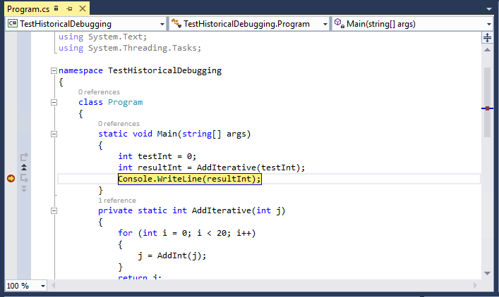
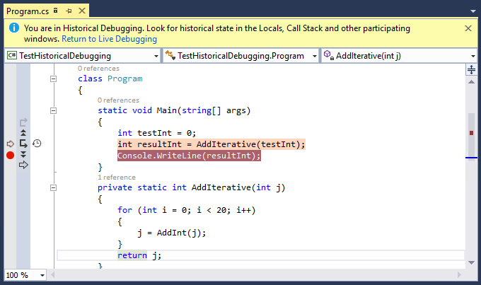

# Historical Debugging
Historical debugging is a mode of debugging that depends on the information collected by IntelliTrace. It allows you to move backward and forward through the execution of your application and inspect its state.  
  
 You can use IntelliTrace in Visual Studio Enterprise edition (but not the Professional or Community editions).  
  
## Why use Historical Debugging?  
 Setting breakpoints to find bugs can be a rather hit-or-miss affair. You set a breakpoint close to the place in your code where you suspect the bug to be, then run the application in the debugger and hope your breakpoint gets hit, and that the place where execution breaks can reveal the source of the bug. If not, you'll have to try setting a breakpoint somewhere else in the code and rerun the debugger, executing your test steps over and over until you find the problem.  
  
   
  
 You can use IntelliTrace and Historical Debugging to roam around in your application and inspect its state (call stack and local variables) without having to set breakpoints, restart debugging, and repeat test steps. This can save you a lot of time, especially when the bug is located deep in a test scenario that takes a long time to execute.  
  
## How do I start using Historical Debugging?  
 IntelliTrace is on by default. All you have to do is decide which events and function calls are of interest to you. For more information about defining what you want to look for, see [IntelliTrace Features](../debugger/intellitrace-features.md). For a step-by-step account of debugging with IntelliTrace, see [Walkthrough: Using IntelliTrace](../debugger/walkthrough-using-intellitrace.md).  
  
## Navigating your code with Historical Debugging  
 Let's start with a simple program that has a bug. In a C# console application, add the following code:  
  
```CSharp  
static void Main(string[] args)  
{  
    int testInt = 0;  
    int resultInt = AddAll(testInt);  
    Console.WriteLine(resultInt);  
}  
private static int AddAll(int j)  
{  
    for (int i = 0; i < 20; i++)  
    {  
        j = AddInt(j);  
    }  
    return j;  
}  
  
private static int AddInt(int add)  
{  
    if (add == 10)  
    {  
        return add += 25;  
    }  
    return ++add;  
}  
```  
  
 We'll assume that the expected value of `resultInt` after calling `AddAll()` is 20 (the result of incrementing `testInt` 20 times). (We'll also assume that you can't see the bug in `AddInt()`).But the result is actually 44. How can we find the bug without stepping through `AddAll()` 10 times? We can use Historical Debugging to find the bug faster and more easily. Here's how:  
  
1.  In Tools > Options > IntelliTrace > General, make sure that IntelliTrace is enabled, and select the IntelliTrace events and call information option. If you do not select this option, you will not be able to see the navigation gutter (as explained below).  
  
2.  Set a breakpoint on the `Console.WriteLine(resultInt);` line.  
  
3.  Start debugging. The code executes to the breakpoint. In the **Locals** window, you can see that the value of `resultInt` is 44.  
  
4.  Open the **Diagnostic Tools** window (**Debug > Show Diagnostic Tools**). The code window should look like this:  
  
       
  
5.  You should see a double arrow next to the left margin, just above the breakpoint. This area is called the navigation gutter, and is used for Historical Debugging. Click the arrow.  
  
     In the code window, you should see that the preceding line of code (`int resultInt = AddIterative(testInt);`) is colored pink. Above the window, you should see a message that you are now in Historical Debugging.  
  
     The code window now looks like this:  
  
       
  
6.  Now you can step into the `AddAll()` method (**F11**, or the **Step Into** button in the navigation gutter. Step forward (**F10**, or **Go to Next Call** in the navigation gutter. The pink line is now on the `j = AddInt(j);` line. **F10** in this case does not step to the next line of code. Instead, it steps to the next function call. Historical debugging navigates from call to call, and it skips lines of code that do not include a function call.  
  
7.  Now step into the `AddInt()` method. You should see the bug in this code immediately.  
  
 This procedure just scratched the surface of what you can do with Historical Debugging. To find out more about the different settings and the effects of the different buttons in the navigation gutter, see [IntelliTrace Features](../debugger/intellitrace-features.md).