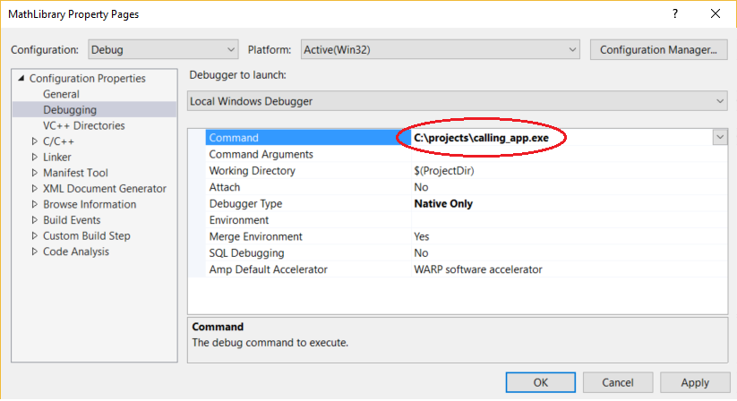
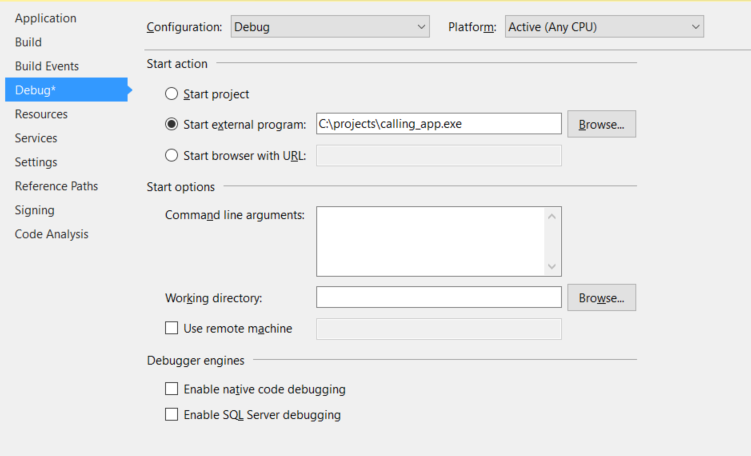

# How to: Debug from a DLL Project in Visual Studio
One way to debug a DLL project is to specify the calling application in the project properties of the DLL project and then you can start debugging from the DLL project itself. For this method to work, the application must call the DLL, and the DLL must be in the location where the application expects to find it (otherwise, the application might find a different version of the DLL and load that instead, and it won't hit your breakpoints). For other methods of debugging DLLs, see [Debugging DLL Projects](../debugger/debugging-dll-projects.md).
  
If a managed DLL is called by native code and you want to debug both, you can specify this in the project properties. For more information, see [How to: Debug in Mixed Mode](../debugger/how-to-debug-in-mixed-mode.md).   

The C++ property pages differ in layout and content from the C# and Visual Basic property pages. 
  
### To specify the calling application in a C++ project  
  
1.  Right-click the project node in the **Solution Explorer** and select **Properties**.  
  
2.  Make sure that the **Configuration** field at the top of the window is set to **Debug**. 

    A **Debug** configuration is required for this method. 
  
3.  Go to **Configuration Properties > Debugging**.  
  
4.  In the **Debugger to launch** list, choose **Local Windows Debugger** or **Remote Windows Debugger**.  
  
5.  In the **Command** or **Remote Command** box, add the fully-qualified path name of the calling application (such as an .exe file).

      
  
6.  Add any necessary program arguments to the **Command Arguments** box.  
  
### To specify the calling application in a C# or Visual Basic project  
  
1.  Right-click the project node in the **Solution Explorer** and select **Properties**, and then select the **Debug** tab.

2.  Make sure that the **Configuration** field at the top of the window is set to **Debug**.

3.  (.NET Framework) Select **Start external program**, and add the fully-qualified path name of the calling application.

4.  (.NET Core) Select **Executable** from the **Launch** list, and then add the fully-qualified path name of the calling application in the **Executable** field. 
  
     If you need to add the external program's command line arguments, add them in the **Command line arguments** (or **Application arguments**) field.

     

5.  If you need to, you can also call an application as a URL. (You might want to do this if you are debugging a managed DLL used by a local ASP.NET application.)  
  
     Under **Start Action**, select the **Start browser with URL:** radio button and fill in the URL.
  
### To start debugging from the DLL project  
  
1.  Set breakpoints in the DLL project. 

2.  Right-click the DLL project and choose **Set as Startup Project**. 

    (Also, make sure that the **Solutions Configuration** field is still set to **Debug**.)   
  
3.  Start debugging (press F5, click the green arrow, or click **Debug > Start Debugging**).

    You will hit the breakpoints in your DLL. If you aren't able to hit the breakpoints, make sure that your DLL output (by default, the **project\Debug** folder) is in a location that the calling application expects to find it.
  
## See Also  
 [Debugging DLL Projects](../debugger/debugging-dll-projects.md)   
 [Project Settings for  C# Debug Configurations](../debugger/project-settings-for-csharp-debug-configurations.md)   
 [Project Settings for a Visual Basic Debug Configuration](../debugger/project-settings-for-a-visual-basic-debug-configuration.md)   
 [Project Settings for a C++ Debug Configuration](../debugger/project-settings-for-a-cpp-debug-configuration.md)