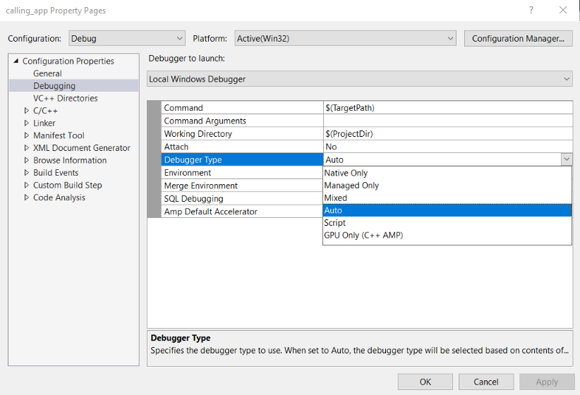
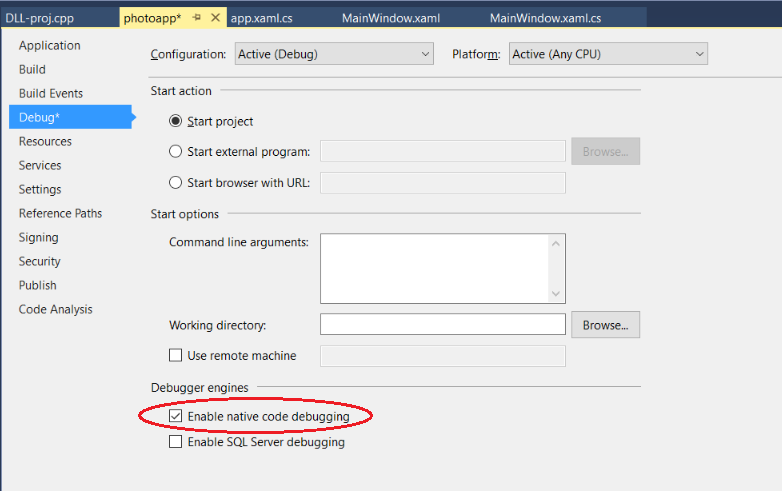

# How to: Debug in Mixed Mode
The following procedures describe how to debug both managed and native code, also known as mixed-mode debugging. There are two scenarios for doing so, depending on whether the DLL or the application is written in native code:  
  
-   The calling application that calls your DLL is written in native code. In this case your DLL is managed, and both managed and native debuggers must be enabled to debug both. You can check this in the **\<Project> Property Pages** dialog box. How you do this depends on whether you start debugging from the DLL project or the calling application project.  
  
-   The calling application that calls your DLL is written in managed code and your DLL is written in native code.  
  
> [!NOTE]
>  The dialog boxes and menu commands you see might differ from those described in Help depending on your active settings or edition. To change your settings, choose **Import and Export Settings** on the **Tools** menu. For more information, see [Personalize the Visual Studio IDE](../ide/personalizing-the-visual-studio-ide.md).

If you don't have access to the project for the calling app, you can debug a DLL from the DLL project. For more information, see [How to: Debug from a DLL Project](../debugger/how-to-debug-from-a-dll-project.md). You don't need to use mixed to debug just the DLL project.
  
### To enable mixed-mode debugging (C++ calling app)  
  
1.  In **Solution Explorer**, select the native project.
  
2.  On the **View** menu, click **Property Pages**.
  
3.  In the **\<Project> Property Pages** dialog box, expand the **Configuration Properties** node, and then select **Debugging**.  
  
4.  Set **Debugger Type** to **Mixed** or **Auto**.

    

### To enable mixed-mode debugging (C# or VB calling app)  
  
1.  In **Solution Explorer**, select the managed project.  
  
2.  On the **View** menu, click **Property Pages**.  
  
3.  In the **\<Project> Property Pages** dialog box, select the **Debug** tab, and then select **Enable native code debugging**

    
  
## See Also  
 [How to: Debug from a DLL Project](../debugger/how-to-debug-from-a-dll-project.md)