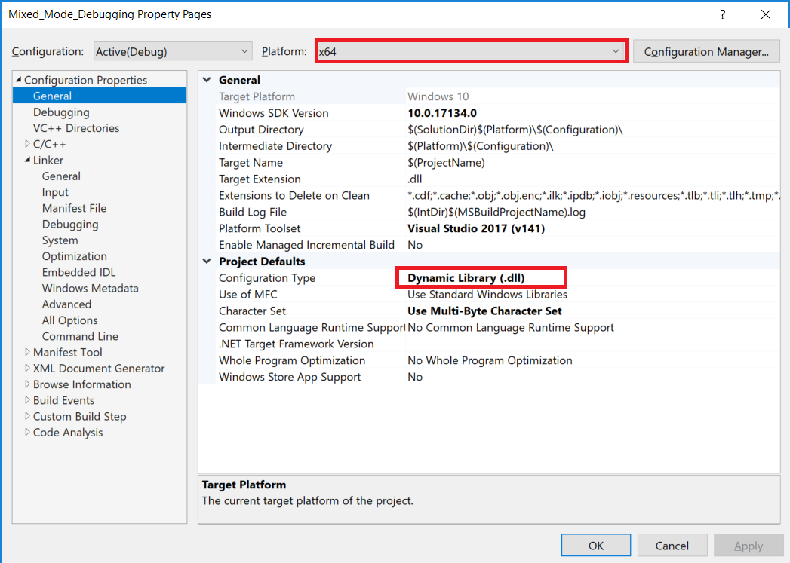
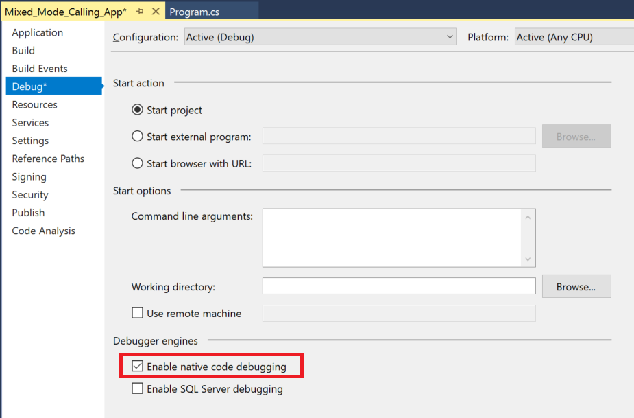

# Tutorial: Debug managed and native code in the same debugging session

Visual Studio allows you to enable more than one debugger type when debugging, which is called mixed mode debugging. In this tutorial, you set options to debug both managed and native code in a single debugging session. This tutorial shows how to debug native code from a managed app, but you can also do the reverse, and [debug managed code from a native app](../debugger/how-to-debug-in-mixed-mode.md). The debugger also supports other types of mixed mode debugging, such as debugging [Python and native code](../python/debugging-mixed-mode-c-cpp-python-in-visual-studio.md) and using the script debugger in app types such as ASP.NET.

In this tutorial, you will:

> [!div class="checklist"]
> * Create a simple native DLL
> * Create a simple .NET Core or .NET Framework app to call the DLL
> * Start the debugger
> * Hit a breakpoint in the managed app
> * Step into native code

## Prerequisites

* You must have Visual Studio installed and the **Desktop development with C++** workload.

    If you haven't already installed Visual Studio, go to the [Visual Studio downloads](https://visualstudio.microsoft.com/downloads/?utm_medium=microsoft&utm_source=docs.microsoft.com&utm_campaign=button+cta&utm_content=download+vs2017) page to install it for free.

    If you need to install the workload but already have Visual Studio, click the **Open Visual Studio Installer** link in the left pane of the **New Project** dialog box. The Visual Studio Installer launches. Choose the **Desktop development with C++** workload, then choose **Modify**.

* You must also have either the **.NET desktop development** workload or the **.NET Core cross platform development** workload installed, depending on which app type you want to create.

## Create a simple native DLL

1. In Visual Studio, choose **File** > **New** > **Project**.

1. In the **New Project** dialog box, choose **Visual C++**, **Other** from the installed templates section, and then in the middle pane select **Empty Project**.

1. In the **Name** field, type **Mixed_Mode_Debugging** and click **OK**.

    Visual Studio creates the empty project, which appears in Solution Explorer in the right pane.

1. In Solution Explorer, right-click the **Source Files** node in the C++ project, and then choose **Add** > **New Item**, and then select **C++ file (.cpp)**. Give the file the name **Mixed_Mode.cpp**, and choose **Add**.

    Visual Studio adds the new C++ file.

1. Copy the following code into *Mixed_Mode.cpp*:

    ```cpp
    #include "Mixed_Mode.h"
    ```
1. In Solution Explorer, right-click the **Header Files** node in the C++ project, and then choose **Add** > **New Item**, and then select **Header file (.h)**. Give the file the name **Mixed_Mode.h**, and choose **Add**.

    Visual Studio adds the new header file.

1. Copy the following code into *Mixed_Mode.h*:

    ```cpp
    #ifndef MIXED_MODE_MULTIPLY_HPP
    #define MIXED_MODE_MULTIPLY_HPP

    extern "C"
    {
    	__declspec(dllexport) int __stdcall mixed_mode_multiply(int a, int b) {
    		return a * b;
    	}
    }
    #endif
    ```

1. From the Debug toolbar, select a **Debug** configuration and **x86** or **x64** as the platform (for .NET Core, which always runs in 64-bit mode, select **x64** as the platform).

1. In Solution Explorer, right-click the project node (**Mixed_Mode_Debugging**) and choose **Properties**.

    > [!IMPORTANT]
    > Property configuration for C++ is per-platform. So, if you switch from one to the other (x86 to x64 or vice versa), you must also set the properties for the new configuration. (In the Properties page, verify either **x64** or **Win32** is set as the platform at the top of the page.)

1. In the **Properties** page, choose **Configuration Properties** > **Linker** > **Advanced**, and then in the **No Entry Point** drop-down list, make sure that **No** is selected. If you need to change the setting to **No**, then choose **Apply**.

1. In the **Properties** page, choose **Configuration Properties** > **General**, and then select **Dynamic Library (.dll)** from the **Configuration Type** field. Then apply settings.

    

1. Right-click the project and choose **Build**.

    The project should build with no errors.

## Create a simple .NET Framework or .NET Core app to call the DLL

1. In Visual Studio, choose **File** > **New** > **Project**.

    > [!NOTE]
    > Although you can also add the new managed project to the solution with the C++ project, instead of creating a new solution, we are not doing that here to support a larger set of debugging scenarios.

1. Choose a template for your application code.

    For .NET Framework, in the **New Project** dialog box, choose **Visual C#**, **Windows Desktop** from the installed templates section, and then in the middle pane select **Console App (.NET Framework)**.

    For .NET Core, in the **New Project** dialog box, choose **Visual C#**, **.NET Core** from the installed templates section, and then in the middle pane select **Console App (.NET Core)**.

1. In the **Name** field, type **Mixed_Mode_Calling_App** and click **OK**.

    Visual Studio creates the console project, which appears in Solution Explorer in the right pane.

1. In *Program.cs*, replace the default code with the following code:

    ```csharp
    using System;
    using System.Runtime.InteropServices;

    namespace Mixed_Mode_Calling_App
    {
        public class Program
        {
            // Replace the file path shown here with the
            // file path on your computer. For .NET Core, the typical (default) path
            // for a 64-bit DLL might look like this:
            // C:\Users\username\source\repos\Mixed_Mode_Debugging\x64\Debug\Mixed_Mode_Debugging.dll
            // Here, we show a typical path for a DLL targeting the **x86** option.
            [DllImport(@"C:\Users\username\source\repos\Mixed_Mode_Debugging\Debug\Mixed_Mode_Debugging.dll", EntryPoint =
            "mixed_mode_multiply", CallingConvention = CallingConvention.StdCall)]
            public static extern int Multiply(int x, int y);
            public static void Main(string[] args)
            {
                int result = Multiply(7, 7);
                Console.WriteLine("The answer is {0}", result);
                Console.ReadKey();
            }
        }
    }
    ```

1. In the new code, update the file path to the path for the DLL that you previously created (see code comments). Make sure you replace the *username* placeholder.

## Configure mixed mode debugging (.NET Framework)

1. In Solution Explorer, right-click the managed **Mixed_Mode_Calling_App** project and choose **Set as Startup Project**.

1. Right-click the managed **Mixed_Mode_Calling_App** project, and then choose **Properties**, and then choose **Debug** in the left pane. Select **Enable native code debugging**, and then close the properties page to save the changes.

    

## Configure mixed mode debugging (.NET Core)

In most versions of Visual Studio 2017, you must enable mixed mode debugging for native code in a .NET Core app using the *launchSettings.json* file instead of the **Properties** page. To track UI updates for this feature, see this [GitHub issue](https://github.com/dotnet/project-system/issues/1125).

1. Open the *launchSettings.json* file in the *Properties* folder. By default, you can find the file in this location.

    *C:\Users\<username>\source\repos\Mixed_Mode_Calling_App\Properties*

    If the file is not present, open the project properties (right-click the managed **Mixed_Mode_Calling_App** project in Solution Explorer and select **Properties**). Make a temporary change in the **Debug** tab and build your project. Revert the change that you made.

1. In the *lauchsettings.json* file, add the following property:

    ```csharp
    "nativeDebugging": true
    ```

    So, for example, your file might look like the following:

    ```csharp
    {
      "profiles": {
        "Mixed_Mode_Calling_App": {
          "commandName": "Project",
          "nativeDebugging": true
        }
      }
    }
    ```

## Set a breakpoint and start the debugger

1. In the C# project, open *Program.cs* and set a breakpoint in the following line of code by clicking in the left margin:

    ```csharp
    int result = Multiply(7, 7);
    ```

    A red circle appears in the left margin to indicate that you have set the breakpoint.

1. Press **F5** (**Debug** > **Start Debugging**) to start the debugger.

    The debugger pauses on the breakpoint that you set. A yellow arrow indicates where the debugger is currently paused.

## Step into native code

1. While paused in the managed app, press **F11** (**Debug** > **Step Into**).

    The header file with the native code opens and you see the yellow arrow where the debugger is paused.

    

    Now, you can do things like set and hit breakpoints and inspect variables.

1. Hover over the variables to see their value.

1. Look at the **Autos** and **Locals** windows to see variable and their values.

    While paused in the debugger, you can use other debugger features such as the **Watch** window and the **Call Stack** window.

1. Press **F11** again to advance the debugger one line.

1. Press **Shift + F11** (**Debug** > **Step Out**) to continue app execution and pause again in the managed app.

1. Press **F5** to continue the app.

    Congratulations! You have completed the tutorial on mixed mode debugging.

## Next steps

In this tutorial, you learned how to debug native code from a managed app by enabling mixed mode debugging. For an overview of other debugger features, see the following article:

> [!div class="nextstepaction"]
> [First look at the debugger](../debugger/debugger-feature-tour.md)
