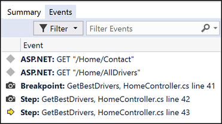
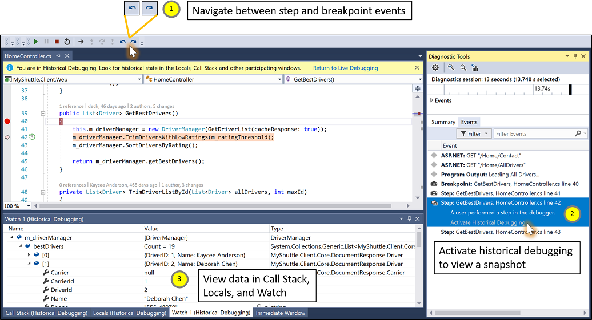

# View snapshots using IntelliTrace step-back
IntelliTrace step-back automatically takes a snapshot of your application on every breakpoint and debugger step event. This enables you to go back to previous breakpoints or steps and view the state of the application as it was in the past. This can save you time when you want to see previous application state without having to restart debugging or recreate the debugging state again.

IntelliTrace step-back is available starting in Visual Studio Enterprise 2017 version 15.5 and requires Windows 10 Anniversary Update or above. The feature is currently supported for debugging ASP.NET, WinForms, WPF, Managed Console apps, and Managed Class Libraries. Debugging ASP.NET Core or UWP applications is not currently supported. 
  
## Enable IntelliTrace events and snapshots mode 
To enable the feature, go to **Tools** > **Options** > **IntelliTrace** settings, and select the option "IntelliTrace events and snapshots." 

IntelliTrace takes a snapshot of the application's process on each debugger step and breakpoint event. These events are recorded in the **Events** tab in the **Diagnostic Tools** window, along with other IntelliTrace events. Choose **Debug / Windows / Show Diagnostic Tools** to open this window.

A camera icon will appear next to the events for which snapshots are available. 

 

> [!NOTE]
>  For performance reasons, snapshots are not taken when you step very quickly. If no camera icon appears next to the step, try stepping more slowly.

## Navigate and view snapshots

You can navigate between events using the **Step Backward** and **Step Forward** buttons in the Debug toolbar. These buttons navigate the events in the **Events** tab in the **Diagnostic Tools window**. 
Stepping backward or forward to an event will automatically activate historical debugging on the selected event.

<!-- -->

This will put Visual Studio in **historical debugging** mode, which sets the debugger's context to the time when the selected event was record. Visual Studio will also move the pointer to the corresponding line of code in the source window. 

From this view, you can inspect the values in the **Call Stack**, **Locals**, **Autos**, and **Watch** windows. You can also hover over variables to view **DataTips** and perform expression evaluation in the **Immediate** window. This data is backed by the snapshot of the application's process taken at that point in time.

So, for example, you've hit a breakpoint and taken a Step (F10), Step Backward will put Visual Studio in historical mode at the line of code corresponding to the breakpoint. 

To return to live execution, **Continue (F5)** or click the Return to Live Debugging link in the infobar. 

You can also view a snapshot from the Events tab. Select an event with a snapshot and click 'Activate Historical Debugging.' You can also click on the camera icon to activate historical debugging.

> [!NOTE]
>  Unlike using Set Next Statement and re-running your code, viewing a snapshot doesn’t re-run your code; it gives you a static view of the state of the application at a point in time that has occurred in the past.

## Frequently Asked Questions
#### How is this different from IntelliTrace Events only mode?
IntelliTrace in events only mode does allow you to activate historical debugging on debugger steps and breakpoints. However, IntelliTrace only captures data in the Locals and Autos if the windows are open, and only the data that is expanded and in view. This often means you will not have a complete view of the variables or any complex objects. Additionally, expression evaluation and viewing data in the Watch window is not supported. 

In events and snapshots mode, IntelliTrace captures the entire snapshot of the application's process, including complex objects. At a line of code, you’ll be able to see the same information as if you were stopped at a breakpoint. There is no need to have expanded out the information previously. Expression evaluation is also supported when viewing a snapshot.  

#### What is the performance impact of this feature? 
The impact on overall stepping performance will depend on your application. The overhead of taking a snapshot is around 30ms. When a snapshot is taken, it is forking the app’s process and suspending the forked copy. When you view a snapshot, Visual Studio is attaching to the forked copy of the process. For each snapshot, it copies only the page table and sets pages to copy-on-write. Between debugger steps on which snapshots are taken, if objects on the heap change, their respective pages are then copied, resulting in minimal memory cost. Visual Studio will not take snapshots if it detects there is not enough memory to do so. 

 
## Known Issues  
* When using IntelliTrace events and snapshots mode on versions of Windows older than Windows 10 Fall Creators Update (RS3), IntelliTrace will not take snapshots during debug sessions when the debug platform target of the application is set to x86.

 * Workaround:
   * Upgrade Windows to Windows 10 Fall Creators Update (RS3). 
   * Alternatively: 
     * Install the VC++ 2015.3 v140 toolset for desktop (x86, x64) component from the Visual Studio installer.
     * Build the target application.
     * From the command line, use the editbin tool to set the Largeaddressaware flag for the target executable. For example (your paths may vary): "C:\Program Files (x86)\Microsoft Visual Studio\Preview\Enterprise\VC\Tools\MSVC\14.12.25718\bin\Hostx86\x86\editbin.exe" /Largeaddressaware "C:\Path\To\Application\app.exe"
     * F5 to start debugging. Now, snapshots will be taken on debugger steps and breakpoints.
     *  Note, the flag will have to be set again anytime the executable is rebuilt with changes.

* When a snapshot of the application's process is taken on an application that uses a persisted memory-mapped file, the snapshotted process will still hold an exclusive lock on the memory-mapped file, even after the parent process has released its lock. Other processes will still be able to read, but not write to the memory-mapped file.  
 * Workaround:
   * Clear all snapshots by ending the debugging session. 

* When saving a file with Debug>IntelliTrace>Save IntelliTrace session under events and snapshots mode, the additional data captured from snapshots will not be available in the .itrace file. On breakpoint and step events, you will see the same information as if you had saved the file in IntelliTrace events only mode. 

## See Also  
 [IntelliTrace](../debugger/intellitrace.md)
 [Debugger Basics](../debugger/debugger-basics.md)