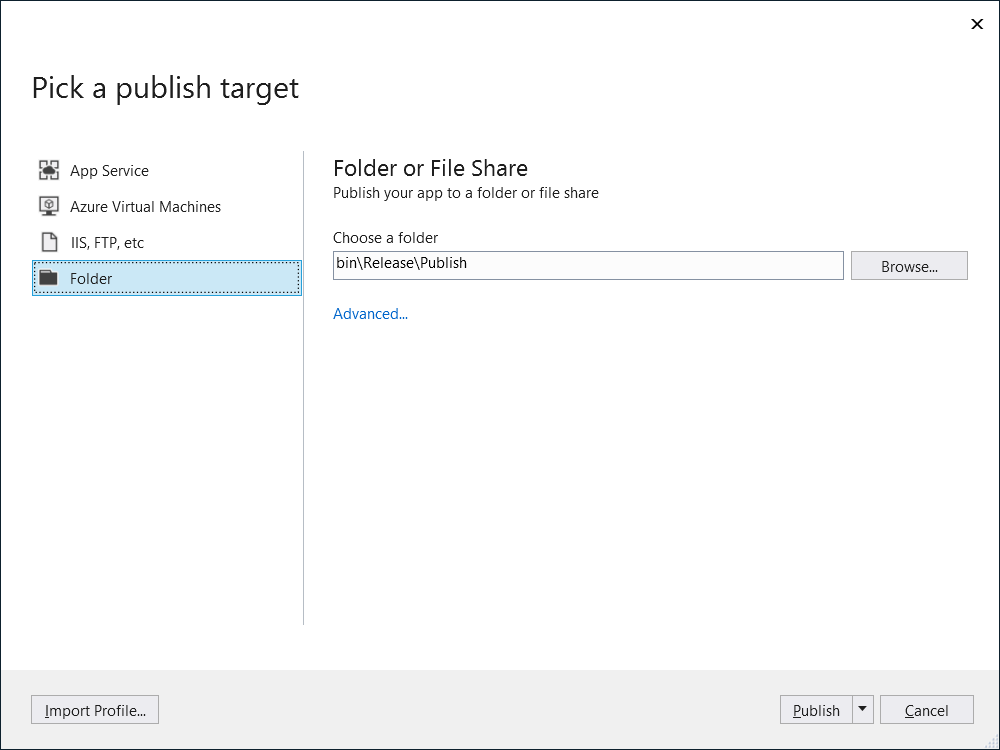

1. In the **Solution Explorer**,  right-click the project node and select **Publish**.
2. For **Select a publish target**, select **Custom** and name the profile **MyASPApp**. Click **Next**.
3. On the **Connection** tab, set the **Publish method** field to **File System** and  the **Target location** field to a local directory. Click **Next**.

    

4. Set the configuration to **Debug**. Click **Publish**.

    
    
    The application should be published to the local directory.

5. Copy the ASP.NET project directory from the Visual Studio computer to the local directory configured for the ASP.NET app (which we'll call **C:\Publish**) on the Windows Server computer. You can copy the project manually, use Xcopy, Robocopy, Powershell, or other options.

    > [!CAUTION]
    >  If you need to make changes to the code or rebuild, you must republish and repeat this step. The executable you copied to the remote machine must exactly match your local source and symbols.

6. On the Windows Server, verify that you can run the app correctly by opening the app in your browser.

    If the app doesn't run correctly, there may be an issue with your IIS configuration, your ASP.NET installation, or your Web site configuration. Recheck earlier steps.