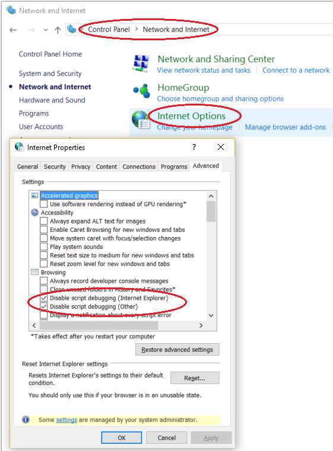

# How to: Respond to the Just-In-Time Debugger

The actions you should take when you see the Visual Studio Just-in-Time debugger dialog box depend on what you are trying to do:

#### If you want to fix or debug the error (Visual Studio users)

- You must have [Visual Studio installed](https://www.microsoft.com/en-us/download/details.aspx?id=48146) to view the detailed information about the error and to try to debug it. See [Debug using the Just-In-Time Debugger](../debugger/debug-using-the-just-in-time-debugger.md) for more information. If you cannot resolve the error and fix the app, contact the owner of the app to resolve the error.

#### If you want to prevent the Just-In-Time Debugger dialog box from appearing

You can take steps to prevent the Just-in-Time Debugger dialog box from appearing. If the app handles the error, you can run the app normally.

1. (Web apps) If you are trying to run a web app, you can disable script debugging.

    For Internet Explorer or Edge, disable script debugging in the Internet Options dialog box. You can access this from the **Control Panel** / **Network and Internet** / **Internet Options** (the exact steps depend on your version of Windows and your browser).

    

    Then re-open the web page where you found the error. If this does not resolve the issue, contact the owner of the web app to fix the issue.

3. (Visual Studio users) If you have Visual Studio installed (or you had it installed previously and removed it), [disable Just-in-Time debugging](../debugger/debug-using-the-just-in-time-debugger.md) and try to run the app again.

    > [!IMPORTANT]
    > If you disable Just-in-Time debugging and the app encounters an unhandled exception (an error), you will either see a standard error dialog box instead, or the app will crash or hang. The app will not run normally until the error is fixed (by you or the owner of the app).

2. (ASP.NET and IIS) If you are hosting an ASP.NET Web app in IIS, disable server-side debugging.

    In IIS Manager, right-click the server node and choose **Switch to Features View**. Under the ASP.NET section, choose **.NET Compilation** and then make sure you choose **False** as the Debug behavior (the steps are different in older versions of IIS).
  
## See Also    
 [Debugger Basics](../debugger/debugger-basics.md)   
