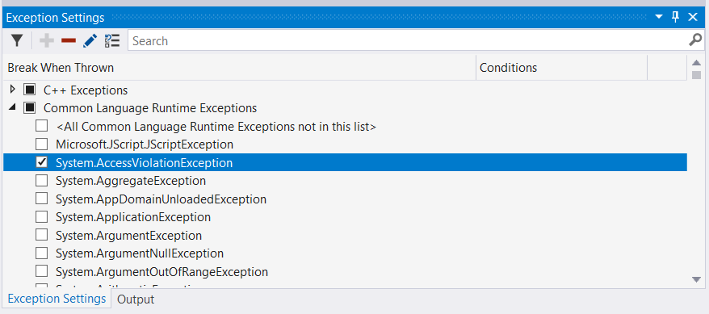
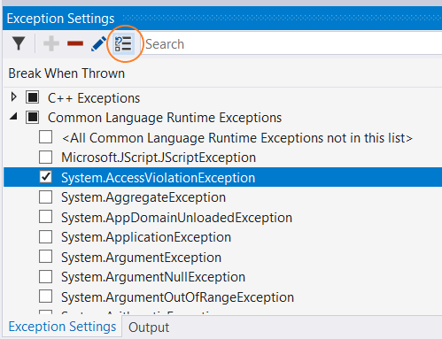
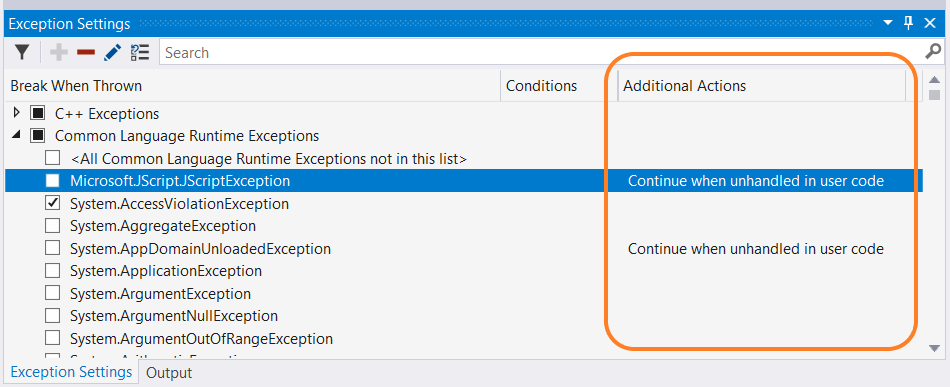
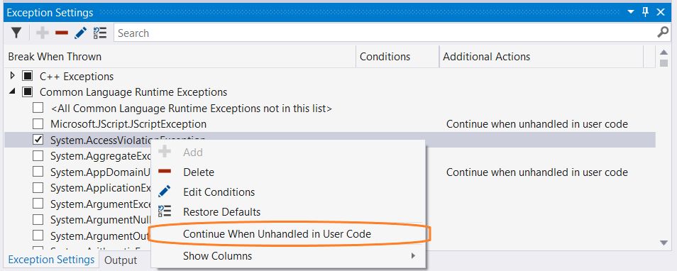
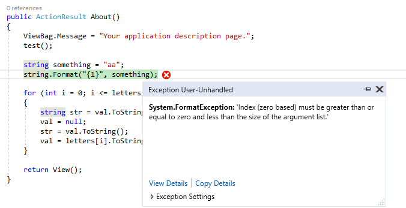
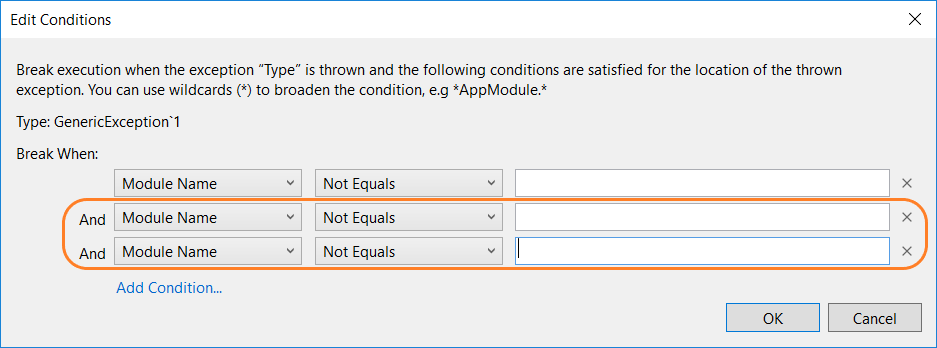

# Manage exceptions with the debugger in Visual Studio

An exception is an indication of an error state that occurs while a program is being executed. You can tell the debugger which exceptions or sets of exceptions to break on, and at which point you want the debugger to break. When the debugger breaks, it shows you where the exception was thrown. You can also add or delete exceptions. With a solution open in Visual Studio, use **Debug > Windows > Exception Settings** to open the **Exception Settings** window.

Provide handlers that respond to the most important exceptions. Also learn how to configure the debugger to always break execution for some exceptions.

When an exception occurs, the debugger writes an exception message to the **Output** window. It may break execution in the following cases when:

- An exception is thrown that isn't handled.
- The debugger is configured to break execution before any handler is invoked.
- You have set [Just My Code](../debugger/just-my-code.md), and the debugger is configured to break on any exception that isn't handled in user code.

> [!NOTE]
> ASP.NET has a top-level exception handler that shows error pages in a browser. It doesn't break execution unless **Just My Code** is turned on. For an example, see [Tell the debugger to continue on user-unhandled exceptions](#BKMK_UserUnhandled) below.

<!-- Two consecutive notes are intentional here...-->

> [!NOTE]
> In a Visual Basic application, the debugger manages all errors as exceptions, even if you use On Error-style error handlers.

## Tell the debugger to break when an exception is thrown

The debugger can break execution at the point where an exception is thrown, so you may examine the exception before a handler is invoked.

In the **Exception Settings** window (**Debug > Windows > Exception Settings**), expand the node for a category of exceptions, such as **Common Language Runtime Exceptions**. Then select the check box for a specific exception within that category, such as **System.AccessViolationException**. You can also select an entire category of exceptions.



> [!TIP]
> You can find specific exceptions by using the **Search** window in the **Exception Settings** toolbar, or use search to filter for specific namespaces (such as **System.IO**).

If you select an exception in the **Exception Settings** window, debugger execution will break wherever the exception is thrown, no matter whether it's handled. Now the exception is called a first chance exception. For example, here are a couple of scenarios:

- In the following C# console application, the Main method throws an **AccessViolationException** inside a `try/catch` block.

  ```csharp
  static void Main(string[] args)
  {
      try
      {
          throw new AccessViolationException();
          Console.WriteLine("here");
      }
      catch (Exception e)
      {
          Console.WriteLine("caught exception");
      }
      Console.WriteLine("goodbye");
  }
  ```

  If you have **AccessViolationException** checked in **Exception Settings**, execution will break on the `throw` line when you run this code in the debugger. You can then continue execution. The console should display both lines:

  ```cmd
  caught exception
  goodbye
  ```

  but it doesn't display the `here` line.

- A C# console application references a class library with a class that has two methods. One method throws an exception and handles it, while a second method throws the same exception but doesn't handle it.

  ```csharp
  public class Class1
  {
      public void ThrowHandledException()
      {
          try
          {
              throw new AccessViolationException();
          }
          catch (AccessViolationException ave)
          {
              Console.WriteLine("caught exception" + ave.Message);
          }
      }

      public void ThrowUnhandledException()
      {
          throw new AccessViolationException();
      }
  }
  ```

  Here's the Main() method of the console application:

  ```csharp
  static void Main(string[] args)
  {
      Class1 class1 = new Class1();
      class1.ThrowHandledException();
      class1.ThrowUnhandledException();
  }
  ```

  If you have **AccessViolationException** checked in **Exception Settings**, execution will break on the `throw` line in both **ThrowHandledException()** and **ThrowUnhandledException()** when you run this code in the debugger.

To restore the exception settings to the defaults, choose the **Restore the list to the default settings** button:



## <a name="BKMK_UserUnhandled"></a>Tell the debugger to continue on user-unhandled exceptions

If you are debugging .NET or JavaScript code with [Just My Code](../debugger/just-my-code.md), you can tell the debugger to prevent breaking on exceptions that aren't handled in user code but are handled elsewhere.

1. In the **Exception Settings** window, open the shortcut menu by right-clicking a column label, and then select **Show Columns > Additional Actions**. (If you've turned off **Just My Code**, you won't see this command.) A third column named **Additional Actions** appears.

   

   For an exception that shows **Continue when unhandled in user code** in this column, the debugger continues if that exception isn't handled in user code but is handled externally.

2. To change this setting for a particular exception, select the exception, right-click to show the shortcut menu, and select **Continue When Unhandled in User Code**. You may also change the setting for an entire category of exceptions, such as the entire Common Language Runtime exceptions).

   

For example, ASP.NET web applications handle exceptions by converting them to an HTTP 500 status code ([Exception handling in ASP.NET Web API](http://www.asp.net/web-api/overview/error-handling/exception-handling)), which may not help you determine the source of the exception. In the example below, the user code makes a call to `String.Format()` that throws a <xref:System.FormatException>. Execution breaks as follows:



## Add and delete exceptions

You can add and delete exceptions. To delete an exception type from a category, select the exception, and choose the **Delete the selected exception from the list** button (the minus sign) on the **Exception Settings** toolbar. Or you may right-click the exception and select **Delete** from the shortcut menu. Deleting an exception has the same effect as having the exception unchecked, which is that the debugger won't break when it's thrown.

To add an exception:

1. In the **Exception Settings** window, select one of the exception categories (for example, **Common Language Runtime**).

2. Choose the **Add an exception to the selected category** button (the plus sign).

   

3. Type the name of the exception (for example, **System.UriTemplateMatchException**).

   

   The exception is added to the list (in alphabetical order) and automatically checked.

To add an exception to the GPU Memory Access Exceptions, JavaScript Runtime Exceptions, or Win32 Exceptions categories, include the error code and the description.

> [!TIP]
> Check your spelling! The **Exception Settings** window doesn't check for the existence of an added exception. So if you type **Sytem.UriTemplateMatchException**, you'll get an entry for that exception (and not for **System.UriTemplateMatchException**).

Exception settings are persisted in the solution's .suo file, so they apply to a particular solution. You can't reuse specific exception settings across solutions. Now only added exceptions are persisted; deleted exceptions aren't. You may add an exception, close and reopen the solution, and the exception will still be there. But if you delete an exception and close/reopen the solution, the exception will reappear.

The **Exception Settings** window supports generic exception types in C# but not in Visual Basic. To break on exceptions like `MyNamespace.GenericException<T>`, you must add the exception as **MyNamespace.GenericException`1**. That is, if you've created an exception like this code:

```csharp
public class GenericException<T> : Exception
{
    public GenericException() : base("This is a generic exception.")
    {
    }
}
```

You can add the exception to **Exception Settings** using the previous procedure:


## Add conditions to an exception

Use the **Exception Settings** window to set conditions on exceptions. Currently supported conditions include the module name(s) to include or exclude for the exception. By setting module names as conditions, you can choose to break for the exception only on certain code modules. You may also choose to avoid breaking on particular modules.

> [!NOTE]
> Adding conditions to an exception is new in [!include[vs_dev15](../misc/includes/vs_dev15_md.md)].

To add conditional exceptions:

1. Choose the **Edit conditions** button in the Exception Settings window, or right-click the exception and choose **Edit Conditions**.

   

2. To add extra required conditions to the exception, select **Add Condition** for each new condition. Additional condition lines appear.

   

3. For each condition line, type the name of the module, and change the comparison operator list to **Equals** or **Not Equals**. You may specify wildcards (**\\***) in the name to specify more than one module.

4. If you need to delete a condition, choose the **X** at the end of the condition line.

## See also

[Continue execution after an exception](../debugger/continuing-execution-after-an-exception.md)<br/>
[How to: Examine system code after an exception](../debugger/how-to-examine-system-code-after-an-exception.md)<br/>
[How to: Use native run-time checks](../debugger/how-to-use-native-run-time-checks.md)<br/>
[Use run-time checks without the C run-time library](../debugger/using-run-time-checks-without-the-c-run-time-library.md)<br/>
[Tutorial: Learn to debug using Visual Studio](../debugger/getting-started-with-the-debugger.md)
