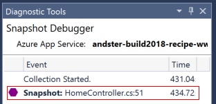
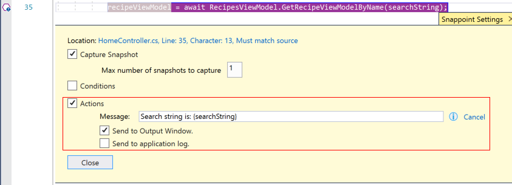

# Welcome to the Snapshot Debugger

The Visual Studio Snapshot Debugger is now connected to your service and you can start collecting snapshots to help with debugging.

To use the Snapshot Debugger, set some snappoints in your code (similar to breakpoints), click the button to begin collecting snapshots, and then run your scenario. When code runs where you've set a snappoint, a snapshot of your application is taken. Then open the snapshot by clicking on it in Visual Studio in the Diagnostic Tools window. You can now debug the snapshot from your service just like it was local. Detailed instruction follow.

## Collect and view snapshots

The Snapshot Debugger collects snapshots from your application. Snapshots are like pictures of your appication at a point in time. You tell Visual Studio where and when to collect a snapshot by setting a snappoint in code along with any conditions you need to make sure you get a snapshot of the problem you're investigating.

### Set a Snappoint

1. In the code editor, click the left gutter next to a line of code that you are interested in to set a snappoint. Make sure it is code that you know will execute. 

    

2. Click **Start Collection** to turn on the snappoint.

### Open a Snapshot

1. When the snappoint is hit, a snapshot appears in the Diagnostic Tools window on the right. If the window doesn't open, you can open it by choosing **Debug** > **Windows** > **Show Diagnostic Tools**. 

    

2. Double-click the snapshot to open the snapshot.

### Inspect Snapshot data

From this view, you can hover over variables to view DataTips, use the Locals, Watches, and Call Stack windows, and also evaluate expressions.

The website itself is still live and end users aren't impacted. Only one snapshot is captured per snappoint by default. That is, after a snapshot is captured, the snappoint turns off. If you want to capture another snapshot at the snappoint, you can turn the snappoint back on by clicking **Update Collection**.

### Set a Logpoint

1. Right-click a snappoint icon (the purple hexagon) and choose **Settings**.

2. In the Snappoint Settings window, select **Actions**.

    

3. In the **Message** field, enter a log message that you want to log. You can also evaluate variables in your log message by placing them inside curly braces.

    

    If you choose **Send to Output Window**, when the logpoint is hit, the message appears in the Diagnostic Tools window. 

    If you choose **Send to application log**, when the logpoint is hit, the message appears anywhere that you can see messages from System.Diagnostics.Trace (or ILogger in .NET Core), such as App Insights.

## Learn More

You can find more information about the Snapshot Debugger on our [docs page](../../debugger/debug-live-azure-applications).

## Dont' Show Me This Again

To never show this page again when you connect the Snapshot Debugger change the option in **Tools** > **Options** > **Snapshot Debugger**. 

