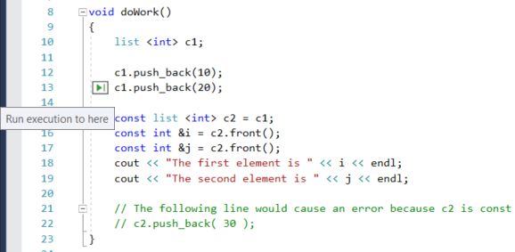
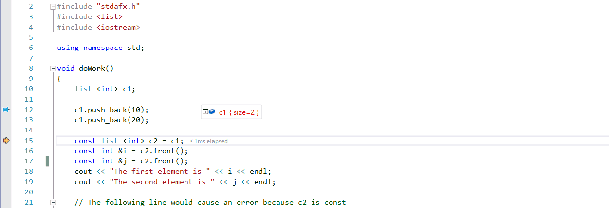

# Debug with C++ using the Visual Studio debugger

The Visual Studio debugger provides many powerful features to help you debug your apps. This topic provides a quick way to learn some of the basic features.

## Create a new project 

1. In Visual Studio, choose **File > New Project**.

2. Under **Visual C++**, choose **Windows Desktop**, and then in the middle pane choose **Windows Console Application**.

    If you don't see the **Windows Console Application** project template, click the **Open Visual Studio Installer** link in the left pane of the **New Project** dialog box. The Visual Studio Installer launches. Choose the **Desktop development with C++** workload, then choose **Modify**.

3. Type a name like **MyDbgApp** and click **OK**.

    Visual Studio creates the project.

4. In MyDbgApp.cpp, replace the following code

    ```c++
    int main()
    {
        return 0;
    }
    ```

    with this code (do not remove `#include "stdafx.h"`):

    ```c++
    #include <list>  
    #include <iostream>

    using namespace std;

    void doWork()
    {
        list <int> c1;

        c1.push_back(10);
        c1.push_back(20);

        const list <int> c2 = c1;
        const int &i = c2.front();
        const int &j = c2.front();
        cout << "The first element is " << i << endl;
        cout << "The second element is " << j << endl;

    }

    int main()
    {
        doWork();
    }
    ```

## Set a breakpoint

A *breakpoint* is a marker that indicates where Visual Studio should suspend your running code so you can take a look at the values of variables, or the behavior of memory, or whether or not a branch of code is getting run. It is the most basic feature in debugging.

1. To set the breakpoint, click in the gutter to the left of the `doWork` function call (or select the line of code and press **F9**).

    

2. Now press **F5** (or choose **Debug > Start Debugging**).

    

    The debugger pauses where you set the breakpoint. The statement where the debugger and app execution is paused is indicated by the yellow arrow. The line with the `doWork` function call has not yet executed.

    > [!TIP]
    > If you have a breakpoint in a loop or recursion, or if you have many breakpoints that you frequently step through, use a [conditional breakpoint](../debugger/using-breakpoints.md#BKMK_Specify_a_breakpoint_condition_using_a_code_expression) to make sure that your code is suspended ONLY when specific conditions are met. A conditional breakpoint saves time and can also make it easier to debug issues that are hard to reproduce.

    When trying to debug memory-related failures in C++, you can also use breakpoints to inspect address values (look for NULL) and reference counts. 

## Navigate code

There are different commands to instruct the debugger to continue. We show a useful code navigation command that is new in Visual Studio 2017.

While paused at the breakpoint, hover over the statement `c1.push_back(20)` until the green **Run to click** button  appears, and then press the **Run to click** button.



The app continues execution, calling `doWork`, and pauses on the line of code where you clicked the button.

Common keyboard commands used to step through code include **F10** and **F11**. For more in-depth instructions, see the [Beginner's Guide](../debugger/getting-started-with-the-debugger.md).

## Inspect variables in a datatip

1. In the current line of code (marked by the yellow execution pointer), hover over the `c1` object with your mouse to show a datatip.

    

    The datatip shows you the current value of the `c1` variable and allows you to inspect its properties. When debugging, if you see a value you don't expect, you probably have a bug in the preceding or calling lines of code. 

2. Expand the datatip to look at the current property values of the `c1` object.

3. If you want to pin the datatip so that you can continue to see the value of `c1` while you execute code, click the small pin icon. (You can move the pinned datatip to a convenient location.)

## Edit code and continue debugging

If you identify a change that you want to test in your code while in the middle of a debugging session, you can do that, too.

1. Click the second instance of `c2.front()` and change `c2.front()` to `c2.back()`.

2. Press **F10** (or **Debug > Step Over**) a few times to advance the debugger and execute the edited code.

    

    **F10** advances the debugger one statement at a time, but steps over functions instead of stepping into them (the code that you skip still executes).

For more information on using edit-and-continue and on feature limitations, see [Edit and Continue](../debugger/edit-and-continue.md).

## Next steps

In this tutorial, you've learned how to start the debugger, step through code, and inspect variables. You may want to get a high-level look at debugger features along with links to more information.

> [!div class="nextstepaction"]
> [Debugger feature tour](../debugger/debugger-feature-tour.md)
