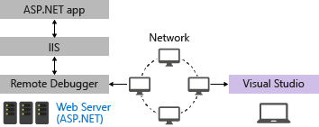
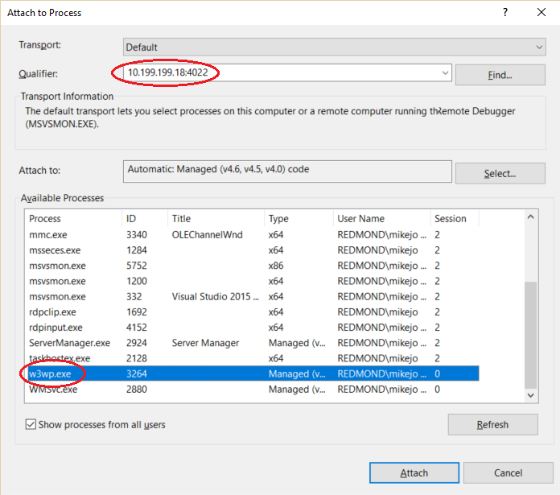

# Remote Debug ASP.NET on a Remote IIS Computer
To debug an ASP.NET application that has been deployed to IIS, install and run the remote tools on the computer where you deployed your app, and then attach to your running app from Visual Studio.



This guide explains how to set up and configure a Visual Studio 2017 ASP.NET MVC 4.5.2 application, deploy it to IIS, and attach the remote debugger from Visual Studio.

> [!NOTE]
> To remote debug ASP.NET Core instead, see [Remote Debug ASP.NET Core on an IIS Computer](../debugger/remote-debugging-aspnet-on-a-remote-iis-computer.md). For Azure App Service, you can easily deploy and debug on a preconfigured instance of IIS using either the [Snapshot Debugger](../debugger/debug-live-azure-applications.md) (.NET 4.6.1 required) or by [attaching the debugger from Server Explorer](../debugger/remote-debugging-azure.md).

These procedures have been tested on these server configurations:
* Windows Server 2012 R2 and IIS 8 (For Windows Server 2008 R2, the server steps are different)

## Requirements

The remote debugger is supported on Windows Server starting with Windows Server 2008 Service Pack 2. For a complete list of requirements, see [Requirements](../debugger/remote-debugging.md#requirements_msvsmon).

> [!NOTE]
> Debugging between two computers connected through a proxy is not supported. Debugging over a high latency or low-bandwidth connection, such as dialup Internet, or over the Internet across countries is not recommended and may fail or be unacceptably slow.

## App already running in IIS?

This article includes steps on setting up a basic configuration of IIS on Windows server and deploying the app from Visual Studio. These steps are included to make sure that the server has required components installed, that the app can run correctly, and that you are ready to remote debug.

* If your app is running in IIS and you just want to download the remote debugger and start debugging, go to [Download and Install the remote tools on Windows Server](#BKMK_msvsmon).

* If you want help to make sure that your app is set up, deployed, and running correctly in IIS so that you can debug, follow all the steps in this topic.

## Create the ASP.NET 4.5.2 application on the Visual Studio computer
  
1. Create a new MVC ASP.NET application. (**File > New > Project**, then select <strong>Visual C# > Web > ASP.NET Web Application. In the **ASP.NET 4.5.2</strong> templates section, select **MVC**. Make sure that **Enable Docker Support** is not selected and that **Authentication** is set to **No Authentication**. Name the project **MyASPApp**.)

2. Open the  HomeController.cs file, and set a breakpoint in the `About()` method.

## <a name="bkmk_configureIIS"></a> Install and Configure IIS on Windows Server

[!INCLUDE [remote-debugger-install-iis-role](../debugger/includes/remote-debugger-install-iis-role.md)]

## Update browser security settings on Windows Server

If Enhanced Security Configuration is enabled in Internet Explorer (it is enabled by default), then you may need to add some domains as trusted sites to enable you to download some of the web server components. Add the trusted sites by going to **Internet Options > Security > Trusted Sites > Sites**. Add the following domains.

- microsoft.com
- go.microsoft.com
- download.microsoft.com
- iis.net

When you download the software, you may get requests to grant permission to load various web site scripts and resources. Some of these resources are not required, but to simplify the process, click **Add** when prompted.

## <a name="BKMK_deploy_asp_net"></a> Install ASP.NET 4.5 on Windows Server

If you want more detailed information to install ASP.NET on IIS, see [IIS 8.0 Using ASP.NET 3.5 and ASP.NET 4.5](/iis/get-started/whats-new-in-iis-8/iis-80-using-aspnet-35-and-aspnet-45).

1. In the left pane of Server Manager, select **IIS**. Right-click the server and select **Internet Information Services (IIS) Manager**.

1. Use the Web Platform Installer (WebPI) to install ASP.NET 4.5 (from the Server node in Windows Server 2012 R2, choose **Get New Web Platform Components** and then search for ASP.NET)

    

    > [!NOTE]
    > If you are using Windows Server 2008 R2, install ASP.NET 4 instead using this command:

     **C:\Windows\Microsoft.NET\Framework64\v4.0.30319\aspnet_regiis.exe -ir**

2. Restart the system (or execute **net stop was /y** followed by **net start w3svc** from a command prompt to pick up a change to the system PATH).

## Choose a deployment option

If you need help to deploy the app to IIS, consider these options:

* Deploy by creating a publish settings file in IIS and importing the settings in Visual Studio. In some scenarios, this is a fast way to deploy your app. When you create the publish settings file, permissions are automatically set up in IIS.

* Deploy by publishing to a local folder and copying the output by a preferred method to a prepared app folder on IIS.

## (Optional) Deploy using a publish settings file

You can use this option create a publish settings file and import it into Visual Studio.

> [!NOTE]
> This deployment method uses Web Deploy. If you want to configure Web Deploy manually in Visual Studio instead of importing the settings, you can install Web Deploy 3.6 instead of Web Deploy 3.6 for Hosting Servers. However, if you configure Web Deploy manually, you will need to make sure that an app folder on the server is configured with the correct values and permissions (see [Configure ASP.NET Web site](#BKMK_deploy_asp_net)).

### Install and configure Web Deploy for Hosting Servers on Windows Server

[!INCLUDE [install-web-deploy-with-hosting-server](../deployment/includes/install-web-deploy-with-hosting-server.md)]

### Create the publish settings file in IIS on Windows Server

[!INCLUDE [install-web-deploy-with-hosting-server](../deployment/includes/create-publish-settings-iis.md)]

### Import the publish settings in Visual Studio and deploy

[!INCLUDE [install-web-deploy-with-hosting-server](../deployment/includes/import-publish-settings-vs.md)]

After the app deploys successfully, it should start automatically. If the app does not start from Visual Studio, start the app in IIS.

1. In the **Settings** dialog box, enable debugging by clicking **Next**, choose a **Debug** configuration, and then choose **Remove additional files at destination** under the **File Publish** options.

    > [!NOTE]
    > If you choose a Release configuration, you disable debugging in the *web.config* file when you publish.

1. Click **Save** and then republish the app.

## (Optional) Deploy by publishing to a local folder

You can use this option to deploy your app if you want to copy the app to IIS using Powershell, RoboCopy, or you want to manually copy the files.

### <a name="BKMK_deploy_asp_net"></a> Configure the ASP.NET Web site on the Windows Server computer

1. Open Windows Explorer and create a new folder, **C:\Publish**, where you will later deploy the ASP.NET project.

2. If it's not already open, open the **Internet Information Services (IIS) Manager**. (In the left pane of Server Manager, select **IIS**. Right-click the server and select **Internet Information Services (IIS) Manager**.)

3. Under **Connections** in the left pane, go to **Sites**.

4. Select the **Default Web Site**, choose **Basic Settings**, and set the **Physical path** to **C:\Publish**.

5. Right-click the **Default Web Site** node and select **Add Application**.

6. Set the **Alias** field to **MyASPApp**, accept the default Application Pool (**DefaultAppPool**), and set the **Physical path** to **C:\Publish**.

7. Under **Connections**, select **Application Pools**. Open **DefaultAppPool** and set the Application pool field to **ASP.NET v4.0** (ASP.NET 4.5 is not an option for the Application pool).

8. With the site selected in the IIS Manager, choose **Edit Permissions**, and make sure that IUSR, IIS_IUSRS, or the user configured for the Application Pool is an authorized user with Read & Execute rights. If none of these users are present, add IUSR as a user with Read & Execute rights.

### Publish and Deploy the app by publishing to a local folder from Visual Studio

You can also publish and deploy the app using the file system or other tools.

1. (ASP.NET 4.5.2) Make sure that the web.config file lists the correct version of the .NET Framework.  For example, if you are targeting ASP.NET 4.5.2, make sure this version is listed in web.config.
  
    ```xml
    <system.web>
      <compilation debug="true" targetFramework="4.5.2" />
      <httpRuntime targetFramework="4.5.2" />
      <httpModules>
        <add name="ApplicationInsightsWebTracking" type="Microsoft.ApplicationInsights.Web.ApplicationInsightsHttpModule, Microsoft.AI.Web" />
      </httpModules>
    </system.web>
  
    ```

    For example, the version should be 4.0 if you install ASP.NET 4 instead of 4.5.2.

[!INCLUDE [remote-debugger-deploy-app-local](../debugger/includes/remote-debugger-deploy-app-local.md)]

## <a name="BKMK_msvsmon"></a> Download and Install the remote tools on Windows Server

In this tutorial, we are using Visual Studio 2017.

[!INCLUDE [remote-debugger-download](../debugger/includes/remote-debugger-download.md)]
  
## <a name="BKMK_setup"></a> Set up the remote debugger on Windows Server

[!INCLUDE [remote-debugger-configuration](../debugger/includes/remote-debugger-configuration.md)]

> [!NOTE]
> If you need to add permissions for additional users, change the authentication mode, or port number for the remote debugger, see [Configure the remote debugger](../debugger/remote-debugging.md#configure_msvsmon).

For information on running the remote debugger as a service, see [Run the remote debugger as a service](../debugger/remote-debugging.md#bkmk_configureService).

## <a name="BKMK_attach"></a> Attach to the ASP.NET application from the Visual Studio computer

1. On the Visual Studio computer, open the solution that you are trying to debug (**MyASPApp** if you are following the steps in this article).
2. In Visual Studio, click **Debug > Attach to Process** (Ctrl + Alt + P).

    > [!TIP]
    > In Visual Studio 2017, you can reattach to the same process you previously attached to by using **Debug > Reattach to Process...** (Shift+Alt+P). 

3. Set the Qualifier field to **\<remote computer name>:4022**.
4. Click **Refresh**.
    You should see some processes appear in the **Available Processes** window.

    If you don't see any processes, try using the IP address instead of the remote computer name (the port is required). You can use `ipconfig` in a command line to get the IPv4 address.

5. Check  **Show processes from all users**.
6. Type the first letter of a process name to quickly find **w3wp.exe** for ASP.NET 4.5.

    

7. Click **Attach**

8. Open the remote computer's website. In a browser, go to **http://\<remote computer name>**.
    
    You should see the ASP.NET web page.
9. In the running ASP.NET application, click the link to the **About** page.

    The breakpoint should be hit in Visual Studio.

## <a name="bkmk_openports"></a> Troubleshooting: Open required ports on Windows Server

In most setups, required ports are opened by the installation of ASP.NET and the remote debugger. However, you may need to verify that ports are open.

> [!NOTE]
> On an Azure VM, you must open ports through the [Network security group](/azure/virtual-machines/virtual-machines-windows-hero-role#open-port-80-for-web-traffic). 

Required ports:

- 80 - Required for IIS
- 8172 - (Optional) Required for Web Deploy to deploy the app from Visual Studio
- 4022 - Required for remote debugging from Visual Studio 2017 (see [Remote Debugger Port Assignments](../debugger/remote-debugger-port-assignments.md) for detailed information.
- UDP 3702 - (Optional) Discovery port enables you to the **Find** button when attaching to the remote debugger in Visual Studio.

1. To open a port on Windows Server, open the **Start** menu, search for **Windows Firewall with Advanced Security**.

2. Then choose **Inbound Rules > New Rule > Port**. Choose **Next** and under **Specific local ports**, enter the port number, click **Next**, then **Allow the Connection**, click Next, and add the name (**IIS**, **Web Deploy**, or **msvsmon**) for the Inbound Rule.

    If you want more details on configuring Windows Firewall, see [Configure the Windows Firewall for Remote Debugging](../debugger/configure-the-windows-firewall-for-remote-debugging.md).

3. Create additional rules for the other required ports.