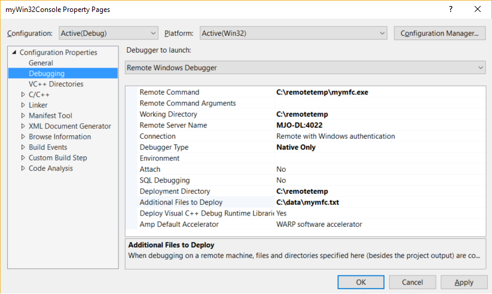
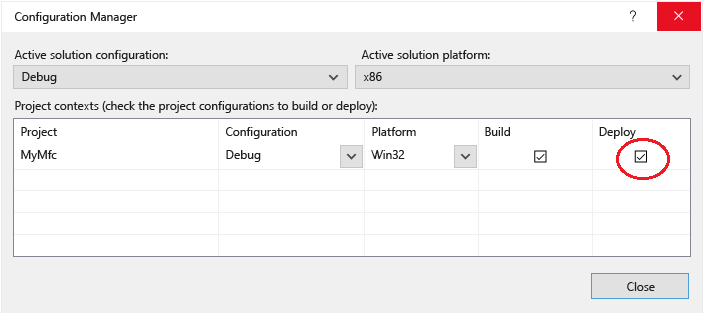

# Remote Debugging a Visual C++ Project in Visual Studio
You can debug a Visual Studio application that has been deployed on a different computer. To do so, you use the Visual Studio remote debugger.  
  
For information about remote debugging apps with Azure backends, see [Remote debugging on Azure](https://docs.microsoft.com/en-us/azure/vs-azure-tools-debug-cloud-services-virtual-machines). For information about remote debugging Universal Windows Apps (UWP), see [Debug an Installed App Package](debug-installed-app-package.md).
  
## Download and Install the Remote Tools

[!INCLUDE [remote-debugger-download](../debugger/includes/remote-debugger-download.md)]
  
> [!TIP]
> In some scenarios, it can be most efficient to run the remote debugger from a file share. For more information, see [Run the remote debugger from a file share](../debugger/remote-debugging.md#fileshare_msvsmon).
  
## Requirements

The remote debugger is supported on Windows 7 and newer (not phone) and versions of Windows Server starting with Windows Server 2008 Service Pack 2. Remote debugging over an Internet connection is not supported. For a complete list of requirements, see [Requirements](../debugger/remote-debugging.md#requirements_msvsmon).
  
##  Set up the remote debugger

[!INCLUDE [remote-debugger-configuration](../debugger/includes/remote-debugger-configuration.md)]

> [!NOTE]
> If you need to add permissions for additional users, change the authentication mode, or port number for the remote debugger, see [Configure the remote debugger](../debugger/remote-debugging.md#configure_msvsmon).

##  Remote debug a Visual C++ project  
 In the following procedure, the name and path of the project is C:\remotetemp\MyMfc, and the name of the remote computer is **MJO-DL**.  
  
1.  Create an MFC application named **mymfc.**  
  
2.  Set a breakpoint somewhere in the application that is easily reached, for example in **MainFrm.cpp**, at the start of `CMainFrame::OnCreate`.  
  
3.  In Solution Explorer, right-click on the project and select **Properties**. Open the **Debugging** tab.  
  
4.  Set the **Debugger to launch** to **Remote Windows Debugger**.  
  
       
  
5.  Make the following changes to the properties:  
  
    |Setting|Value|
    |-|-|  
    |Remote Command|C:\remotetemp\mymfc.exe|  
    |Working Directory|C:\remotetemp|  
    |Remote Server Name|MJO-DL:*portnumber*|  
    |Connection|Remote with Windows Authentication|  
    |Debugger Type|Native Only|  
    |Deployment Directory|C:\remotetemp.|  
    |Additional Files to Deploy|C:\data\mymfcdata.txt.|  
  
     If you deploy additional files (optional), the folder must exist on both machines.  
  
6.  In Solution Explorer, right-click the solution and choose **Configuration Manager**.  
  
7.  For the **Debug** configuration, select the **Deploy** check box.  
  
       
  
8.  Start debugging (**Debug / Start Debugging**, or **F5**).  
  
9. The executable is automatically deployed to the remote computer.  
  
10. If prompted, enter network credentials to connect to the remote machine.  
  
     The required credentials are specific to your network's security configuration. For example, on a domain computer, you might choose a security certificate or enter your domain name and password. On a non-domain machine, you might enter the machine name and a valid user account name, like **MJO-DL\name@something.com**, along with the correct password.  
  
11. On the Visual Studio computer, you should see that execution is stopped at the breakpoint.  
  
    > [!TIP]
    >  Alternatively, you can deploy the files as a separate step. In the **Solution Explorer,** right-click the **mymfc** node and then choose **Deploy**.  
  
 If you have non-code files that need to be used by the application, you need to include them in the Visual Studio project. Create a project folder for the additional files (in the **Solution Explorer**, click **Add / New Folder**.) Then add the files to the folder (in the **Solution Explorer**, click **Add / Existing Item**, then select the files.). On the **Properties** page for each file, set **Copy to Output Directory** to **Copy always**.
  
## Set Up Debugging with Remote Symbols 

[!INCLUDE [remote-debugger-symbols](../debugger/includes/remote-debugger-symbols.md)] 
  
## See Also  
 [Debugging in Visual Studio](../debugger/index.md)
 [Debugger Feature Tour](../debugger/debugger-feature-tour.md)   
 [Configure the Windows Firewall for Remote Debugging](../debugger/configure-the-windows-firewall-for-remote-debugging.md)   
 [Remote Debugger Port Assignments](../debugger/remote-debugger-port-assignments.md)   
 [Remote Debugging ASP.NET on a Remote IIS Computer](../debugger/remote-debugging-aspnet-on-a-remote-iis-computer.md)  
 [Remote Debugging Errors and Troubleshooting](../debugger/remote-debugging-errors-and-troubleshooting.md)