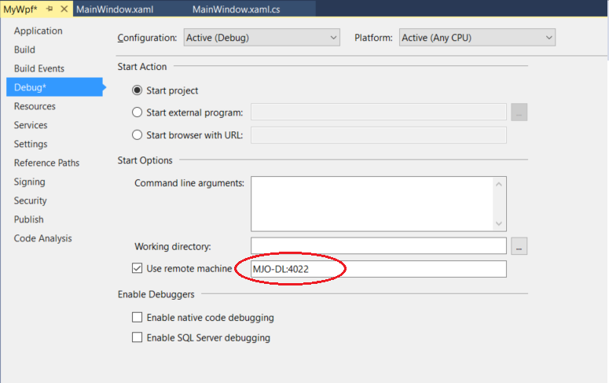

# Remote Debugging a C# or Visual Basic project in Visual Studio
To debug a Visual Studio application that has been deployed on a different computer, install and run the remote tools on the computer where you deployed your app, configure your project to connect to the remote computer from Visual Studio, and then run your app.

  
For information about remote debugging Universal Windows Apps (UWP), see [Debug an Installed App Package](debug-installed-app-package.md).

## Requirements

The remote debugger is supported on Windows 7 and newer (not phone) and versions of Windows Server starting with Windows Server 2008 Service Pack 2. For a complete list of requirements, see [Requirements](../debugger/remote-debugging.md#requirements_msvsmon).

> [!NOTE]
> Debugging between two computers connected through a proxy is not supported. Debugging over a high latency or low bandwidth connection, such as dialup Internet, or over the Internet across countries is not recommended and may fail or be unacceptably slow.
  
## Download and Install the Remote Tools

[!INCLUDE [remote-debugger-download](../debugger/includes/remote-debugger-download.md)]

> [!TIP]
> In some scenarios, it can be most efficient to run the remote debugger from a file share. For more information, see [Run the remote debugger from a file share](../debugger/remote-debugging.md#fileshare_msvsmon).
  
##  Set up the remote debugger

[!INCLUDE [remote-debugger-configuration](../debugger/includes/remote-debugger-configuration.md)]

> [!NOTE]
> If you need to add permissions for additional users, change the authentication mode, or port number for the remote debugger, see [Configure the remote debugger](../debugger/remote-debugging.md#configure_msvsmon).
  
##  Remote debug the project
The debugger cannot deploy Visual C# or Visual Basic desktop applications to a remote machine, but you can still debug them remotely as follows. The following procedure assumes that you want to debug it on a computer named **MJO-DL**, as shown in the illustration below.
  
1.  Create a WPF project named **MyWpf**.  
  
2.  Set a breakpoint somewhere in the code that is easily reached.  
  
     For example, you might set a breakpoint in a button handler. To do this, open MainWindow.xaml, and add a Button control from the Toolbox, then double-click the button to open it's handler.
  
3.  In Solution Explorer, right-click the project and choose **Properties**.  
  
4.  On the **Properties** page, choose the **Debug** tab.  
  
       
  
5.  Make sure the **Working directory** text box is empty.  
  
6.  Choose **Use remote machine**, and type **MJO-DL:4022** in the text box. (4022 is the port number shown in the remote debugger window. The port number increments 2 in each version of Visual Studio).
  
7.  Make sure that **Enable native code debugging** is not selected.  
  
8.  Build the project.  
  
9. Create a folder on the remote computer that is the same path as the **Debug** folder on your Visual Studio computer: **\<source path>\MyWPF\MyWPF\bin\Debug**.  
  
10. Copy the executable that you just built from your Visual Studio computer to the newly-created folder on the remote computer.
  
    > [!CAUTION]
    >  Do not make changes to the code or rebuild (or you must repeat this step). The executable you copied to the remote machine must exactly match your local source and symbols.

    You can copy the project manually, use Xcopy, Robocopy, Powershell, or other options.
  
11. Make sure the remote debugger is running on the target machine (If it's not, search for **Remote Debugger** in the **Start** menu). The remote debugger window looks like this.  
  
       
  
12. In Visual Studio, start debugging (**Debug > Start Debugging**, or **F5**).  
  
13. If prompted, enter network credentials to connect to the remote machine.  
  
     The required credentials vary depending on your network's security configuration. For example, on a domain computer, you can  enter your domain name and password. On a non-domain machine, you might enter the machine name and a valid user account name, like **MJO-DL\name@something.com**, along with the correct password.

     You should see that the WPF application's main window is open on the remote computer.
  
14. If necessary, take action to hit the breakpoint. You should see that the breakpoint is active. If it isn't, the symbols for the application haven't loaded. Retry, and if that doesn't work, get information about loading symbols and how troubleshoot them at [Understanding symbol files and Visual Studio's symbol settings](http://blogs.msdn.com/b/visualstudioalm/archive/2015/01/05/understanding-symbol-files-and-visual-studio-s-symbol-settings.aspx).
  
15. On the Visual Studio machine, you should see that execution has stopped at the breakpoint.
  
 If you have non-code files that need to be used by the application, you need to include them in the Visual Studio project. Create a project folder for the additional files (in the **Solution Explorer**, click **Add > New Folder**). Then add the files to the folder (in the **Solution Explorer**, click **Add > Existing Item**, then select the files). On the **Properties** page for each file, set **Copy to Output Directory** to **Copy always**.

## Set Up Debugging with Remote Symbols 

[!INCLUDE [remote-debugger-symbols](../debugger/includes/remote-debugger-symbols.md)]  
  
## See Also  
 [Debugging in Visual Studio](../debugger/index.md)
 [Debugger Feature Tour](../debugger/debugger-feature-tour.md)   
 [Configure the Windows Firewall for Remote Debugging](../debugger/configure-the-windows-firewall-for-remote-debugging.md)   
 [Remote Debugger Port Assignments](../debugger/remote-debugger-port-assignments.md)   
 [Remote Debugging ASP.NET on a Remote IIS Computer](../debugger/remote-debugging-aspnet-on-a-remote-iis-computer.md)  
 [Remote Debugging Errors and Troubleshooting](../debugger/remote-debugging-errors-and-troubleshooting.md)