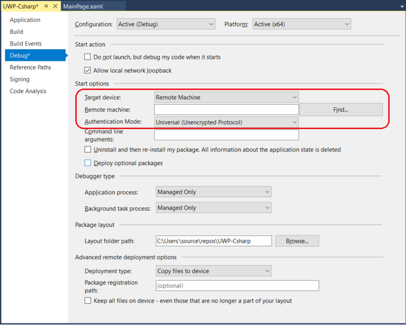
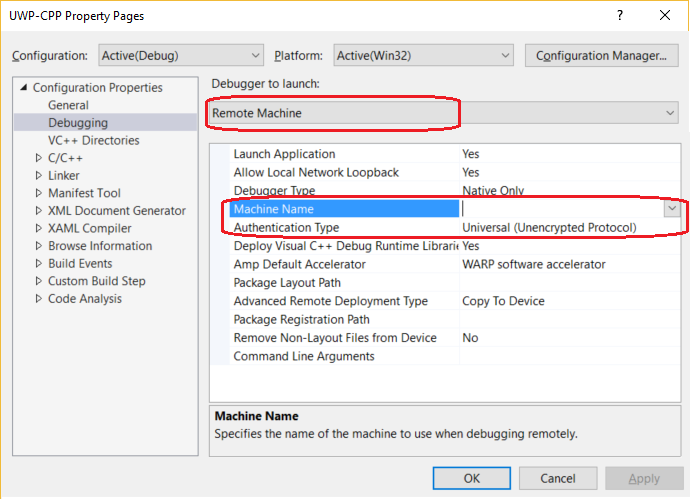

# Debug UWP apps on remote machines from Visual Studio
  
You can use Visual Studio to run, debug, profile, and test a Universal Windows Platform (UWP) app on another computer or device. Running the UWP app on a remote machine is especially helpful when the Visual Studio computer does not support UWP-specific functionality like touch, geo-location, or physical orientation. 

##   Prerequisites  

To debug a UWP app on a remote device from Visual Studio:  
  
- The Visual Studio project must be configured for remote debugging.
- The remote machine and the Visual Studio computer must be connected over a network, or connected directly through a USB or Ethernet cable. Debugging over the internet is not supported.  
- You must [turn on developer mode](/windows/uwp/get-started/enable-your-device-for-development) on both the Visual Studio computer and the remote machine. 
- Remote computers must be running the Remote Tools for Visual Studio. 
  - Some Windows 10 versions start and run the remote tools automatically. Otherwise, [install and run the Remote Tools for Visual Studio](#BKMK_download).
  - Windows Mobile 10 devices don't require or support the remote tools. 

##   Configure a Visual Studio project for remote debugging

You use the project **Properties** to specify the remote device to connect to. The settings differ depending on the programming language. 

> [!CAUTION]
> By default, the property page sets **Universal (Unencrypted Protocol)** as the **Authentication Type** for Windows 10 remote connections. You may need to set **No Authentication** to connect to the remote debugger. **Universal (Unencrypted Protocol)** and **No Authentication** protocols have no network security, so data passed between the development and remote machines is vulnerable. Choose these authentication types only for trusted networks that you are sure are not at risk from malicious or hostile traffic. 
>
>If you choose **Windows Authentication** for the **Authentication Type**, you will need to sign in to the remote machine when debugging. The remote debugger must also be running under **Windows Authentication** mode, with the same user account as on the Visual Studio machine.

###   Configure a C# or Visual Basic project for remote debugging  

1. Select the C# or Visual Basic project in Visual Studio **Solution Explorer** and select the **Properties** icon, press **Alt**+**Enter**, or right-click and choose **Properties**.
  
1.  Select the **Debug** tab.  
  
1.  Under **Target device**, select **Remote Machine** for a remote computer, or **Device** for a direct-connected Windows Mobile 10 device.  
  
1.  For a remote machine, enter the network name or IP address in the **Remote machine** field, or select **Find** to search for the device in the [Remote Connections dialog box](#remote-connections). 
    
      
    
###   Configure a JavaScript or C++ project for remote debugging   
  
1.  Select the C++ or JavaScript project in Visual Studio **Solution Explorer** and select the **Properties** icon, press **Alt**+**Enter**, or right-click and choose **Properties**.
  
1.  Select the **Debugging** tab.  
  
3.  Under **Debugger to launch**, select **Remote Machine** for a remote computer, or **Device** for a direct-connected Windows Mobile 10 device. 
  
1.  For a remote machine, enter or select the network name or IP address in the **Machine Name** field, or drop down and select **Locate** to search for the device in the [Remote Connections dialog box](#remote-connections). 

    
    
###  Use the Remote Connections dialog box

In the **Remote Connections** dialog box, you can search for a specific remote computer name or IP address, or auto-detect connections by selecting the rounded-arrow refresh icon. The dialog searches only devices on the local subnet that are currently running the remote debugger. Not all devices can be detected in the **Remote Connections** dialog box. 

   

>[!TIP]
>If you can't connect to a remote device by name, try using its IP address. To determine the IP address, on the remote device, enter **ipconfig** in a command window. The IP address appears as **IPv4 Address**.  
    
##  Download and install the Remote Tools for Visual Studio

For Visual Studio to debug apps on a remote computer, the remote computer must be running the Remote Tools for Visual Studio. 

- Windows Mobile 10 devices do not require or support the remote tools. 
- Windows 10 PCs running Creator's Update (version 1703) and later, Windows 10 Xbox, IoT, and HoloLens devices install the remote tools automatically when you deploy the app. 
- On pre-Creator's Update Windows 10 PCs, you must manually download, install, and be running the remote tools on the remote computer before you start debugging.

**To download and install the remote tools:**

[!INCLUDE [remote-debugger-download](../debugger/includes/remote-debugger-download.md)]
  
###  Configure the remote tools

[!INCLUDE [remote-debugger-configuration](../debugger/includes/remote-debugger-configuration.md)]  
  
##   Debug UWP apps remotely 

Remote debugging works the same as local debugging. 

1. On pre-Creator's Update versions of Windows 10, make sure the Remote Debugging Monitor (*msvsmon.exe*) is running on the remote device.  
   
1. On the Visual Studio computer, make sure the correct debugging target (**Remote Machine** or **Device**) appears next to the green arrow on the toolbar. 
   
1. Start debugging by selecting **Debug** > **Start Debugging**, pressing **F5**, or selecting the green arrow on the toolbar. 
   
   The project recompiles, then deploys and starts on the remote device. The debugger suspends execution at breakpoints, and you can step into, over, and out of code. 
   
1. If necessary, select **Debug** > **Stop Debugging** or press **Shift**+**F5** to stop debugging and close the remote app.
  
## See also  
 [Advanced remote deployment options](/windows/uwp/debug-test-perf/deploying-and-debugging-uwp-apps#advanced-remote-deployment-options)  
 [Testing UWP apps with Visual Studio](../test/testing-store-apps-with-visual-studio.md)   
 [Debug UWP apps in Visual Studio](debugging-windows-store-and-windows-universal-apps.md)
