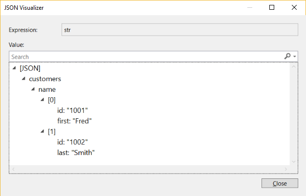

# View strings in a string visualizer in Visual Studio

While you are debugging in Visual Studio, you can view strings with the built-in string visualizer. The string visualizer shows strings that are too long for a data tip or debugger window. It can also help you identify malformed strings.

The built-in string visualizer includes plain text, XML, HTML, and JSON options. You can also open visualizers for a few other types, such as WPF objects, from the **Autos** or other debugger windows.

## Open a string visualizer

To open the string visualizer, you must be paused during debugging. Hover over a variable that has a plain text, XML, HTML, or JSON string value, and select the magnifying glass icon .

## View string visualizer data

In the string visualizer window, the **Expression** field shows the variable or expression you're hovering over, and the **Value** field shows the string value.

A blank **Value** means that the chosen visualizer can't recognize the string. For example, the **XML Visualizer** shows a blank **Value** for a text string with no XML tags, or a JSON string.

To view strings that the chosen visualizer can't recognize, choose the **Text Visualizer**. The **Text Visualizer** shows plain text.

### View JSON string data

A well-formed JSON string appears similar to the following illustration in the JSON visualizer. Malformed JSON may display an error icon (or blank if unrecognized). To identify the JSON error, copy and paste the string into a JSON linting tool such as [JSLint](https://www.jslint.com/).

### View XML string data

A well-formed XML string appears similar to the following illustration in the XML visualizer. Malformed XML may display without the XML tags, or blank if unrecognized.

### View HTML string data

A well-formed HTML string appears as if rendered in a browser, as shown in the following illustration. Malformed HTML may display as plain text.

## See also

- [Create custom visualizers (C#, Visual Basic)](../debugger/create-custom-visualizers-of-data.md)
- [Data visualizations in Visual Studio for Mac](/visualstudio/mac/data-visualizations)