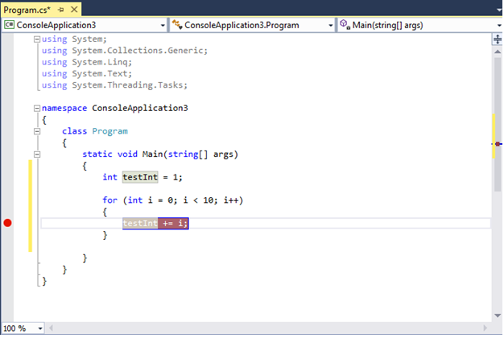
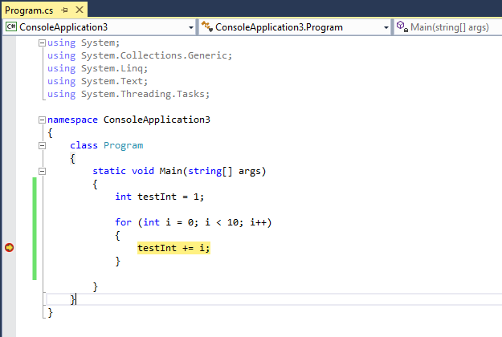
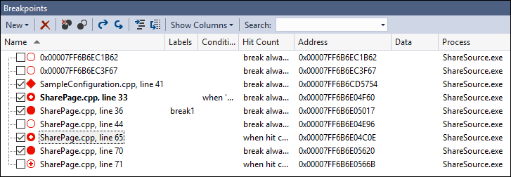
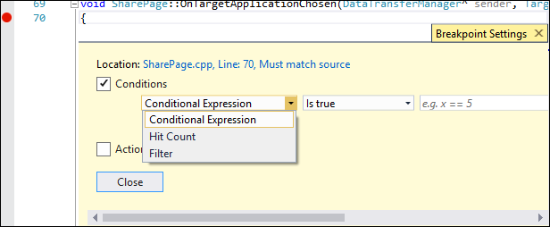
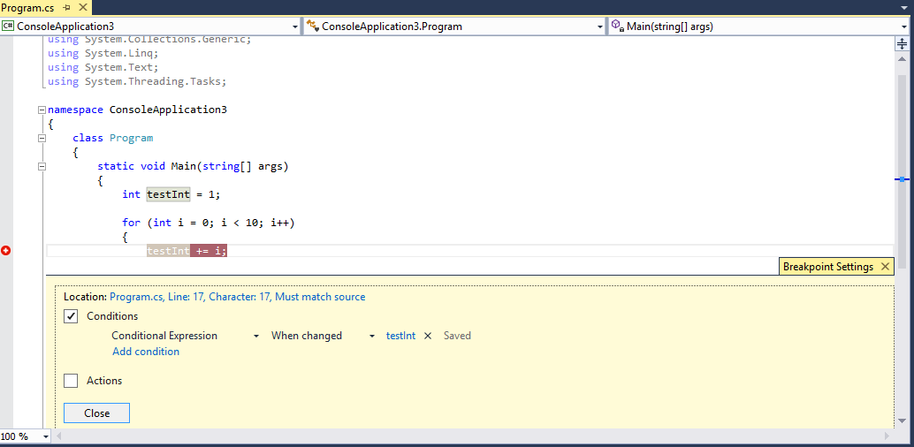
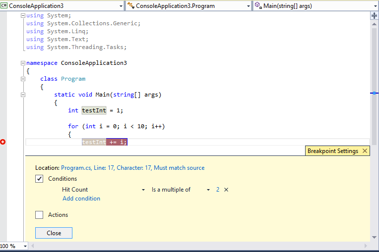

# Use breakpoints in the Visual Studio debugger
Breakpoints are one of the most important debugging techniques in your toolbox. You set breakpoints where you want to stop debugger execution. For example, you may want to see the state of code variables or look at the call stack at the breakpoint.  
  
##  <a name="BKMK_Overview"></a> Set breakpoints in source code  
 You can set a breakpoint on any line of executable code. For example, in the following C# code, you could set a breakpoint on the variable declaration, the `for` loop, or any code inside the `for` loop. You can't set a breakpoint on the namespace or class declarations, or the method signature.  

 To set a line breakpoint in source code, select a line and then click in the left margin. You can also press **F9**, select **Debug** > **Toggle Breakpoint**, or right-click and select **Breakpoint** > **Insert breakpoint**. The breakpoint appears as a red dot in the left margin.  
  
   
  
 When you debug the code, execution stops when the breakpoint is hit, before the code on that line is executed. The breakpoint symbol shows a yellow arrow. 

 At the breakpoint in the following example, the value of `testInt` is still 1.  
  
   
  
 When the debugger stops at the breakpoint, you can look at the current state of the app, including variable values and the call stack. For more information about the call stack, see [How to: Use the Call Stack window](../debugger/how-to-use-the-call-stack-window.md).  

The breakpoint is a toggle. You can click it to delete it, then click again to reinsert it.

To disable a breakpoint without deleting it, hover over it or right-click ,and select **Disable breakpoint**. Disabled breakpoints appear as empty circles in the left margin. To reenable a breakpoint, hover over it and select **Enable breakpoint**. 
You can also set conditions and actions, add and edit labels, or export a breakpoint by right-clicking and selecting the appropriate command, or hovering over it and selecting the **Settings** icon.

##  <a name="BKMK_Set_a_breakpoint_in_a_function"></a> Set breakpoints in debugger windows 
 You can also set breakpoints from **Call Stack** or **Disassembly** windows.  
  
### <a name="BKMK_Set_a_breakpoint_in_the_call_stack_window"></a> Set a breakpoint in the Call Stack window  

 You can break execution at the instruction or line that a calling function returns to by setting a breakpoint in the **Call Stack** window. For more information about the call stack, see [How to: Use the Call Stack Window](../debugger/how-to-use-the-call-stack-window.md). 
  
1. To open the **Call Stack** window, start debugging the app, and wait until execution is paused; for example, at a breakpoint. Select **Debug** > **Windows** > **Call Stack**, or press **Ctrl**+**Alt**+**C**.  
   
2. Right-click the calling function and select **Breakpoint** > **Insert Breakpoint**, or press **F9**.  
   
3. A breakpoint symbol appears in the left margin of the call stack, next to the function call name.  
   
   The call stack breakpoint appears in the **Breakpoints** window as an address with a memory location that corresponds to the next executable instruction in the function. The debugger breaks at the instruction.  
   
   To visually trace breakpoints during code execution, see [Map methods on the call stack while debugging](../debugger/map-methods-on-the-call-stack-while-debugging-in-visual-studio.md).  
  
### Set a breakpoint in the Disassembly window  
   
1. To open the **Disassembly** window, start debugging the app, and wait until execution is paused; for example, at a breakpoint. Select **Debug** > **Windows** > **Disassembly**, or press **Ctrl**+**Alt**+**D**.  
   
2. To set a breakpoint, click in the left margin at the instruction you want to break at, or select the instruction and press **F9**. right-click, **Breakpoint** > **Insert Breakpoint**. 
  

##  <a name="BKMK_Specify_advanced_properties_of_a_breakpoint_"></a> Manage breakpoints in the Breakpoints window 

 You can use the **Breakpoints** window (**Debug** > **Windows** > **Breakpoints**, or **Ctrl**+**Alt**+**B**) to see and manage all the breakpoints in your solution. This centralized location is especially helpful in a large solution or for complex debugging scenarios where breakpoints are critical. In the **Breakpoints** window, you can search, sort, filter, enable/disable, or delete breakpoints. You can also add a new function breakpoint or data breakpoint from the **Breakpoints** window.
  
   
  
###  <a name="BKMK_Set_a_breakpoint_at_a_function_return_in_the_Call_Stack_window"></a> Breakpoint labels  
You can use labels to sort and filter the list of breakpoints in the **Breakpoints** window. 

1. To add a label to a breakpoint, right-click the breakpoint in the source code or the **Breakpoints** window, and then select **Edit labels**. Add a new label or choose an existing one, and then select **OK**.
2. Sort the breakpoint list in the **Breakpoints** window by selecting the **Labels** (or **Conditions**, or other) row header.  
  
### Export and import breakpoints  
 To save or share the state and location of your breakpoints, you can export or import them. 

- To export a single breakpoint to an XML file, right-click the breakpoint in the source code or **Breakpoints** window and select **Export** or **Export selected**. Select an export location, and then select **Save**.  
- To export several breakpoints, select the boxes next to the desired breakpoints in the **Breakpoints** window, or enter search criteria in the **Search** field. Select the **Export all breakpoints matching the current search criteria** icon, and save the file. Deselect all boxes and leave the **Search** field blank to export all breakpoints.  
- To import breakpoints, in the **Breakpoints** window toolbar, select the **Import breakpoints from a file** icon, navigate to the XML file location, and select **Open**. 
  
##  <a name="BKMK_Set_a_breakpoint_in_a_source_file"></a> Set function breakpoints  

  You can break execution when a function is called. To set a function breakpoint:
  
1. Select **Debug** > **New Breakpoint** > **Function Breakpoint**, or press **Alt**+**F9** > **B**. You can also use the **Breakpoints** window and select **New** > **Function Breakpoint**.

1. In the **New Function Breakpoint** dialog, enter the function name in the **Function Name** box. 

   To narrow the function specification:
   
   Use the fully qualified function name. 
   Example:  Namespace1.ClassX.MethodA()
   
   Add the parameter types of an overloaded function. 
   Example:  MethodA(int, string)
   
   Use the '!' symbol to specify the module.
   Example: App1.dll!MethodA
   
   Use the context operator in native C++.
   {function, , [module]} [+&lt;line offset from start of method&gt;]
   Example: {MethodA, , App1.dll}+2

1. In the **Language** dropdown, choose the language of the function.
  
1. Select **OK**.
  
### Set a breakpoint with a memory address (native C++ only)  
 You can also use the address of an object to set a breakpoint on a method called by a specific instance of a class.  For example, given an addressable object of type `my_class`, you can set a function breakpoint on the `my_method` method that instance calls. 
  
1.  Set a breakpoint somewhere after that instance of the class is instantiated.  
  
2.  Find the address of the instance (for example, `0xcccccccc`).  
  
3.  Select **Debug** > **New Breakpoint** > **Function Breakpoint**, or press **Alt**+**F9** > **B**.  
  
4.  Add the following text to the **Function Name** box:  
  
    ```C++  
    ((my_class *) 0xcccccccc)->my_method  
    ```  

## <a name="BKMK_set_a_data_breakpoint_native_cplusplus_only"></a>Set data breakpoints (native C++ only) 
 
 Data breakpoints break execution when a value stored at a specified memory address changes. If the value is read but not changed, execution doesn't break.  
  
1.  Start debugging the application, and wait until a breakpoint is reached. On the **Debug** menu, choose **New Breakpoint** > **Data Breakpoint** (or in the **Breakpoints** window, select **New** > **Data Breakpoint**.  
  
2.  In the **Address** box, type a memory address, or an expression that evaluates to a memory address. For example, type `&avar` to break when the contents of the variable `avar` changes.  
  
3.  In the **Byte Count** dropdown, select the number of bytes you want the debugger to watch. For example, if you select **4**, the debugger will watch the four bytes starting at `&avar` and break if any of those bytes change value.  

- Keep in mind that data breakpoints depend on specific memory addresses. The address of a variable changes from one debugging session to the next, so data breakpoints are automatically disabled at the end of each debugging session.  
  
-   If you set a data breakpoint on a local variable, the breakpoint remains enabled when the function ends, but the memory address is no longer applicable, so the behavior of the breakpoint is unpredictable. If you set a data breakpoint on a local variable, you should delete or disable the breakpoint before the function ends.  
  
 Data breakpoints don't work under these conditions:  
  
-   A process that is not being debugged writes to the memory location.  
  
-   The memory location is shared between two or more processes.  
  
-   The memory location is updated within the kernel. For example, if memory is passed to the 32-bit Windows `ReadFile` function, the memory will be updated from kernel mode and the debugger won't break on the memory write.  

##  <a name="BKMK_Specify_a_breakpoint_condition_using_a_code_expression"></a> Breakpoint conditions  
 You can control when and where a breakpoint executes by setting conditions. The condition can be any valid expression that the debugger recognizes. For more information about valid expressions, see [Expressions in the debugger](../debugger/expressions-in-the-debugger.md).  

1.  Right-click the breakpoint and select **Conditions**. Or, hover over the breakpoint, select the **Settings** icon, and then select **Conditions** in the **Breakpoint Settings** window.  
  
   
  
1. In the dropdown, select **Conditional Expression**, **Hit Count**, or **Filter**, and fill out the conditions accordingly. 
  
1. When finished, select **Close** or press **Ctrl**+**Enter** to close the **Breakpoint Settings** window.

### Conditional Expression

You can choose between two conditions: **Is true** and **When changed**. Choose **Is true** to break when the expression is satisfied, or choose **When changed** to break when the value of the expression has changed.  
  
 In the following example, the breakpoint is hit only when the value of `testInt` is **4**:  
  
   
  
 In the following example, the breakpoint is hit only when the value of `testInt` changes:  
  
   
  
 >[!NOTE]
 >The behavior of the **When changed** field is different for different programming languages. If you choose **When changed** for native code, the debugger doesn't consider the first evaluation of the condition to be a change, so doesn't hit the breakpoint on the first evaluation. If you choose **When changed** for managed code, the debugger hits the breakpoint on the first evaluation after **When changed** is selected.  
  
 If you set a breakpoint condition with invalid syntax, a warning message appears. If you specify a breakpoint condition with valid syntax but invalid semantics, a warning message appears the first time the breakpoint is hit. In either case, the debugger breaks when it hits the invalid breakpoint. The breakpoint is skipped only if the condition is valid and evaluates to `false`.  
  
### Using Object IDs in conditional expressions (C# and F# only)  
 There are times when you want to observe the behavior of a specific object; for example, you might want to find out why an object was inserted more than once into a collection. In C# and F#, you can create object IDs for specific instances of [reference types](/dotnet/csharp/language-reference/keywords/reference-types) and use them in breakpoint conditions. The object ID is generated by the common language runtime (CLR) debugging services and associated with the object.  To create an object ID, do the following:  
  
1.  Set a breakpoint in the code some time after the object has been created.  
  
2.  Start debugging, and when execution stops in the breakpoint, find the breakpoint in the **Locals** window, right-click it, and select **Make Object ID**.  
  
     You should see a **$** plus a number in the **Locals** window. This is the object ID.  
  
3.  Add a new conditional breakpoint at the point you want to investigate, for example when the object is to be added to the collection.  
  
4.  Use the Object ID in the Conditional Expression field. For example, if there is a variable `item` referring to the object that is to be added to the collection, you would put **item == $n**, where **n** is the object ID number.  
  
     Execution will break at the point when that object is to be added to the collection.  
  
 If you later want to delete the object ID, you can right-click the variable in the **Locals** window and select **Delete Object ID**.  
  
 Note that Object IDs create weak references, and do not prevent the object from being garbage collected. They are valid only for the current debugging session.  
  
### Hit Count  
 If you suspect that a loop in your code starts misbehaving after a certain number of iterations, you can set a breakpoint to stop execution after that number of hits, rather than having to repeatedly press **F5**.  
  
 In the **Breakpoint Settings** window, select **Hit Count**, and then specify the number of iterations. In the following example, the breakpoint is set to hit on every other iteration:  
  
   
  
### Filter  
 You can restrict a breakpoint to fire only on specified devices, or in specified processes and threads.  
  
 In the **Breakpoint Settings** window, select **Filter**, and then enter one or more of the following expressions:  
  
-   MachineName = "name"  
  
-   ProcessId = value  
  
-   ProcessName = "name"  
  
-   ThreadId = value  
  
-   ThreadName = "name"  
  
 Enclose string values in double quotes. You can combine clauses using `&` (AND), `||` (OR), `!` (NOT), and parentheses.  
  
##  <a name="BKMK_Print_to_the_Output_window_with_tracepoints"></a> Breakpoint actions and tracepoints  
 A *tracepoint* is a breakpoint that prints a message to the **Output** window. A tracepoint can act like a temporary trace statement in the programming language.  
  
1.  Right-click the breakpoint and select **Actions**. Or, hover over the breakpoint, select the **Settings** icon, and then select **Actions** in the **Breakpoint Settings** window.  
   
1. Choose **Log a message to Output window** in the **Action** group. You can print a generic string, such as **this is a test**. To include the value of a variable or expression, enclose it in curly braces.  You can also use format specifiers ([C#](../debugger/format-specifiers-in-csharp.md) and [C++](../debugger/format-specifiers-in-cpp.md)) for values included in a tracepoint.
  
 To break execution when the tracepoint is hit, clear the **Continue Execution** check box. When **Continue Execution** is checked, execution is not halted. In both cases, the message is printed.  
  
 You can use the following special keywords in the **Message**.  
  
|||  
|-|-|  
|**$ADDRESS**|Current instruction|  
|**$CALLER**|Calling function name|  
|**$CALLSTACK**|Call stack|  
|**$FUNCTION**|Current function name|  
|**$PID**|Process id|  
|**$PNAME**|Process name|  
|**$TID**|Thread id|  
|**$TNAME**|Thread name|  
|**$TICK**|Tick count (from Windows `GetTickCount`)|  
  
## See also  
[Troubleshoot breakpoints in the Visual Studio debugger](../debugger/troubleshooting-breakpoints.md)  
[Navigating through code with the debugger](../debugger/navigating-through-code-with-the-debugger.md)
