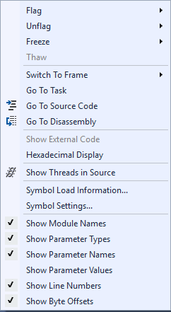
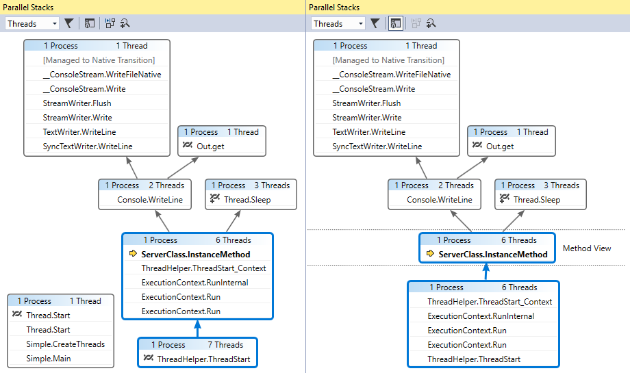

# Using the Parallel Stacks Window
The **Parallel Stacks** window is useful when you are debugging multithreaded applications. Its **Threads View** shows call stack information for all the threads in your application. It lets you navigate between threads and stack frames on those threads. In managed code, the **Tasks View** shows call stacks of <xref:System.Threading.Tasks.Task?displayProperty=fullName> objects. In native code, the **Tasks View** shows call stacks of [task groups](/visual-cpp/parallel/concrt/task-parallelism-concurrency-runtime), [parallel algorithms](/visual-cpp/parallel/concrt/parallel-algorithms), [asynchronous agents](/visual-cpp/parallel/concrt/asynchronous-agents), and [lightweight tasks](/visual-cpp/parallel/concrt/task-scheduler-concurrency-runtime).  
  
## Threads View  
 The following illustration shows one thread that went from Main to A to B and then to some external code. Two other threads started from some external code and then went to A, but one of the threads continued to B and then to some external code, and the other thread continued to C and then to some AnonymousMethod.  
  
   
  
 In the illustration, the call path of the current thread is highlighted in blue, and the active stack frame is signified by the yellow arrow. You can change the current stack frame by selecting a different method in the **Parallel Stacks** window. This might result in also switching the current thread, depending on whether the method you selected is part of the current thread already or of another thread. The following table describes the main features of the **Parallel Stacks** window as shown in the illustration.  
  
|Callout Letter|Element Name|Description|  
|--------------------|------------------|-----------------|  
|A|Call Stack Segment or Node|Contains a series of method contexts for one or more threads. If the node has no arrow lines connected to it, then it represents the entire call path for the thread(s).|  
|B|Blue Highlight|Indicates the call path of the current thread.|  
|C|Arrow lines|Connect nodes to make up the entire call path for the thread(s).|  
|D|Tooltip on Node Header|Shows the ID and user-defined name of each thread whose call path shares this node.|  
|E|Method Context|Represents one or more stack frames in the same method.|  
|F|Tooltip on method context|In Threads view, it shows all the threads in a table similar to the **Threads** window. In Task view, it shows all the tasks in a table similar to the **Parallel Tasks** window.|  
  
 In addition, the Parallel Stacks window shows a **Bird's Eye View** icon in the main pane when the graph is too large to fit into the window. You can click on the icon to see the entire graph in the window.  
  
## Method Context Icons  
 The following table describes the icons that provide information about the active and current stack frames:  
  
|||  
|-|-|  
|Icon|Description|  
||Indicates that the method context contains the active stack frame of the current thread.|  
||Indicates that the method context contains the active stack frame of a non-current thread.|  
||Indicates that the method context contains the current stack frame. That method name is bold in all nodes in which it appears.|  
  
## Toolbar Controls  
 The following illustration and table describe the controls that are available in the Parallel Stacks toolbar.  
  
   
  
|Callout Letter|Control|Description|  
|--------------------|-------------|-----------------|  
|A|Threads/Tasks combo box|Switches the view between call stacks of threads and call stacks of tasks. For more information, see Tasks View and Threads View.|  
|B|Show Only Flagged|Shows call stacks only for the threads that are flagged in other debug windows, such as the **GPU Threads** window and the **Parallel Watch** window.|  
|C|Toggle Method View|Switches between Stack View and Method View. For more information, see Method View.|  
|D|Auto Scroll To Current Stack Frame|Autoscrolls the diagram so that the current stack frame is in view. This feature is useful when you are changing the current stack frame from other windows or when you are hitting a new breakpoint in large diagrams.|  
|E|Toggle Zoom Control|Shows or hides the zoom control. You can also zoom by pressing CTRL and turning the mouse wheel, regardless of the visibility of the zoom control.|  
  
### Context Menu Items  
 The following illustration and table describe the shortcut menu items that are available when you right-click a method context in either Threads View or Tasks View. The last six items are borrowed directly from the Call Stack window and introduce no new behavior.  
  
   
  
|Menu Item|Description|  
|---------------|-----------------|  
|Flag|Flags the selected item.|  
|Unflag|Unflags the selected item.|  
|Freeze|Freezes the selected item.|  
|Thaw|Thaws the selected item.|  
|Go to Task (Thread)|Performs the same function as the combo box on the toolbar, but keeps the same stack frame highlighted.|  
|Go To Source Code|Navigates to the location in source code that corresponds to the stack frame that the user right-clicked.|  
|Switch To Frame|Same as the corresponding menu command on the Call Stack window. However, with Parallel Stacks, multiple frames may correspond to one method context. Therefore, the menu item has submenus, each of which represents a specific stack frame. If one of the stack frames is on the current thread, then the menu that corresponds to that stack frame is selected.|  
|Go To Disassembly|Navigates to the location in the disassembly window that corresponds to the stack frame that the user right-clicked.|  
|Show External Code|Shows or hides external code.|  
|Hexadecimal Display|Toggles between decimal and hexadecimal display.|  
|Symbol Load Information|Displays the corresponding dialog box.|  
|Symbol Settings|Displays the corresponding dialog box.|  
  
## Tasks View  
 If your application is using <xref:System.Threading.Tasks.Task?displayProperty=fullName> objects (managed code) or `task_handle` objects (native code) to express parallelism, you can use the combo box in the Parallel Stacks window toolbar to switch to *Tasks View*. Tasks View shows call stacks of tasks instead of threads. Tasks View differs from Threads View as follows:  
  
-   Call stacks of threads that are not running tasks are not shown.  
  
-   Call stacks of threads that are running tasks are visually trimmed at the top and bottom to show the most relevant frames that pertain to tasks.  
  
-   When multiple tasks are on one thread, the call stacks of those tasks are split out into separate nodes.  
  
 The following illustration shows the Parallel Stacks Tasks View on the right and the corresponding Threads View on the left.  
  
   
  
 To see the entire call stack, just switch back to Threads View by right-clicking a stack frame and then clicking **Go to Thread**.  
  
 As described in the earlier table, by hovering over a method context, you can see additional information. The following image shows the information in the tooltip for the Threads View and the Tasks View.  
  
   
  
## Method View  
 From either Threads View or Tasks View, you can pivot the graph on the current method by clicking the Method View icon on the toolbar. Method View shows at a glance all methods on all threads that either call or are called by the current method. The following illustration shows a Threads View, and also how the same information looks in Method View.  
  
   
  
 By switching to a new stack frame, you make that method the current method and cause the window to show all the callers and callees for the new method. This may cause some threads to appear or disappear from the view, depending on whether that method appears on their call stacks. To return to Stack View, click the Method View toolbar button again.  
  
## See Also  
 [Walkthrough: Debugging a Parallel Application](../debugger/walkthrough-debugging-a-parallel-application.md)   
 [Debugger Basics](../debugger/debugger-basics.md)   
 [Debugging Managed Code](../debugger/debugging-managed-code.md)   
 [Parallel Programming](http://msdn.microsoft.com/Library/4d83c690-ad2d-489e-a2e0-b85b898a672d)   
 [Using the Tasks Window](../debugger/using-the-tasks-window.md)   
 [Walkthrough: Debugging a Parallel Application](../debugger/walkthrough-debugging-a-parallel-application.md)   
 [Task Class](../extensibility/debugger/task-class-internal-members.md)