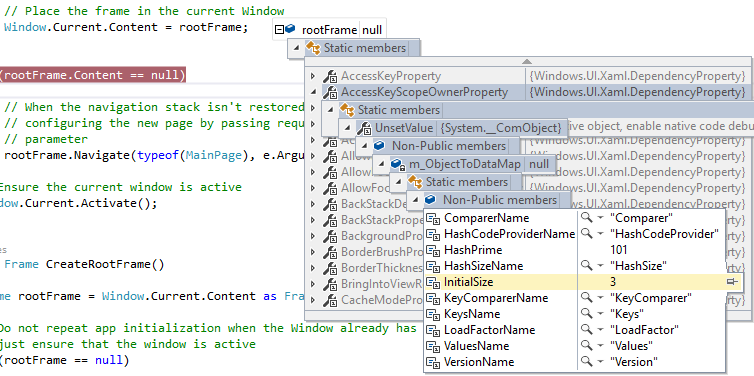

# View data values in DataTips in the code editor

DataTips provide a convenient way to view information about variables in your program during debugging. DataTips work only in break mode, and only with variables that are in the current scope of execution. 

If this is your first time debugging, you may want to read [Write better C# code using Visual Studio](../debugger/write-better-code-with-visual-studio.md) and [Debugging for absolute beginners](../debugger/debugging-absolute-beginners.md) before you read this article.
  
### To display a DataTip  
  
1. Set a breakpoint in your code, and start debugging by pressing **F5** or selecting **Debug** > **Start Debugging**.
  
1. When paused at the breakpoint, hover over any variable in the current scope. A DataTip appears.
   

### Pin a DataTip

To pin a DataTip so that it stays open, select the pushpin **Pin to source** icon. 

>[!NOTE]
>DataTips are always evaluated in the context where execution is suspended, not where the cursor is hovering. If you hover over a variable in another function that has the same name as a variable in the current context, the value of the variable in the current context is displayed.
  
### Unpin a DataTip

To unpin a pinned DataTip, hover over the pinned DataTip and select the **Unpin from source** icon. 

The pin icon changes to the unpinned position, and the DataTip now floats above any open windows. The floating DataTip closes when the debugging session ends.  
  
### Repin a DataTip  
  
To repin a floating DataTip, hover over it and select the pin icon. The pin icon changes to the pinned position. 

If the DataTip is outside a source window, the pin icon is disabled and the DataTip cannot be pinned.  
  
### Close a DataTip  
  
To close a DataTip, hover over the DataTip and select the **Close** icon.  
  
### Close all DataTips  
  
To close all DataTips, on the **Debug** menu, select **Clear All DataTips**.  
  
### Close all DataTips for a specific file  
  
To close all DataTips for a specific file, on the **Debug** menu, select **Clear All DataTips Pinned to \<Filename>**.  
  
## Expand and edit information  
You can use DataTips to expand an array, a structure, or an object to view its members. You can also edit the value of a variable from a DataTip.  
  
### Expand a variable

To expand an object in a DataTip to see its elements, hover over the expand arrow before the object name. The object expands to show its elements in tree form.

You can use the mouse or the arrow keys on the keyboard to move up and down in the expanded view. 

### Edit the value of a variable

To edit the value of a variable in a DataTip, select the value, type a new value, and select **Enter**. Selection is disabled for read-only values.  

### Make a DataTip transparent  
You can make the DataTip temporarily transparent to see the code that is behind it. This doesn't apply to DataTips that are pinned or floating.  

To make a DataTip transparent, while in the DataTip, hold down the **Ctrl** key. The DataTip stays transparent as long as you hold down the **Ctrl** key.  
  
## Visualize complex data types  
If a magnifying glass icon appears next to a variable name in a DataTip, one or more [visualizers](../debugger/create-custom-visualizers-of-data.md), such as the [string visualizer](../debugger/string-visualizer-dialog-box.md), are available for the variable. The visualizer displays the information in a more meaningful, usually graphical, manner.
  
To view a variable using a visualizer, select the magnifying glass icon  to select the default visualizer for the data type. Select the arrow next to the magnifying glass icon to select from a list of visualizers for the data type.  

## Add a variable to a Watch window  
If you want to continue to watch a variable, you can add the variable to a **Watch** window from a DataTip.  

To add a variable to a **Watch** window, right-click a DataTip, and select **Add Watch**. 

The variable appears in the **Watch** window. If your Visual Studio edition supports more than one **Watch** window, the variable is added to **Watch 1**. 
  
## Import and export DataTips  

You can export DataTips to an XML file, which you can share or edit using a text editor. You can also import a DataTip XML file you have received or edited. 
  
**To export DataTips:** 
  
1. Select **Debug** > **Export DataTips**.  
   
1. In the **Export DataTips** dialog box, navigate to the location to save the XML file, type a name for the file, and then select **Save**.  
  
**To import DataTips:** 
  
1. Select **Debug** > **Import DataTips**.  
   
1. In the **Import DataTips** dialog box, select the DataTips XML file you want to open, and then select **Open**.  

## See also  
 [What is debugging?](../debugger/what-is-debugging.md)  
 [Write better C# code using Visual Studio](../debugger/write-better-code-with-visual-studio.md)  
 [First look at debugging](../debugger/debugger-feature-tour.md)   
 [View data in the debugger](../debugger/viewing-data-in-the-debugger.md)   
 [Watch and QuickWatch windows](../debugger/watch-and-quickwatch-windows.md)   
 [Create custom visualizers](../debugger/create-custom-visualizers-of-data.md)   
