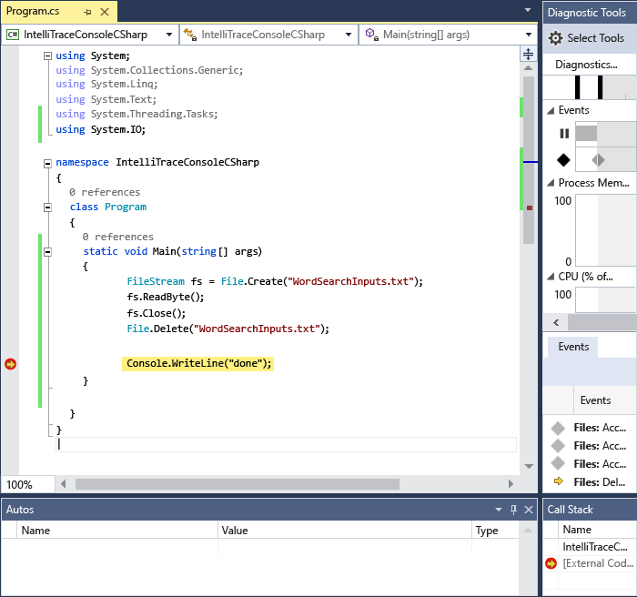
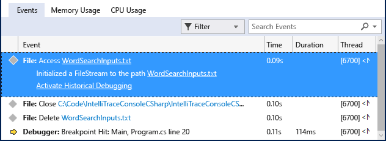
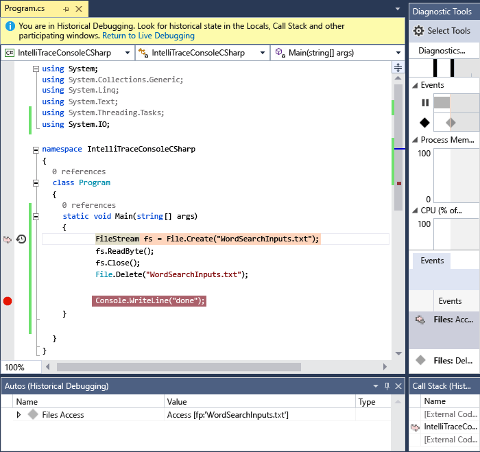

# View events with IntelliTrace in Visual Studio
You can use IntelliTrace to collect information about specific events or categories of events, or about individual function calls in addition to events. The following procedures show how to do this.  
  
 You can use IntelliTrace in Visual Studio Enterprise edition, but not the Professional or Community editions.  
  
##  <a name="GettingStarted"></a> Configure Intellitrace  
 You can try debugging with just IntelliTrace events. IntelliTrace events are debugger events, exceptions, .NET Framework events, and other system events. You should turn on or turn off specific events to control the events that IntelliTrace records before you start debugging. For more information, see [IntelliTrace Features](../debugger/intellitrace-features.md).  
  
 - Turn on the IntelliTrace event for File Access. Go to the **Tools > Options > IntelliTrace > IntelliTrace Events** page, and expand the **File** category. Check the **File** event category. This causes all the file events (access, close, delete) to be checked.

## Create your app
  
1.  Create a C# console application. In the Program.cs file, add the following `using` statement:  
  
    ```csharp  
    using System.IO;  
    ```  
  
2.  Create a <xref:System.IO.FileStream> in the Main method, read from it, close it, and delete the file. Add another line just to have a place to set a breakpoint:  
  
    ```csharp  
    static void Main(string[] args)  
    {  
        FileStream fs = File.Create("WordSearchInputs.txt");  
        fs.ReadByte();  
        fs.Close();  
        File.Delete("WordSearchInputs.txt");  
  
        Console.WriteLine("done");  
    }  
    ```  
  
3.  Set a breakpoint on `Console.WriteLine("done");`  

## Start debugging and view IntelliTrace events
  
1.  Start debugging as usual. (Press **F5** or click **Debug > Start Debugging**.  
  
    > [!TIP]
    >  Keep the **Locals** and **Autos** windows open while you're debugging to see and record the values in those windows.  
  
2.  Execution stops at the breakpoint. If you do not see the **Diagnostic Tools** window, click **Debug > Windows > IntelliTrace Events**.  
  
     In the **Diagnostic Tools** window, find the **Events** tab (You should see 3 tabs, **Events**, **Memory Usage**, and **CPU Usage**). The **Events** tab shows a chronological list of events, ending with the last event before the debugger broke execution. You should see an event named **Access WordSearchInputs.txt**.  
  
     The following screenshot is from Visual Studio 2015 Update 1.  
  
       
  
3.  Select the event to expand its details.  
  
     The following screenshot is from Visual Studio 2015 Update 1.  
  
       
  
     You can choose the pathname link to open the file. If the full pathname is not available, the **Open File** dialog box appears.  
  
     Click **Activate Historical Debugging**, which sets the debugger's context to the time when the selected event was collected, showing historical data in the **Call Stack**, **Locals** and the other participating debugger windows. If source code is available, Visual Studio moves the pointer to the corresponding code in the source window so you can examine it.  
  
     The following screenshot is from Visual Studio 2015 Update 1.  
  
       
  
4.  If you didn't find the bug, try examining other events leading up to the bug. You can also have IntelliTrace record call information so you can step through function calls. 
  
## Next Steps

You can use some of the advanced features of IntelliTrace with historical debugging:

 - To view snapshots, see [View snapshots using IntelliTrace step-back](../debugger/how-to-use-intellitrace-step-back.md)
 - To learn how to inspect variables and navigate code, see [Inspect your app with historical debugging](../debugger/historical-debugging-inspect-app.md)