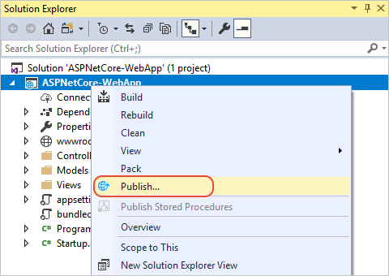
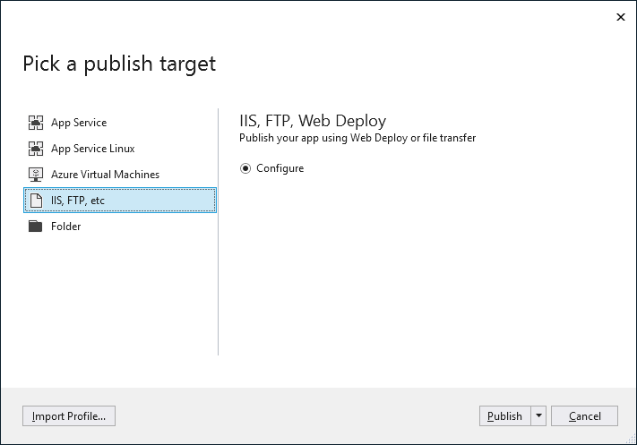
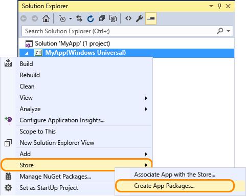
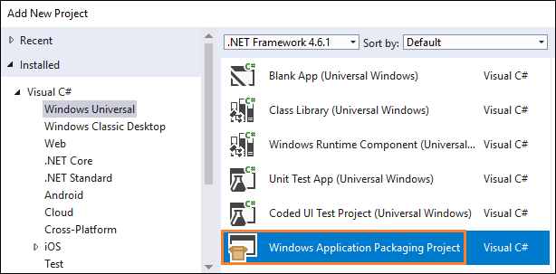

# Deployment Overview in Visual Studio

By deploying an application, service, or component, you distribute it for installation on other computers, devices, servers, or in the cloud. You choose the appropriate method in Visual Studio for the type of deployment that you need. (Many app types support other deployment tools such as command line deployment or NuGet that are not described here.)

See the Tutorials for step-by-step instructions.

### Deploy to local folder

- **ASP.NET**, **ASP.NET Core**, **Node.js**, **Python**, and **.NET Core**: Use the Publish tool to deploy to a local folder. The exact options available depend on your app type. In Solution Explorer, right-click your project and choose **Publish**, and then choose **Folder**. For more information, see [Deploy to a local folder](quickstart-deploy-to-local-folder.md).

    

- **Visual C++ runtime**: You can deploy the Visual C++ runtime using local deployment or static linking. For more information, see [Deploying Native Desktop Applications (Visual C++)](/cpp/ide/deploying-native-desktop-applications-visual-cpp.md). 

### Publish to Web or deploy to network share

- **ASP.NET**, **ASP.NET Core**, **Node.js**, **Python**, and **.NET Core**: You can use the Publish tool to deploy to a website using FTP or Web Deploy. For more information, see [Deploy to a web site](quickstart-deploy-to-a-web-site.md).

    In Solution Explorer, right-click the project and choose **Publish**. In the Publish tool, choose the option you want and follow the configuration steps.

    

    You can also deploy ASP.NET applications and services in a number of other ways. For more information, see [Deploying ASP.NET web applications and services](http://www.asp.net/aspnet/overview/deployment).

- **Visual C++ runtime**: You can deploy the Visual C++ runtime using central deployment. For more information, see [Deploying Native Desktop Applications (Visual C++)](/cpp/ide/deploying-native-desktop-applications-visual-cpp.md). 

- **Windows desktop** You can publish a Windows desktop application to a web server or a network file share using ClickOnce deployment. Users can then install the application with a single click. For more information, see [Deploy a desktop app using ClickOnce](how-to-publish-a-clickonce-application-using-the-publish-wizard.md) and [Deploy a native app using ClickOnce](/cpp/ide/clickonce-deployment-for-visual-cpp-applications).

### Publish to Azure

- **ASP.NET, ASP.NET Core, Python, Node.js, and .NET Core** web applications: You can use the Publish tool to quickly deploy apps to Azure App Service or to an Azure Virtual Machine. In Solution Explorer, right-click the project and choose **Publish**. In the Publish dialog box, choose either **Microsoft Azure App Service** or **Microsoft Azure Virtual Machines**, and then follow the configuration steps.

    

    To publish to an Azure Virtual Machine, scroll right and select **Microsoft Azure Virtual Machines**.

    For a quick introduction, see [Publish to Azure](quickstart-deploy-to-azure.md). Also, see [Publish an ASP.NET Core app to Azure](/aspnet/core/tutorials/publish-to-azure-webapp-using-vs). For deployment using Git, see [Continuous deployment of ASP.NET Core to Azure with Git](/aspnet/core/publishing/azure-continuous-deployment).

    > [!NOTE]
    > If you do not already have an Azure account, you can [sign up here](https://azure.microsoft.com/free/?ref=microsoft.com&utm_source=microsoft.com&utm_medium=doc&utm_campaign=visualstudio).

- Other **Azure services**: See the specific [Azure service](https://docs.microsoft.com/azure/#pivot=products) documentation for different deployment options that may be supported by Visual Studio.

### Publish to Microsoft Store

From Visual Studio, you can create app packages for deployment to Microsoft Store.

- **UWP**: You can package your app and deploy it using menu items. For more information, see [Package a UWP app by using Visual Studio](/windows/uwp/packaging/packaging-uwp-apps).

    

- **Windows desktop**: You can deploy to the Microsoft Store using the Desktop Bridge starting in Visual Studio 2017 version 15.4. To do this, start by creating a Windows Application Packaging Project. For more information, see [Package a desktop app for Microsoft Store (Desktop Bridge)](/windows/uwp/porting/desktop-to-uwp-packaging-dot-net).

    

### Create an Installer package (Windows client)

- An MSI-based WiX installer can be created using the [WiX Toolset Visual Studio 2017 Extension](https://marketplace.visualstudio.com/items?itemName=RobMensching.WixToolsetVisualStudio2017Extension).

- [InstallShield](https://www.flexerasoftware.com/producer/products/software-installation/installshield-software-installer/tab/requirements) from Flexera Software may be used with Visual Studio 2017 (Community Edition not supported). Note that InstallShield Limited Edition is no longer included with Visual Studio and is not supported in Visual Studio 2017; check with [Flexera Software](http://learn.flexerasoftware.com/content/IS-EVAL-InstallShield-Limited-Edition-Visual-Studio) about future availability.

- If you want to create a Setup project (vdproj), install the [Visual Studio 2017 Installer Projects extension](https://marketplace.visualstudio.com/items?itemName=VisualStudioProductTeam.MicrosoftVisualStudio2017InstallerProjects#overview).

- You can install prerequisite components for desktop applications by configuring a generic installer, which is known as a bootstrapper. For more information, see [Application Deployment Prerequisites](../deployment/application-deployment-prerequisites.md).

### Deploy to test lab

You can enable more sophisticated development and testing by deploying your applications into virtual environments. For more information, see [Test on a lab environment](../test/lab-management/using-a-lab-environment-for-your-application-lifecycle.md).

### DevOps deployment

In a team environment, you can use Visual Studio Team Services (VSTS) to enable continuous deployment of your app. For more information, see [Build and Release](/vsts/build-release/index) and [Deploy to Azure](/vsts/deploy-azure/index).

### Deployment for other app types

| App type | Deployment Scenario | Link |
| --- | --- | --- |
| **Office app** | You can publish an add-in for Office from Visual Studio. | [Deploy and publish your Office add-in](https://dev.office.com/docs/add-ins/publish/publish) |
| **WCF or OData service**  | Other applications can use WCF RIA services that you deploy to a web server. | [Developing and deploying WCF Data Services](/dotnet/framework/data/wcf/developing-and-deploying-wcf-data-services) |
| **LightSwitch** | LightSwitch is no longer supported in Visual Studio 2017, but can still be deployed from Visual Studio 2015 and earlier. | [Deploying LightSwitch Applications](http://msdn.microsoft.com/Library/4818d933-295c-4ecc-9148-7ad9ca28dcdb) | 

