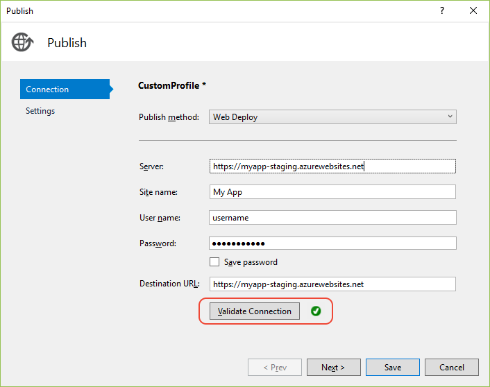

# Publish a web app or a .NET Core app to a web site using the Visual Studio Publish tool

You can use the **Publish** dialog box to publish ASP.NET apps to a website.

These steps apply to ASP.NET, ASP.NET Core, .NET Core, and Python apps in Visual Studio. For Node.js, the steps are supported but the dialog boxes are different.

## Create a new project 

1. In Visual Studio, choose **File > New Project**.

1. Under **Visual C#** or **Visual Basic**, choose **Web**, and then in the middle pane choose either **ASP.NET Web Application (.NET Framework)** or (C# only) **ASP.NET Core Web Application (.NET Core)**, and then click **OK**.

1. Choose **MVC**, make sure that **No Authentication** is selected, and then click **OK**.

1. Type a name like **MyWebApp** and click **OK**.

    Visual Studio creates the project.

1. Choose **Build > Build Solution** to build the project.

## Publish to a web site

1. In Solution Explorer, right-click the project and choose **Publish**.

    

1. In the **Publish** pane, choose **IIS, FTP, etc**.

    

1. Click **Publish**.

    The profile publish settings dialog box opens.

    

1. In the **Publish method** field, choose a method such as **Web Deploy** or **FTP**.

    The settings that you see next correspond to your publishing method.

1. Configure required settings for the publish method and click **Validate Connection**.

    If the server or target is available and your settings are correct, you will see a message that indicates the connection is validated, and you are ready to publish.

    

1. If you want to configure other deployment settings, click **Settings**.

    You can configure options such as whether to deploy a Debug or Release configuration, and then click **Save**. If you are debugging remotely, a Debug configuration is required.

1. To publish, click **Publish**.

    The Output window shows deployment progress and results.

## Next steps

- [Deploy ASP.NET to IIS](https://docs.microsoft.com/en-us/iis/get-started/whats-new-in-iis-8/iis-80-using-aspnet-35-and-aspnet-45)
