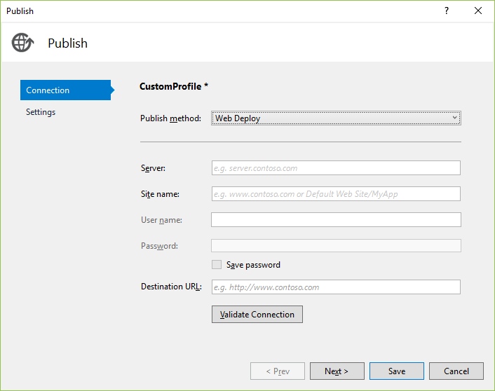

# Publish an ASP.NET or ASP.NET Core app to Azure App Service using Visual Studio

You can use the **Publish** tool to publish ASP.NET, ASP.NET Core, Python, Node.js, and .NET Core apps to Azure App Service.

If you do not already have an Azure account, you can [sign up here](https://azure.microsoft.com/free/?ref=microsoft.com&utm_source=microsoft.com&utm_medium=doc&utm_campaign=visualstudio).

## Create a new project 

1. In Visual Studio, choose **File > New Project**.

1. Under **Visual C#** or **Visual Basic**, choose **Web**, and then in the middle pane choose either **ASP.NET Web Application (.NET Framework)** or (C# only) **ASP.NET Core Web Application**, and then click **OK**.

1. Choose **MVC**, make sure that **No Authentication** is selected, and then click **OK**.

1. Type a name like **MyWebApp** and click **OK**.

    Visual Studio creates the project.

1. Choose **Build > Build Solution** to build the project.

## Publish to Azure App Service

1. In Solution Explorer, right-click the project and choose **Publish**.

    

1. In the **Publish** pane, choose **Microsoft Azure App Service**.

    

1. Click **Publish**.

    The **Create App Service** dialog box appears.

    
    
1. If you are not signed into Visual Studio, sign in, and then the default app service settings populate the fields.

    The profile publish settings dialog box opens.

    

    In this dialog box, you can select the subscription you are using, select or create an Azure resource group, etc.

1. Click **Create**.

    Visual Studio deploys the app to your Azure App Service, and the web app loads in your browser.

    In the Summary of the **Publish** pane, you see the Site URL for the new Azure App Service.

## Next steps

- [Deploy an ASP.NET Core app to Azure](https://docs.microsoft.com/en-us/aspnet/core/tutorials/publish-to-azure-webapp-using-vs)
- [Continuous deployment of ASP.NET Core to Azure with Git](https://docs.microsoft.com/en-us/aspnet/core/publishing/azure-continuous-deployment)
