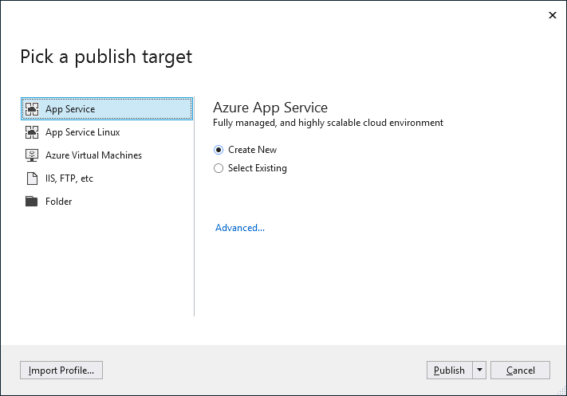

# Publish an ASP.NET or ASP.NET Core app to Azure App Service using Visual Studio

You can use the **Publish** tool to publish ASP.NET, ASP.NET Core, Python, Node.js, and .NET Core apps to Azure App Service.

If you do not already have an Azure account, you can [sign up here](https://azure.microsoft.com/free/?ref=microsoft.com&utm_source=microsoft.com&utm_medium=doc&utm_campaign=visualstudio).

## Prerequisites

* You must have Visual Studio 2017 installed and the **ASP.NET and web development** workload and .**NET desktop development** workload. For a .NET Core app, you need the .**NET Core** workload.

    If you haven't already installed Visual Studio, go to the [Visual Studio downloads](https://visualstudio.microsoft.com/downloads/?utm_medium=microsoft&utm_source=docs.microsoft.com&utm_campaign=button+cta&utm_content=download+vs2017) page to install it for free.

## Create a new project

1. In Visual Studio, choose **File** > **New Project**.

1. Under **Visual C#** or **Visual Basic**, choose **Web**, and then in the middle pane choose either **ASP.NET Web Application (.NET Framework)** or (C# only) **ASP.NET Core Web Application**, and then click **OK**.

1. Choose **MVC** (or choose **Web Application (Model-View-Controller)** for .NET Core), make sure that **No Authentication** is selected, and then click **OK**.

1. Type a name like **MyWebApp** and click **OK**.

    Visual Studio creates the project.

1. Choose **Build** > **Build Solution** to build the project.

## Publish to Azure App Service

1. In Solution Explorer, right-click the project and choose **Publish**.

    

1. If you have previously configured any publishing profiles, the **Publish** pane appears. Click **Create new profile**.

1. In the **Pick a publish target** dialog box, choose **App Service**.

    

1. Click **Publish**.

    The **Create App Service** dialog box appears.

    

1. If you are not signed into Visual Studio, sign in, and then the default app service settings populate the fields.

    The profile publish settings dialog box opens.

    

    In this dialog box, you can select the subscription you are using, select or create an Azure resource group, etc.

1. Click **Create**.

    Visual Studio deploys the app to your Azure App Service, and the web app loads in your browser.

    In the Summary of the **Publish** pane, you see the Site URL for the new Azure App Service.

## Next steps

In this quickstart, you learned how to use Visual Studio to create a publishing profile for deployment to Azure. You can also configure a publishing profile by importing publish settings from Azure App Service.

> [!div class="nextstepaction"]
> [Import publish settings and deploy to Azure](tutorial-import-publish-settings-azure.md)
