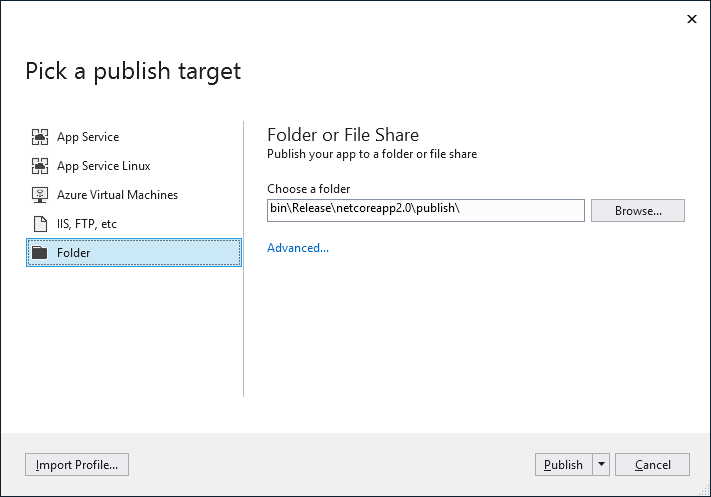
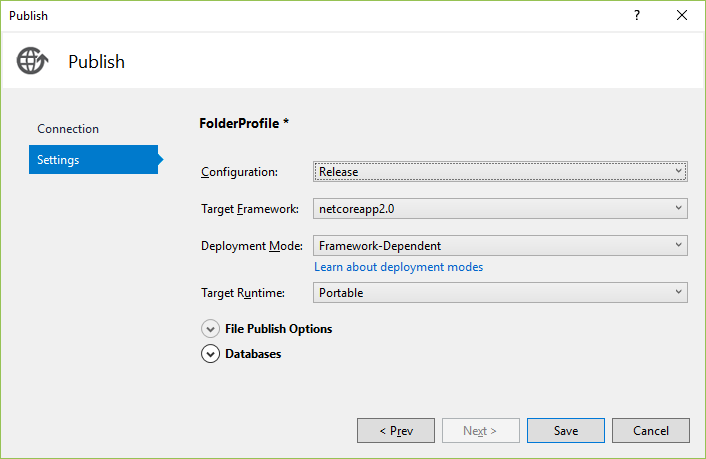

# Deploy a web app or .NET Core app to a local folder using the Visual Studio Publish tool

You can use the **Publish** tool to publish your app to a local folder. 

These steps apply to ASP.NET, ASP.NET Core, .NET Core, and Python apps in Visual Studio. For Node.js, the steps are supported but the user interface is different.

## Create a new project 

1. In Visual Studio, choose **File > New Project**.

1. Under **Visual C#** or **Visual Basic**, choose **.NET Core**, and then in the middle pane choose **Console App (.NET Core)**.

1. Type a name like **MyLocalApp** and click **OK**.

    Visual Studio creates the project.

## Deploy to a local folder

1. In Solution Explorer, right-click the project and choose **Publish**.

    

1. In the **Publish** pane, choose **Folder**.

    

1. Enter a path or click **Browse** to browse to a local folder.

1. Click **Publish**.

    Visual Studio builds the project and publishes it to the specified folder.

    The Publish pane shows a profile summary.

1. To configure deployment settings, click **Settings** in the profile summary.

     

1. Configure options such as whether to deploy a Debug or Release configuration, and then click **Save**.

1. To republish, click **Publish**.

Deploy the published files in any way you like. For example, you can package them in a Zip file, use a simple copy command, or deploy them with any installation package of your choice.

## Next steps

- [Deploy a .NET Core Application with the Publish tool](https://docs.microsoft.com/en-us/dotnet/core/deploying/deploy-with-vs)
- [Package a desktop app for Microsoft Store (Desktop Bridge)](https://docs.microsoft.com/en-us/windows/uwp/porting/desktop-to-uwp-packaging-dot-net)
- (.NET) [Deploy the .NET Framework and applications](https://docs.microsoft.com/en-us/dotnet/framework/deployment/)
