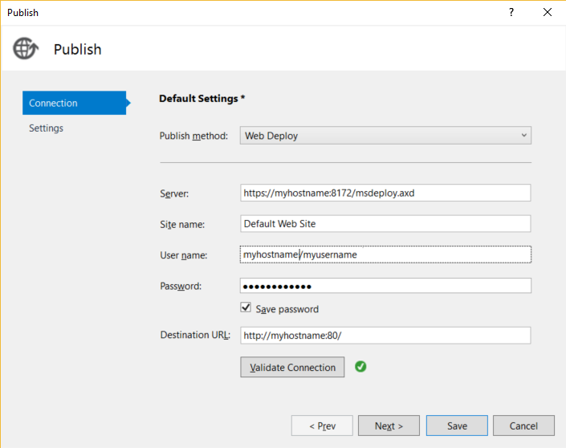

# Publish an application to IIS by importing publish settings in Visual Studio

You can use the **Publish** tool import publish settings and then deploy your app. In this article, we use publish settings for IIS, but you can use similar steps to import publish settings for Azure App Service.

These steps apply to ASP.NET, ASP.NET Core, and .NET Core apps in Visual Studio.

In this tutorial, you will:

> [!div class="checklist"]
> * Configure IIS so that you can generate a publish settings file
> * Create a publish settings file
> * Import the publish settings file into Visual Studio
> * Deploy the app to IIS

A publish settings file is different than a publishing profile created in Visual Studio. A publish settings file is created by IIS or Azure App Service, or it can be manually created, and then it can be imported into Visual Studio.

> [!NOTE]
> If you just need to copy a Visual Studio publishing profile (\*.pubxml file), you can find the publishing profile, *\<profilename\>.pubxml*, in the *\\<projectname\>\Properties\PublishProfiles* folder for managed project types. For websites, look under the *\App_Data* folder. The publishing profiles are MSBuild XML files. You can copy these profiles from one installation of Visual Studio to another.

## Prerequisites

* You must have Visual Studio installed and the **ASP.NET** and **.NET Framework** development workload. For a .NET Core app, you also need the **.NET Core** workload.

    If you haven't already installed Visual Studio, install it for free [here](http://www.visualstudio.com).

* To generate the publish settings file from IIS, you must have another computer running Windows Server 2012 with the IIS 8.0 Web Server role correctly configured and either ASP.NET 4.5 or ASP.NET Core installed. For ASP.NET Core, see [Publishing to IIS](/aspnet/core/publishing/iis?tabs=aspnetcore2x#iis-configuration). For ASP.NET 4.5, see [IIS 8.0 Using ASP.NET 3.5 and ASP.NET 4.5](/iis/get-started/whats-new-in-iis-8/iis-80-using-aspnet-35-and-aspnet-45).

## Create a new ASP.NET project in Visual Studio

1. On the computer running Visual Studio, choose **File > New Project**.

1. Under **Visual C#** or **Visual Basic**, choose **Web**, and then in the middle pane choose either **ASP.NET Web Application (.NET Framework)** or (C# only) **ASP.NET Core Web Application**, and then click **OK**.

    If you don't see the **Web Application** project template, click the **Open Visual Studio Installer** link in the left pane of the **New Project** dialog box. The Visual Studio Installer launches. Choose the **ASP.NET** and **.NET Core** workload, then choose **Modify**.

1. Choose **MVC**, make sure that **No Authentication** is selected, and then click **OK**.

1. Type a name like **MyWebApp** and click **OK**.

    Visual Studio creates the project.

1. Choose **Build > Build Solution** to build the project.

## Install and configure Web Deploy on Windows Server

[!INCLUDE [install-web-deploy-with-hosting-server](../deployment/includes/install-web-deploy-with-hosting-server.md)]

## Create the publish settings file in IIS on Windows Server

1. In IIS, right-click the **Default Web Site**, choose **Deploy** > **Configure Web Deploy Publishing**.

    

1. In the **Configure Web Deploy Publishing** dialog box, check the settings.

1. Click **Setup**.

    In the **Results** panel, the output shows that access rights have been granted to the specified user, and that a file with a *.publishsettings* file extension has been generated in the location shown in the dialog box.

    ```xml
    <?xml version="1.0" encoding="utf-8"?>
    <publishData>
      <publishProfile
        publishUrl="https://myhostname:8172/msdeploy.axd"
        msdeploySite="Default Web Site"
        destinationAppUrl="http://myhostname:80/"
        mySQLDBConnectionString=""
        SQLServerDBConnectionString=""
        profileName="Default Settings"
        publishMethod="MSDeploy"
        userName="myhostname\myusername" />
    </publishData>
    ```

    Depending on your Windows Server and IIS configuration, you will see different values. Here is some information about these values.

    * In the `publishUrl` attribute, msdeploy.axd is a dynamically-generated HTTP handler file for Web Deploy. (For testing purposes, `http://myhostname:8172` will generally work as well.)
    * The `publishUrl` port is usually set to port 8172, which is the default for Web Deploy.
    * The `destinationAppUrl` port is usually set to port 80, which is the default for IIS.
    * If you are unable to connect to the remote host in Visual Studio using the host name (see next section), test the IP address in place of the host name.

    > [!NOTE]
    > If you are publishing to IIS running on an Azure VM, the Web Deploy and IIS ports must be opened in the Network Security group. For detailed information, see [Install and run IIS](/azure/virtual-machines/virtual-machines-windows-hero-role).

1. Copy this file to the computer where you are running Visual Studio.

## Import the publish settings in Visual Studio and deploy

1. On the computer where you have the ASP.NET project open in Visual Studio, right-click the project in Solution Explorer, and choose **Publish**.

    

1. In the **Pick a publish target** dialog box, click **Import Profile**.

    > [!NOTE]
    > If you have previously configured any publishing profiles, the **Publish** pane appears instead. In this scenario, click **New Profile**, then click **Import Profile** in the dialog box.

1. Navigate to the location of the publish settings file that you created in the previous section.

1. In the **Import Publish Settings File** dialog box, navigate to and select the profile that you created in the previous section, and click **Open**.

    The Output window shows deployment progress and results.

    If you get an any deployment errors, click **Settings** to edit settings. Modify settings and click **Validate** to test new settings.

    

## Next steps

In this tutorial, you created a publish settings file, imported it into Visual Studio, and deployed an ASP.NET app to IIS.

> [!div class="nextstepaction"]
> [First look at deployment](../deployment/deploying-applications-services-and-components.md)
