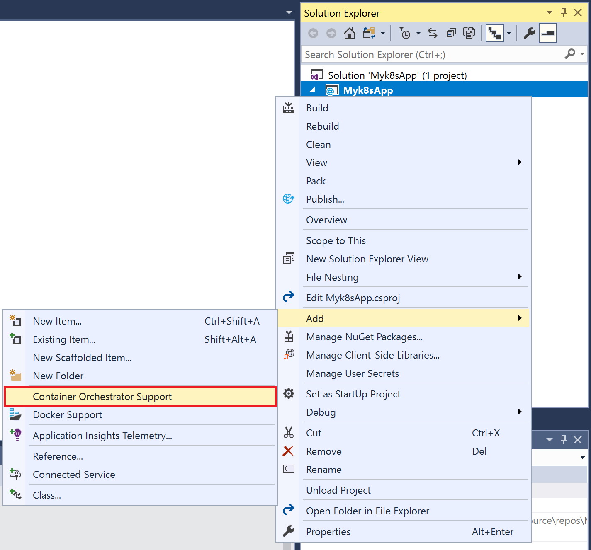
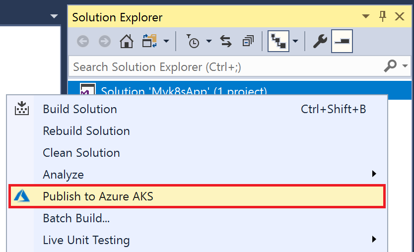

# Get started with Visual Studio Kubernetes Tools

The Visual Studio Kubernetes Tools help streamline the development of containerized applications targeting Kubernetes. Visual Studio can automatically create the configuration-as-code files needed to support Kubernetes deployment, such as Dockerfiles and Helm charts. In addition, you can publish directly to an Azure Kubernetes Service (AKS) cluster from Visual Studio.

## Prerequisites

To leverage this new functionality, you'll need:

- The latest preview of [Visual Studio 2017](https://www.visualstudio.com/vs/preview) with the Azure development workload.

- The [Kubernetes tools for Visual Studio](https://aka.ms/get-vsk8stools), available as a separate download.

- [Docker for Windows](https://store.docker.com/editions/community/docker-ce-desktop-windows) installed on your development workstation (that is, where you run Visual Studio)

- If you wish to publish to AKS from Visual Studio:

    1.  The [AKS publishing tools](https://aka.ms/get-vsk8spublish), available as a separate download.

    1.  An Azure Kubernetes Service cluster. For more information, see
        [Creating an AKS cluster](/azure/aks/kubernetes-walkthrough-portal#create-aks-cluster). Be sure to [connect to the cluster](/azure/aks/kubernetes-walkthrough#connect-to-the-cluster) from your development workstation.

    1.  Helm CLI installed on your development workstation. For more information
        see [Installing Helm](https://github.com/kubernetes/helm/blob/master/docs/install.md).

    1.  Helm configured against your AKS cluster. For more information on how to
        do this, see [How to configure Helm](/azure/aks/kubernetes-helm#configure-helm).

## Create a new Kubernetes project

Once you have the appropriate tools installed, launch Visual Studio and create a new project. Under **Cloud**, choose the **Container Application for Kubernetes** project type. Select this project type and choose **OK**.

You can then choose which type of ASP.NET Core web application to create. Choose **Web Application** and choose **OK**. The usual **Enable Docker Support** option does not appear on this dialog.  Docker support is enabled by default for a container application for Kubernetes.

## Add Kubernetes support to an existing project

Alternatively, you can add Kubernetes support to an existing ASP.NET Core web application project. To do this, right-click on the project, and choose **Add** > **Container Orchestrator Support**.

In the dialog box, select “Kubernetes/Helm” and choose **OK**.

## What Visual Studio creates for you

After creating a new **Container Application for Kubernetes** project or adding Kubernetes container orchestrator support to an existing project, you see some additional files in your project that facilitate deploying to Kubernetes.

The added files are:

- a Dockerfile, which allows you to generate a Docker container image hosting this web application. As you'll see, the Visual Studio tooling leverages this Dockerfile when debugging and deploying to Kubernetes. If you prefer to work directly with the Docker image, you can right-click on the Dockerfile and choose **Build Docker Image**.

   

- a Helm chart, and a *charts* folder. These yaml files make up the Helm chart for the application, which you can use to deploy it to Kubernetes. For more information on Helm, see [https://www.helm.sh](https://www.helm.sh).

- *azds.yaml*. This contains settings for Azure Dev Spaces, a new service that provides a rapid, iterative debugging experience in Azure Kubernetes Service. This file is currently unused, but is reserved for future use by Azure Dev Spaces.

## Publish to Azure Kubernetes Service (AKS)

With all these files in place, you can use the Visual Studio IDE to write and debug your application code, just as you always have.

Once you have your code running the way you want, you can publish directly from Visual Studio to an AKS cluster.

To do this, you first need to set up a publish profile that publishes your container image to Azure Container Registry (ACR). Then AKS can pull your container image from ACR and deploy it into the cluster.

1. In **Solution Explorer**, right-click on your *project* and choose **Publish**.

   

1. In the **Publish** screen, choose **Container Registry** as the publish target, and follow the prompts to select your container registry. If you don't already have a container registry, choose **Create New Azure Container Registry** to create one from Visual Studio. For more information, see [Publish your container to Azure Container Registry](#publish-your-container-to-azure-container-registry).

   

1. Back in Solution Explorer, right click on your *solution* and click **Publish to Azure AKS**.

   

1. Choose your subscription and your AKS cluster, along with the ACR publish profile that you just created. Then click **OK**.

   

   This takes you to the **Publish to Azure AKS** screen.

1.  Choose the **Configure Helm** link to update the command line used to install the Helm charts on the server.

   

   Updating the command line is useful if there are custom command line arguments that you wish to specify, such as a different Kubernetes context or chart name.

   

1. When you are ready to deploy, click the **Publish** button to publish your application to AKS.

   

Congratulations! You can now use the full power of Visual Studio for all your Kubernetes app development.

## Next Steps

Learn more about Kubernetes development on Azure by reading the [AKS documentation](/azure/aks).