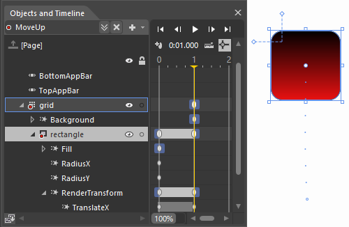

# Animate objects in XAML Designer
You can create short animations that move objects, or fade them in and out.  
  
 To get started, create a *storyboard*. A storyboard contains one or more *timelines*. Set *keyframes* on a timeline to mark property changes. Then, when you run the animation, Blend interpolates the property changes over the designated period of time. The result is a smooth transition. You can animate any property that belongs to an object, even nonvisual properties.  
  
 The following illustration shows a storyboard named **MoveUp**. The timeline contains keyframes that mark the X and Y position of a rectangle. When this animation runs, the rectangle moves from one position to another smoothly.  
  
   
  
 Learn to create animations by watching these videos.  
  
|Watch a short video:|Learn how to:|  
|--------------------------|-------------------|  
| [Create timelines](http://www.popscreen.com/v/6A4eF/Microsoft-Expression-Blend-Creating-Timelines)|Create a timeline, and work with objects in the timeline.|  
| [Add keyframes and repeat the animation](http://www.popscreen.com/v/6A4fi/Microsoft-Expression-Blend-Adding-Keyframes-and-Repeating-an-Animation)|Add keyframes and set properties at each keyframe. Then, run the animation and watch objects smoothly transition between them.|  
| [Add event triggers for interactivity](http://www.popscreen.com/v/6A4e4/Microsoft-Expression-Blend-Adding-Event-Triggers-for-Interactivity)|Start an animation when an event occurs. For example, start one when the window loads.|  
| [Animate colors](http://www.popscreen.com/v/6A4gv/Microsoft-Expression-Blend-Animating-Colors)|Use an animation to change the color of an object.|  
| [Create and modify motion paths](http://www.popscreen.com/v/6A4fX/Microsoft-Expression-Blend-Creating-and-Modifying-Motion-Paths)|Animate objects along a path.|  
| [Ease keyframes](http://www.popscreen.com/v/6A4dM/Microsoft-Expression-Blend-Easing-Keyframes)|Speed up or slow down an animation near the beginning (*easing in*) or near the end (*easing out*) of an animation.|  
| [Animate the button](http://www.popscreen.com/v/6A4fK/Microsoft-Expression-Blend-Animating-a-Button)|Create interesting effects that appear on a button when the user points to it.|  
| [Create animation and work with easing](https://www.youtube.com/watch?v=mAJXYrwxGYo)|Animate effects that appear when a user presses down a button on the image of a calculator.|  
  
## See Also  
 [Creating a UI by using Blend for Visual Studio](../designers/creating-a-ui-by-using-blend-for-visual-studio.md)