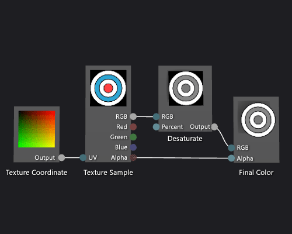

# How to: Create a Grayscale Texture Shader
This document demonstrates how to use the Shader Designer and the Directed Graph Shader Language (DGSL) to create a grayscale texture shader. This shader modifies the RGB color value of the texture sample, and then uses it together with the unmodified alpha value to set the final color.  
  
## Creating a grayscale texture shader  
 You can implement a grayscale texture shader by modifying the color value of a texture sample before you write it to the final output color.  
  
 Before you begin, make sure that the **Properties** window and the **Toolbox** are displayed.  
  
#### To create a grayscale texture shader  
  
1.  Create a basic texture shader, as described in [How to: Create a Basic Texture Shader](../designers/how-to-create-a-basic-texture-shader.md).  
  
2.  Disconnect the **RGB** terminal of the **Texture Sample** node from the **RGB** terminal of the **Final Color** node. In **Select** mode, choose the **RGB** terminal of the **Texture Sample** node, and then choose **Break Links**. This makes room for the node that's added in the next step.  
  
3.  Add a **Desaturate** node to the graph. In the **Toolbox**, under **Filters**, select **Desaturate** and move it to the design surface.  
  
4.  Calculate the grayscale value by using the **Desaturate** node. In **Select** mode, move the **RGB** terminal of the **Texture Sample** node to the **RGB** terminal of the **Desaturate** node.  
  
    > [!NOTE]
    >  By default, the **Desaturate** node fully desaturates the input color, and uses the standard luminance weights for greyscale conversion. You can change how the **Desaturate** node behaves by changing the value of the **Luminance** property, or by only partially desaturating the input color. To partially desaturate the input color, provide a scalar value in the range [0,1) to the **Percent** terminal of the **Desaturate** node.  
  
5.  Connect the grayscale color value to the final color. Move the **Output** terminal of the **Desaturate** node to the **RGB** terminal of the **Final Color** node.  
  
 The following illustration shows the completed shader graph and a preview of the shader applied to a cube.  
  
> [!NOTE]
>  In this illustration, a plane is used as the preview shape, and a texture has been specified to better demonstrate the effect of the shader.  
  
   
  
 Certain shapes might provide better previews for some shaders. For more information about previewing shaders in the Shader Designer, see [Shader Designer](../designers/shader-designer.md)  
  
## See Also  
 [How to: Apply a Shader to a 3-D Model](../designers/how-to-apply-a-shader-to-a-3-d-model.md)   
 [How to: Export a Shader](../designers/how-to-export-a-shader.md)   
 [Image Editor](../designers/image-editor.md)   
 [Shader Designer](../designers/shader-designer.md)   
 [Shader Designer Nodes](../designers/shader-designer-nodes.md)