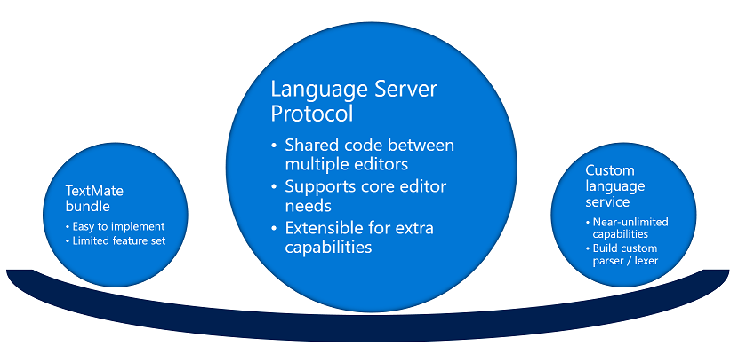
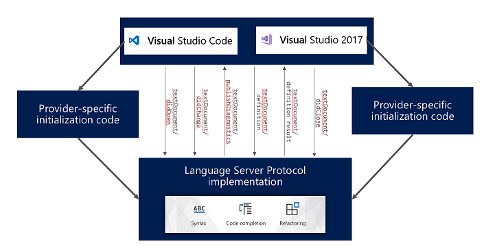
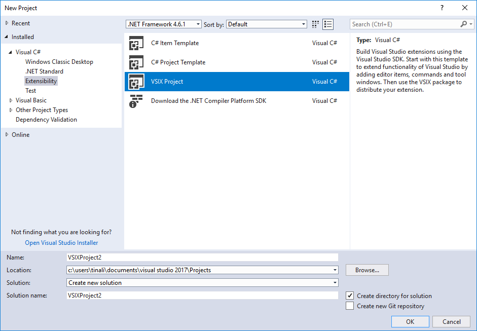
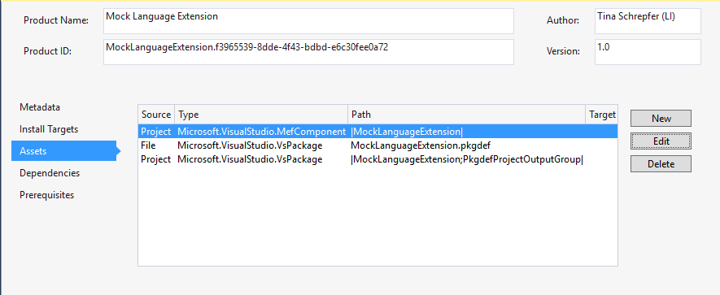
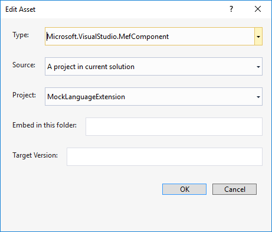
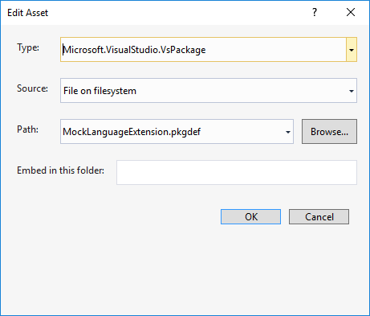

# Adding a Language Server Protocol extension

The Language Server Protocol (LSP) is a common protocol, in the form of JSON RPC v2.0, used to provide language service features to various code editors. Using the protocol, developers can write a single language server to provide language service features like IntelliSense, error diagnostics, find all references, etc to various code editors that support the LSP. Traditionally, language services in Visual Studio can be added by either using TextMate grammar files to provide basic functionalities such as syntax highlighting, or by writing custom language services using the full set of Visual Studio extensibility APIs to provide richer data. Now, support for the LSP offers a third option.



## Language Server Protocol

For more information on the protocol itself, see the documentation [here](https://github.com/Microsoft/language-server-protocol). Visual Studio’s implementation of Language Server Protocol is in preview, and support should be considered experimental. The preview release is in the form of an extension ([Language Server Protocol Client Preview](https://marketplace.visualstudio.com/items?itemName=vsext.LanguageServerClientPreview)), **but this extension can only be installed on the preview channel of Visual Studio**. A later release of Visual Studio will include built-in support for Language Server Protocol, at which time the Preview flag will be dropped. **You should not use the preview for production purposes.**

For more information on how to create a sample language server or how to integrate an existing language server into Visual Studio Code, see the documentation [here](https://code.visualstudio.com/docs/extensions/example-language-server).



This article describes how to create an extension in Visual Studio which uses an LSP-based language server. It assumes that you have already developed an LSP-based language server and just want to integrate it into Visual Studio.

For support within Visual Studio, language servers can communicate with the client (Visual Studio) via the following mechanisms:

* Standard input/output streams
* Named pipes
* Sockets

The intent of the LSP and support for it in Visual Studio is to onboard language services that are not part of Visual Studio product. It is not intended to extend existing language services (like C#) in Visual Studio. To extend existing languages, refer to the language service’s extensibility guide (for example, the ["Roslyn" .NET Compiler Platform](https://docs.microsoft.com/visualstudio/extensibility/dotnet-compiler-platform-roslyn-extensibility)).

## Language Server Protocol features supported

The following LSP features are supported in Visual Studio so far:

Message | Has Support in Visual Studio
--- | ---
initialize | yes
initialized | 
shutdown | yes
exit | yes
$/cancelRequest | yes
window/showMessage | yes
window/showMessageRequest | yes
window/logMessage | yes
telemetry/event |
client/registerCapability |
client/unregisterCapability |
workspace/didChangeConfiguration | yes
workspace/didChangeWatchedFiles | yes
workspace/symbol | yes
workspace/executeCommand |
workspace/applyEdit |
textDocument/publishDiagnostics | yes
textDocument/didOpen | yes
textDocument/didChange | yes
textDocument/willSave |
textDocument/willSaveWaitUntil |
textDocument/didSave |
textDocument/didClose | yes
textDocument/completion | yes
completion/resolve | yes
textDocument/hover |
textDocument/signatureHelp |
textDocument/references | yes
textDocument/documentHighlight |
textDocument/documentSymbol | yes
textDocument/formatting | yes
textDocument/rangeFormatting | yes
textDocument/onTypeFormatting |
textDocument/definition | yes
textDocument/codeAction |
textDocument/codeLens |
codeLens/resolve |
textDocument/documentLink |
documentLink/resolve |
textDocument/rename |

## Getting Started

### Create a VSIX project

To create a language service extension using an LSP-based language server, first make sure you have the **Visual Studio extension development** Workload installed for your instance of VS.

Next create a new blank VSIXProject by navigating to **File** > **New Project** > **Visual C#** > **Extensibility** > **VSIX Project**:



For the preview release, VS support for the LSP will be in the form of a VSIX ([Microsoft.VisualStudio.LanguageServer.Client.Preview](https://marketplace.visualstudio.com/items?itemName=vsext.LanguageServerClientPreview)). Extension developers who wish to create an extension using LSP language servers must take a dependency on this VSIX. This means that for customers wishing to install a language server extension **must first install the Language Server Protocol Client Preview VSIX.**

To define the VSIX dependency, open the VSIX manifest designer for your VSIX (by double-clicking the source.extension.vsixmanifest file in your project) and navigate to **Dependencies**:


Create a new dependency like the following:


* **Source**: Defined manually
* **Name**: Language Server Protocol Client Preview
* **Identifier**: Microsoft.VisualStudio.LanguageServer.Client.Preview
* **Version Range**: [1.0,2.0)
* **How is dependency resolved**: Installed by User
* **Download URL**: [https://marketplace.visualstudio.com/items?itemName=vsext.LanguageServerClientPreview](https://marketplace.visualstudio.com/items?itemName=vsext.LanguageServerClientPreview)

>**Note**: The **Download URL** should always be filled in so users installing your extension know how to install the required dependency.

### Language server and runtime installation

By default, the extensions created to support LSP-based language servers in Visual Studio will not contain the language servers themselves or the runtimes needed to execute them. Extension developers are responsible for distributing the language servers and the runtimes needed. There are several ways to do so:

* Language servers can be embedded in the VSIX as content files.
* Create an MSI to install the language server and/or needed runtimes.
* Provide instructions on Marketplace informing users how to obtain runtimes and language servers.

### TextMate grammar files

The LSP does not include specification on how to provide text colorization for languages. To provide custom colorization for languages in Visual Studio, extension developers can use a TextMate grammar file. To add custom TextMate grammar or theme files, follow these steps:

1. Create a folder called "Grammars" inside your extension (or it can be whatever name you choose).

2. Inside the "Grammars" folder, include any *.tmlanguage or *.tmtheme files you’d like which provides custom colorization.

3. Right-click on the files and select **Properties**. Change the Build action to **Content** and the **Include in VSIX** property to true.

4. Create a .pkgdef file and add a line similar to this:

  ```xml
  [$RootKey$\TextMate\Repositories]
  "MyLang"="$PackageFolder$\Grammars"
  ```

5. Right-click on the files and select **Properties**. Change the Build action to **Content** and the **Include in VSIX** property to true.

This adds "Grammars" folder in the package’s install directory as a repository source named 'MyLang' ('MyLang' is just a name for disambiguation and can be any unique string). All of the grammars (.tmlanguage files) and theme files (.tmtheme files) in this directory are picked up as potentials and they supersede the built-in grammars provided with TextMate. If the grammar file's declared extensions match the extension of the file being opened, TextMate will step in.

## Creating a simple language client

### Main Interface - [ILanguageClient](https://docs.microsoft.com/dotnet/api/microsoft.visualstudio.languageserver.client.ilanguageclient?view=visualstudiosdk-2017)

After creating your VSIX project, add the following NuGet package(s) to your project:

* [Microsoft.VisualStudio.LanguageServer.Client](https://www.nuget.org/packages/Microsoft.VisualStudio.LanguageServer.Client)

You can then create a new class which implements the [ILanguageClient](https://docs.microsoft.com/dotnet/api/microsoft.visualstudio.languageserver.client.ilanguageclient?view=visualstudiosdk-2017) interface, the main interface needed for language clients connecting to an LSP-based language server.

Below is a sample:

```csharp
namespace MockLanguageExtension
{
    [ContentType("bar")]
    [Export(typeof(ILanguageClient))]
    public class BarLanguageClient : ILanguageClient
    {
        public string Name => "Bar Language Extension";

        public IEnumerable<string> ConfigurationSections => null;

        public object InitializationOptions => null;

        public IEnumerable<string> FilesToWatch => null;

        public event AsyncEventHandler<EventArgs> StartAsync;
        public event AsyncEventHandler<EventArgs> StopAsync;

        public async Task<Connection> ActivateAsync(CancellationToken token)
        {
            await Task.Yield();

            ProcessStartInfo info = new ProcessStartInfo();
            info.FileName = Path.Combine(Path.GetDirectoryName(Assembly.GetExecutingAssembly().Location), "Server", @"MockLanguageServer.exe");
            info.Arguments = "bar";
            info.RedirectStandardInput = true;
            info.RedirectStandardOutput = true;
            info.UseShellExecute = false;
            info.CreateNoWindow = true;

            Process process = new Process();
            process.StartInfo = info;

            if (process.Start())
            {
                return new Connection(process.StandardOutput.BaseStream, process.StandardInput.BaseStream);
            }

            return null;
        }

        public async Task OnLoadedAsync()
        {
            await StartAsync?.InvokeAsync(this, EventArgs.Empty);
        }
    }
}
```

The main methods that need to be implemented are [OnLoadedAsync](https://docs.microsoft.com/dotnet/api/microsoft.visualstudio.languageserver.client.ilanguageclient.onloadedasync?view=visualstudiosdk-2017) and [ActivateAsync](https://docs.microsoft.com/dotnet/api/microsoft.visualstudio.languageserver.client.ilanguageclient.activateasync?view=visualstudiosdk-2017). [OnLoadedAsync](https://docs.microsoft.com/dotnet/api/microsoft.visualstudio.languageserver.client.ilanguageclient.onloadedasync?view=visualstudiosdk-2017) is called when Visual Studio has loaded your extension and your language server is ready to be started. In this method, you can invoke the [StartAsync](https://docs.microsoft.com/dotnet/api/microsoft.visualstudio.languageserver.client.ilanguageclient.startasync?view=visualstudiosdk-2017) delegate immediately to signal that the language server should be started, or you can do additional logic and invoke [StartAsync](https://docs.microsoft.com/dotnet/api/microsoft.visualstudio.languageserver.client.ilanguageclient.startasync?view=visualstudiosdk-2017) later. **To activate your language server you must call StartAsync at some point.**

[ActivateAsync](https://docs.microsoft.com/dotnet/api/microsoft.visualstudio.languageserver.client.ilanguageclient.activateasync?view=visualstudiosdk-2017) is the method eventually invoked by calling the [StartAsync](https://docs.microsoft.com/dotnet/api/microsoft.visualstudio.languageserver.client.ilanguageclient.startasync?view=visualstudiosdk-2017) delegate; it contains the logic to start the language server and establish connection to it. A connection object will need to be returned which contains streams for writing to the server and reading from the server. Any exceptions thrown here will be caught and displayed to user via an InfoBar message in Visual Studio.

### Activation

Once your language client class is implemented, you’ll need to define two attributes for it to define how it will be loaded into Visual Studio and activated:

```csharp
  [Export(typeof(ILanguageClient))]
  [ContentType("bar")]
```

### MEF

Visual Studio uses [MEF](https://github.com/Microsoft/vs-mef/blob/master/doc/index.md) (Managed Extensibility Framework) to manage its extensibility points. The [Export](https://msdn.microsoft.com/library/system.componentmodel.composition.exportattribute(v=vs.110).aspx) attribute indicates to Visual Studio that this class should be picked up as an extension point and loaded at the appropriate time.

To use MEF, you must also define MEF as an Asset in the VSIX manifest.

Open up your VSIX manifest designer and navigate to the **Assets** tab:



Click new to create a new Asset:



* **Type**: Microsoft.VisualStudio.MefComponent
* **Source**: A project in the current solution
* **Project**: [Your project]

### Content Type Definition

Currently the only way to load your LSP-based language server extension is by file content type. That is, when defining your language client class (which implements [ILanguageClient](https://docs.microsoft.com/dotnet/api/microsoft.visualstudio.languageserver.client.ilanguageclient?view=visualstudiosdk-2017)), you will need to define the types of files, when opened, that will load your extension. If no files that match your defined content type are opened, then your extension will not be loaded.

This is done through defining one or more ContentTypeDefinition classes:

```csharp
namespace MockLanguageExtension
{
    public class BarContentDefinition
    {
        [Export]
        [Name("bar")]
        [BaseDefinition(CodeRemoteContentDefinition.CodeRemoteContentTypeName)]
        internal static ContentTypeDefinition BarContentTypeDefinition;


        [Export]
        [FileExtension(".bar")]
        [ContentType("bar")]
        internal static FileExtensionToContentTypeDefinition BarFileExtensionDefinition;
    }
}
```

In the example above, a content type definition is created for files that end in .bar file extension. The content type definition is given the name "bar" and **must** derive from [CodeRemoteContentTypeName](https://docs.microsoft.com/dotnet/api/microsoft.visualstudio.languageserver.client.coderemotecontentdefinition.coderemotecontenttypename?view=visualstudiosdk-2017).

After adding a content type definition, you can then define when to load your language client extension in the language client class:

```csharp
    [ContentType("bar")]
    [Export(typeof(ILanguageClient))]
    public class BarLanguageClient : ILanguageClient
    {
    }
```

Adding support for LSP language servers does not require you to implement your own project system in Visual Studio. Customers can open a single file or a folder in Visual Studio to start using your language service. In fact, support for LSP language servers is designed to work only in open folder/file scenarios. Some features, such as settings, will not work if a custom project system is implemented.

## Advanced Features

### Settings

Support for custom language server specific settings is available for Preview release of LSP support in Visual Studio, but it is still in the process of being improved. Settings are specific to what the language server supports and usually control how the language server emits data. For example, a language server might have a setting for the maximum number of errors reported. Extension authors would define a default value, which can be changed by users for specific projects.

Follow these steps below to add support for settings to your LSP language service extension:

1. Add a JSON file (for example, "MockLanguageExtensionSettings.json") in your project that contains the settings and their default values. For example:

  ```json
  {
    "foo.maxNumberOfProblems": -1
  }
  ```
2. Right click on the JSON file and select **Properties**. Change the **Build** action to "Content" and the "Include in VSIX' property to true.

3. Implement ConfigurationSections and return the list of prefixes for the settings defined in the JSON file (In Visual Studio Code, this would map to the configuration section name in package.json):

  ```csharp
  public IEnumerable<string> ConfigurationSections
  {
      get
      {
          yield return "foo";
      }
  }
  ```
4. Add a .pkgdef file to the project (add new text file and change the file extension to .pkgdef). The pkgdef file should contain this info:

  ```xml
    [$RootKey$\OpenFolder\Settings\VSWorkspaceSettings\[settings-name]]
    @="$PackageFolder$\[settings-file-name].json"
  ```

5. Right click on the .pkgdef file and select **Properties**. Change the **Build** action to "Content" and the "Include in VSIX" property to true.

6. Open up the `source.extension.vsixmanifest` file and add an asset in the **Asset** tab:

  

  * **Type**: Microsoft.VisualStudio.VsPackage
  * **Source**: File on filesystem
  * **Path**: [Path to your pkgdef file]

### User editing of settings for a workspace

1. User opens a workspace containing files your server owns.
2. User adds a file in the ".vs" folder called "VSWorkspaceSettings.json".
3. User adds a line to the VSWorkspaceSettings.json file for a setting the server provides. For example:

  ```json
  {
    "foo.maxNumberOfProblems": 10
  }
  ```

### Custom messages

There are APIs in place to facilitate passing messages to and receiving messages from the language server that are not part of the standard language server protocol. To handle custom messages, implement [ILanguageClientCustomMessage](https://docs.microsoft.com/dotnet/api/microsoft.visualstudio.languageserver.client.ilanguageclientcustommessage?view=visualstudiosdk-2017) interface in your language client class. [VS-StreamJsonRpc](https://github.com/Microsoft/vs-streamjsonrpc/blob/master/doc/index.md) library is used to transmit custom messages between your language client and language server. Since your LSP language client extension is just like any other Visual Studio extension, you can decide to add additional features (that are not supported by the LSP) to Visual Studio (using other Visual Studio APIs) in your extension through custom messages.

#### Receiving custom messages

To receive custom messages from the language server, implement the [CustomMessageTarget](https://docs.microsoft.com/dotnet/api/microsoft.visualstudio.languageserver.client.ilanguageclientcustommessage.custommessagetarget?view=visualstudiosdk-2017) property on [ILanguageClientCustomMessage](https://docs.microsoft.com/dotnet/api/microsoft.visualstudio.languageserver.client.ilanguageclientcustommessage?view=visualstudiosdk-2017) and return an object that knows how to handle your custom messages. Example below:

```csharp
internal class MockCustomLanguageClient : MockLanguageClient, ILanguageClientCustomMessage
{
    private JsonRpc customMessageRpc;

    public MockCustomLanguageClient() : base()
    {
        CustomMessageTarget = new CustomTarget();
    }

    public object CustomMessageTarget
    {
        get;
        set;
    }

    public class CustomTarget
    {
        public void OnCustomNotification(JToken arg)
        {
            // Provide logic on what happens OnCustomNotification is called from the language server
        }

        public string OnCustomRequest(string test)
        {
            // Provide logic on what happens OnCustomRequest is called from the language server
        }
    }
}
```

#### Sending custom messages

To send custom messages to the language server, implement the [AttachForCustomMessageAsync](https://docs.microsoft.com/dotnet/api/microsoft.visualstudio.languageserver.client.ilanguageclientcustommessage.attachforcustommessageasync?view=visualstudiosdk-2017) method on [ILanguageClientCustomMessage](https://docs.microsoft.com/dotnet/api/microsoft.visualstudio.languageserver.client.ilanguageclientcustommessage?view=visualstudiosdk-2017). This method is invoked when your language server is started and ready to receive messages. A [JsonRpc](https://github.com/Microsoft/vs-streamjsonrpc/blob/master/src/StreamJsonRpc/JsonRpc.cs) object is passed as a parameter, which you can then keep to send messages to the language server using [VS-StreamJsonRpc](https://github.com/Microsoft/vs-streamjsonrpc/blob/master/doc/index.md) APIs. Example below:

```csharp
internal class MockCustomLanguageClient : MockLanguageClient, ILanguageClientCustomMessage
{
    private JsonRpc customMessageRpc;

    public MockCustomLanguageClient() : base()
    {
        CustomMessageTarget = new CustomTarget();
    }

    public async Task AttachForCustomMessageAsync(JsonRpc rpc)
    {
        await Task.Yield();

        this.customMessageRpc = rpc;
    }

    public async Task SendServerCustomNotification(object arg)
    {
        await this.customMessageRpc.NotifyWithParameterObjectAsync("OnCustomNotification", arg);
    }

    public async Task<string> SendServerCustomMessage(string test)
    {
        return await this.customMessageRpc.InvokeAsync<string>("OnCustomRequest", test);
}
```

### Middle Layer

Sometimes an extension developer may want to intercept LSP messages sent to and received from the language server. For example, an extension developer may want to alter the message parameter sent for a particular LSP message, or modify the results returned from the language server for an LSP feature (for example  completions). When this is necessary, extension developers can use the MiddleLayer API to intercept LSP messages.

Each LSP message has its own middle layer interface for interception. To intercept a particular message, create a class that implements the middle layer interface for that message. Then, implement the [ILanguageClientCustomMessage](https://docs.microsoft.com/dotnet/api/microsoft.visualstudio.languageserver.client.ilanguageclientcustommessage?view=visualstudiosdk-2017) interface in your language client class and return an instance of your object in the [MiddleLayer](https://docs.microsoft.com/dotnet/api/microsoft.visualstudio.languageserver.client.ilanguageclientcustommessage.middlelayer?view=visualstudiosdk-2017) property. Example below:

```csharp
public class MockLanguageClient: ILanguageClient, ILanguageClientCustomMessage
{

    public object MiddleLayer => MiddleLayerProvider.Instance;

    private class MiddleLayerProvider : ILanguageClientWorkspaceSymbolProvider
    {
        internal readonly static MiddleLayerProvider Instance = new MiddleLayerProvider();

        private MiddleLayerProvider()
        {
        }

        public async Task<SymbolInformation[]> RequestWorkspaceSymbols(WorkspaceSymbolParams param, Func<WorkspaceSymbolParams, Task<SymbolInformation[]>> sendRequest)
        {
            // Send along the request as given
            SymbolInformation[] symbols = await sendRequest(param);

            // Only return symbols that are "files"
            return symbols.Where(sym => string.Equals(new Uri(sym.Location.Uri).Scheme, "file", StringComparison.OrdinalIgnoreCase)).ToArray();
        }
}
```

The middle layer feature is still under development and not yet comprehensive.

## Sample LSP language server extension

To see the source code of a sample extension using the LSP client API in Visual Studio, see VSSDK-Extensibility-Samples [LSP sample](https://github.com/Microsoft/VSSDK-Extensibility-Samples/tree/master/LanguageServerProtocol).

## FAQ

**I would like to build a custom project system to supplement my LSP language server to provide richer feature support in Visual Studio, how do I go about doing that?**

Support for LSP-based language servers in Visual Studio rely on the [open folder feature](https://blogs.msdn.microsoft.com/visualstudio/2016/04/12/open-any-folder-with-visual-studio-15-preview/) and is specifically designed to not require a custom project system. You can build your own custom project system following instructions [here](https://github.com/Microsoft/VSProjectSystem), but some features, such as settings, may not work. The default initialization logic for LSP language servers is to pass in the root folder location of the folder currently being opened, so if you use a custom project system, you may need to provide custom logic during initialization to ensure your language server can start properly.

**How do I add debugger support?**

We will be providing support for the [common debugging protocol](https://code.visualstudio.com/docs/extensionAPI/api-debugging) in a future release.

**If there is already a VS supported language service installed (for example, JavaScript), can I still install an LSP language server extension that offers additional features (such as linting)?**

Yes, but not all features will work properly. The ultimate goal for LSP language server extensions is to enable language services not natively supported by Visual Studio. You can create extensions that offer additional support using LSP language servers, but some features, such as IntelliSense, won’t be a smooth experience. In general we advise that LSP language server extensions be used for providing new language experiences, not extending existing ones.

**Where do I publish my completed LSP language server VSIX?**

See the Marketplace instructions [here](walkthrough-publishing-a-visual-studio-extension.md).
