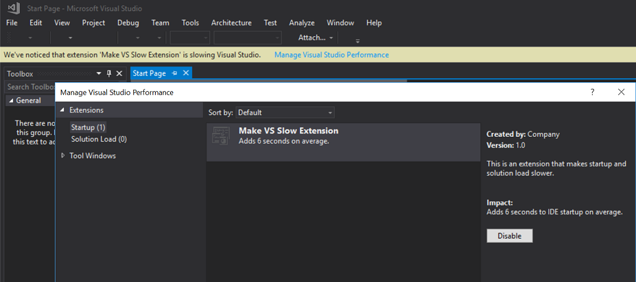
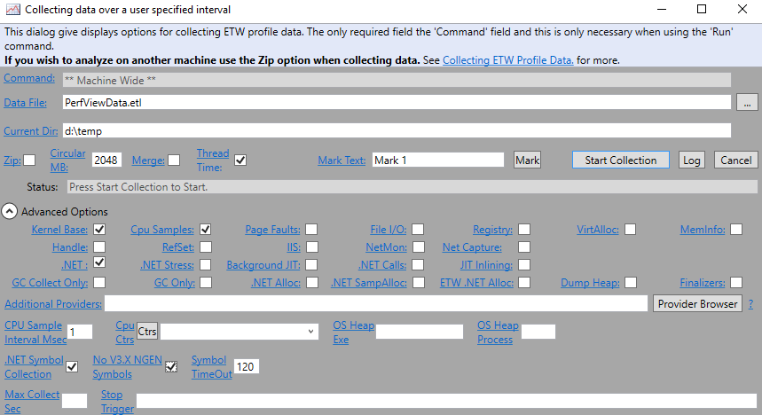
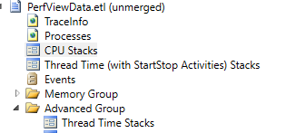

# Measuring extension impact in startup

## Focus on extension performance in Visual Studio 2017

Based on customer feedback, one of the focus areas for Visual Studio 2017 release has been startup and solution load performance. As the Visual Studio platform team, we have been working on improving startup and solution load performance. In general, our measurements suggest installed extensions can also have a considerable impact on those scenarios.

To help users understand this impact, we added a new feature in Visual Studio to notify users of slow extensions. Sometimes, Visual Studio detects a new extension that slows down either solution load or startup. When a slowdown is detected, users will see a notification in the IDE pointing them to new "Manage Visual Studio Performance" dialog. This dialog can also always be accessed by Help menu to browse previously detected extensions.



This document aims to help extension developers by describing how extension impact is calculated. This document also describes how extension impact can be analyzed locally. Locally analyzing extension impact will determine if an extension may be shown as a performance impacting extension.

> [!NOTE]
> This document focuses on the impact of extensions on startup and solution load. Extensions also impact Visual Studio performance when they cause the UI to become unresponsive. For more on this topic, see [How to: Diagnose UI delays caused by extensions](how-to-diagnose-ui-delays-caused-by-extensions.md).

## How extensions can impact startup

One of the most common ways for extensions to impact startup performance is by choosing to auto load at one of the known startup UI contexts such as NoSolutionExists or ShellInitialized. These UI contexts get activated during startup. Any packages that include the `ProvideAutoLoad` attribute in their definition with those contexts will be loaded and initialized at that time.

When we measure the impact of an extension, we primarily focus on time spent by those extensions that choose to auto load in the contexts above. Measured times would include but not be limited to:

* Loading of extension assemblies for synchronous packages
* Time spent in the package class constructor for synchronous packages
* Time spent in package Initialize (or SetSite) method for synchronous packages
* For asynchronous packages, the above operations run on background thread.  As such, the operations are excluded from monitoring.
* Time spent in any asynchronous work scheduled during package initialization to run on main thread
* Time spent in event handlers, specifically shell initialized context activation or the shell zombie state change
* Starting from Visual Studio 2017 Update 3, we will also start monitoring time spent in on idle calls before shell is initialized. Long operations in idle handlers also cause unresponsive IDE and contribute to perceived startup time by user.

We have added many features starting from Visual Studio 2015. These features help with removing the need for packages to auto load. The features also postpone the need for packages to load to more specific cases. These cases include examples where users would be more certain to use the extension or reduce an extension impact when loading automatically.

You can find more details about these features in the following documents:

[Rule-based UI contexts](how-to-use-rule-based-ui-context-for-visual-studio-extensions.md): A richer rule-based engine built around UI contexts allows you to create custom contexts based on project types, flavors, and attributes. Custom contexts can be used to load a package during more specific scenarios. These specific scenarios include the presence of a project with a specific capability instead of startup. Custom contexts also allow [command visibility to be tied to a custom context](visibilityconstraints-element.md) based on project components or other available terms. This feature eliminates the need to load a package to register a command status query handler.

[Asynchronous package support](how-to-use-asyncpackage-to-load-vspackages-in-the-background.md): The new AsyncPackage base class in Visual Studio 2015 allows Visual Studio packages to be loaded in the background asynchronously if package load was requested by an auto load attribute or an asynchronous service query. This background loading allows the IDE to stay responsive. The IDE is responsive even while the extension is initialized in the background and critical scenarios like startup and solution load wouldn't be impacted.

[Asynchronous services](how-to-provide-an-asynchronous-visual-studio-service.md): With asynchronous package support, we also added support for querying services asynchronously and being able to register asynchronous services. More importantly we are working on converting core Visual Studio services to support asynchronous query so that the majority of work in an async query occurs in background threads. SComponentModel (Visual Studio MEF host) is one of the major services that now supports asynchronous query to allow extensions to support asynchronous loading completely.

## Reducing impact of auto loaded extensions

If a package still needs to be auto loaded at startup, it is important to minimize the work done during package initialization. Minimizing the package initialization work reduces the chances of the extension impacting startup.

Some examples that could cause package initialization to be expensive are:

### Use of synchronous package load instead of asynchronous package load

Because synchronous packages are loaded on the main thread by default, we encourage extension owners that have auto loaded packages to use the asynchronous package base class instead as mentioned earlier. Changing an auto loaded package to support asynchronous loading will also make it easier to resolve the other issues below.

### Synchronous file/network IO requests

Ideally any synchronous file or network IO request should be avoided in the main thread. Their impact will depend on machine state and can block for long periods of time in some cases.

Using asynchronous package loading and asynchronous IO APIs should make sure that package initialization doesn't block the main thread in such cases. Users also can continue to interact with Visual Studio while I/O requests happen in background.

### Early initialization of services, components

One of the common patterns in package initialization is to initialize services either used by or provided by that package in the package `constructor` or `initialize` method. While this ensures services are ready to be used, it can also add unnecessary cost to package loading if those services are not used immediately. Instead such services should be initialized on demand to minimize the work done in package initialization.

For global services provided by a package, you can use `AddService` methods that take a function to lazily initialize the service only when it is requested by a component. For services used within the package, you can use Lazy\<T> or AsyncLazy\<T> to make sure that services are initialized/queried on first use.

## Measuring impact of auto loaded extensions using Activity log

Beginning in Visual Studio 2017 Update 3, Visual Studio activity log will now contain entries for performance impact of packages during startup and solution load. In order to see these measurements, you have to start Visual Studio with /log switch and open *ActivityLog.xml* file.

In the activity log, the entries will be under "Manage Visual Studio Performance" source, and will look like the following example:

```Component: 3cd7f5bf-6662-4ff0-ade8-97b5ff12f39c, Inclusive Cost: 2008.9381, Exclusive Cost: 2008.9381, Top Level Inclusive Cost: 2008.9381```

This example shows that a package with GUID "3cd7f5bf-6662-4ff0-ade8-97b5ff12f39c" spent 2008 ms in startup of Visual Studio. Note that Visual Studio considers top-level cost as the primary number when calculating impact of a package as that would be the savings users see when they disable the extension for that package.

## Measuring impact of auto loaded extensions using PerfView

While code analysis can help identify code paths that can slow down package initialization, you can also utilize tracing by using applications like PerfView to understand the impact of a package load in Visual Studio startup.

PerfView is a system-wide tracing tool. This tool will help you understand hot paths in an application either because of CPU usage or blocking system calls. Below is a quick example on analyzing a sample extension using PerfView available at the [Microsoft Download Center](https://www.microsoft.com/en-us/download/details.aspx?id=28567).

**Example code:**

This example is based on the sample code below, which is designed to show case some common delay causes:

```csharp
protected override void Initialize()
{
    // Initialize a class from another assembly as an example
    MakeVsSlowServiceImpl service = new MakeVsSlowServiceImpl();

    // Costly work in main thread involving file IO
    string systemPath = Environment.GetFolderPath(Environment.SpecialFolder.Windows);
    foreach (string file in Directory.GetFiles(systemPath))
    {
        DateTime creationDate = File.GetCreationTime(file);
    }

    // Costly work after shell is initialized. This callback executes on main thread
    KnownUIContexts.ShellInitializedContext.WhenActivated(() =>
    {
        DoMoreWork();
    });

    // Start async work on background thread
    DoAsyncWork().Forget();
}

private async Task DoAsyncWork()
{
    // Switch to background thread to do expensive work
    await TaskScheduler.Default;
    System.Threading.Thread.Sleep(500);
}

private void DoMoreWork()
{
    // Costly work
    System.Threading.Thread.Sleep(500);
    // Blocking call to an asynchronous work.
    ThreadHelper.JoinableTaskFactory.Run(async () => { await DoAsyncWork(); });
}
```

**Recording a trace with PerfView:**

Once you set up your Visual Studio environment with your extension installed, you can record a trace of startup by opening PerfView and opening the **Collect** dialog from the **Collect** menu.



The default options will provide call stacks for CPU consumption but since we are interested in blocking time as well, you also should enable **Thread Time** stacks. Once the settings are ready you can click on **Start Collection** and start Visual Studio once recording is started.

Before you stop collection, you want to make sure Visual Studio is fully initialized, the main window is completely visible and if your extension has any UI pieces that automatically show,  they are also visible. Once Visual Studio is completely loaded and your extension is initialized, you can stop recording to analyze the trace.

**Analyzing a trace with PerfView:**

Once recording is completed PerfView will automatically open the trace and expand options.

For the purposes of this example, we are mainly interested in the **Thread Time Stacks** view which you can find under **Advanced Group**. This view will show total time spent on a thread by a method including both CPU time and blocked time, such as disk IO or waiting on handles.

 

 While opening **Thread Time Stacks** view, you should choose the **devenv** process to start analysis.

PerfView has detailed guidance on how to read thread time stacks under its own Help menu for more detailed analysis. For purposes of this example, we want to filter this view further by only including stacks with our packages module name and startup thread.

1. Set **GroupPats** to empty text to remove any grouping added by default.
2. Set **IncPats** to include part of your assembly name and Startup Thread in addition to existing process filter. In this case, it should be **devenv;Startup Thread;MakeVsSlowExtension**.

Now the view will only show cost that is associated with the assemblies related to extension. In this view, any time listed under the **Inc (Inclusive cost)** column of startup thread is related to our filtered extension and will be impacting startup.

For the example above some interesting call stacks would be:

1. IO using `System.IO` class: While inclusive cost of these frames might not be too expensive in the trace, they are a potential cause of an issue since file IO speed will vary from machine to machine.

   

2. Blocking calls waiting on other asynchronous work: In this case, inclusive time would represent the time the main thread is blocked on the completion of asynchronous work.

   

One of the other views in the trace that will be useful to determine impact will be the **Image Load Stacks**. You can apply the same filters as applied to **Thread Time Stacks** view and find out all assemblies loaded because of the code executed by your auto loaded package.

It is important to minimize number of loaded assemblies inside a package initialization routine as each additional assembly will involve extra disk I/O which can slow down startup considerably on slower machines.

## Summary

Startup of Visual Studio has been one of the areas we continually get feedback on. Our goal as stated earlier is for all users to have a consistent startup experience regardless of components and extensions they have installed. We would like to work with extension owners to help them help us achieve that goal. The guidance above should be helpful in understanding an extensions impact on startup and either avoiding the need to auto load or load it asynchronously to minimize impact on user productivity.
