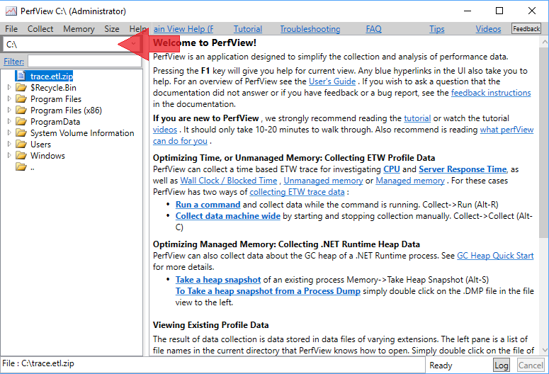
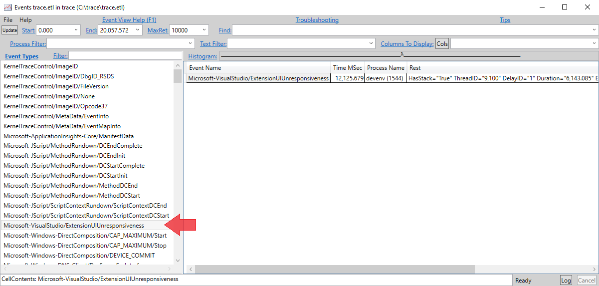
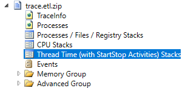
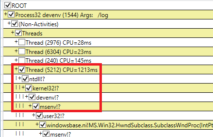

# How to: Diagnose UI delays caused by extensions

When Visual Studio UI becomes unresponsive, it examines the call-stack of the UI thread, starting with the leaf and working towards the base. If Visual Studio determines that a frame belongs to a module that is part of an installed and enabled extension, it shows a notification.


The notification informs the user that the UI delay (i.e. the unresponsiveness in the UI) might have been the result of code from an extension as well as providing the user with options to disable the extension or future notifications for that extension.

You can diagnose UI delays by using a combination of Visual Studio's activity-log and an (ETW) event trace. In the following sections, we will describe how you can do this. 

## Using the Visual Studio activity-log
To use the Visual Studio activity-log, you first need to start Visual Studio with `/log` command line option. This instructs Visual Studio to generate an "activity log". This activity log is stored at the below path:

```DOS
%APPDATA%\Microsoft\VisualStudio\<vs_instance_id>\ActivityLog.xml
```

(To learn more about how you can find your VS instance ID, please see [Tools for detecting and managing Visual Studio instances](https://docs.microsoft.com/en-us/visualstudio/install/tools-for-managing-visual-studio-instances).)

 Every time we detect an extension UI delay, we write a node to the activity-log with "UIDelayNotifications" as the source. This node contains 4 pieces of information about the UI delay:
1. The UI delay ID, a sequential number that uniquely identifies a UI delay in a VS session
2. The session ID, which uniquely identifies your Visual Studio session from start to close
3. Whether or not a notification was shown for the UI delay
4. The extension that likely caused the UI delay

```xml
<entry>
  <record>271</record>
  <time>2018/02/03 12:02:52.867</time>
  <type>Information</type>
  <source>UIDelayNotifications</source>
  <description>A UI delay (Delay ID = 0) has been detected. (Session ID=16e49d4b-26c2-4247-ad1c-488edeb185e0; Blamed extension="UIDelayR2"; Notification shown? Yes.)</description>
</entry>
```

Please note that not always do delays result in a notification. Therefore, you should always check the "Notification shown?" value to correctly identify the right UI delay.

Once you have the delay ID of the UI delay, we can proceed to the next step for collect an ETW trace and use this delay ID to locate the UI delay in our trace.

## Collecting an ETW trace
You can collect an ETW trace to see what was running on the UI thread when the notification was shown. [PerfView](https://github.com/Microsoft/perfview/) provides an easy-to-use interface both for collecting an ETW trace and for analyzing it. You can use the below command line to collect a trace:

```DOS
Perfview.exe collect C:\trace.etl /BufferSizeMB=1024 -CircularMB:2048 -Merge:true -Providers:*Microsoft-VisualStudio:@StacksEnabled=true -NoV2Rundown /kernelEvents=default+FileIOInit+ContextSwitch+Dispatcher
```
This enables the "Microsoft-VisualStudio" provider, which is the provider we use for events related to UI delay notifications. It also specifies the keyword for the kernel provider that PerfView can use to generate the "Thread Time Stacks" view.

You can start trace collection from a few seconds before running the action that triggers the notification. Once the notification is shown, you can stop trace collection for PerfView to process and generate the output trace file.

## Analyzing your ETW trace
Once you have the trace file, you can open it in PerfView by setting the current folder path in upper-left portion of PerfView to where your trace file is located.



Then double-click the trace file for PerfView to open it. This may take several seconds to complete.

> [!NOTE]
> By default PerfView outputs a Zip archive and when you double-click trace.zip, it automatically decompresses the archive and opens the trace. You can skip this by unchecking the "Zip" box during trace collection. However, if you are planning to transfer and use traces across different machines, we strongly recommend against unchecking the "Zip" box since without this option, the required PDBs for Ngen assemblies will not accompany the trace and thus symbols from Ngen assemblies will not be resolved on the destination machine. (See [this blog post](https://blogs.msdn.microsoft.com/devops/2012/12/10/creating-ngen-pdbs-for-profiling-reports/) for more information on PDBs for Ngen assemblies.)

The default view that will be displayed is the summary view. In the summary view, you can see a list of traces in the same directory as well as the other subviews for the currently-selected trace.


We will first use the "Events" view to obtain the time-range of the UI delay:
1. Double-click on "Events" to open the "Events" views.
2. Select "`Microsoft-VisualStudio/ExtensionUIUnresponsiveness`" in the left pane.
3. Press Enter so the selection is applied and all `ExtensionUIUnresponsiveness` events are displayed in the right pane.



Each row in the right pane will correspond to a UI delay. The event includes a "Delay ID" value which should match the delay ID in the activity-log from the step 1. Since `ExtensionUIUnresponsiveness` is fired at the end of the UI delay, the timestamp of the event will (roughly) mark the end time of the UI delay. The event also contains the duration of the delay. We can subtract the duration from the end timestamp to obtain the timestamp of when the UI delay started.


In the picture above, for example, the timestamp of the event is 12,125.679 and the delay duration is 6,143.085 (ms). Thus,
* The delay start is 12,125.679 - 6,143.085 = 5,982.594.
* The UI delay time-range is 5,982.594 to 12,125.679.

Once we have the time-range, we can close out of the Events view and open the "Thread Time (with StartStop Activities) Stacks" view. This view is especially handy because often extensions blocking the UI thread are merely waiting on other threads or an I/O-bound operation. Thus, the "CPU Stack" view (which is the go-to option for most cases), may not capture the time the thread spends blocking since it is not using the CPU during that time. The "Thread Time Stacks" solves this problem by properly showing blocked time.



While opening "Thread Time Stacks" view, you should choose the "devenv" process to start analysis.


In the "Thread Time Stacks" view, in the top-left of the page, you can set the time-range to the values we calculated in the previous step and hit Enter so the stacks are adjusted to that time range.

> [!NOTE]
> Determining which thread is the UI (startup) thread can be counterintuitive if trace collection is started after Visual Studio is already open. However, the first elements on the stack of the UI (startup) thread are most-likely always OS DLLs (ntdll.dll and kernel32.dll) followed by devenv!? and then msenv!?. This sequence can help identify the UI thread.

 

You can also further filter this view by only including stacks with your packages module name.

* Set "GroupPats" to empty text to remove any grouping added by default.
* Set "IncPats" to include part of your assembly name in addition to existing process filter. In this case, it should be "devenv;UIDelayR2".


PerfView also has detailed guidance on how to read thread time stacks under its own Help menu for more detailed analysis that you can use to diagnose why the extension code is causing unresponsiveness in the UI.


