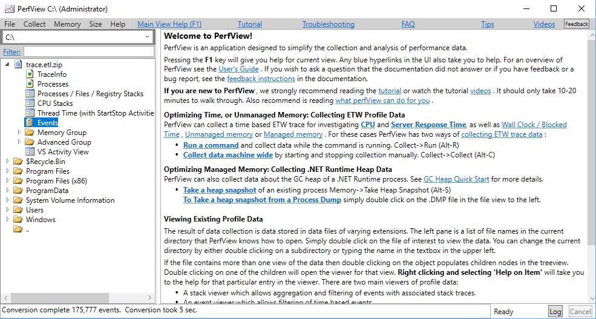
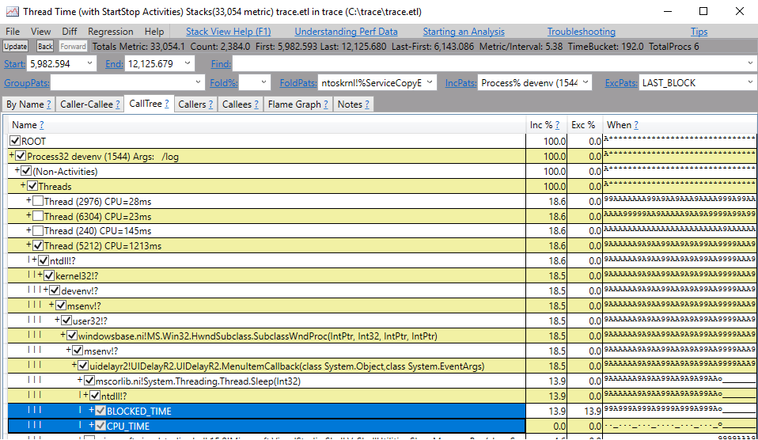

# How to: Diagnose UI delays caused by extensions

When the Visual Studio UI becomes unresponsive, PerfWatson2.exe, an external process that performs diagnostics and performance-monitoring for Visual Studio, examines the call-stack of the UI thread. If the code on the call-stack is identified as part of an extension, a notification is displayed in Visual Studio informing the user that the UI delay, i.e. the unresponsiveness in the UI, might have been the result of code from an extension. The notification also provides options to disable the extension or future notifications for that extension.

> [!NOTE]
> To analyze the call-stack, we start at the top (i.e. the leaf) of the call-stack and proceed toward the bottom (i.e. the root of the call-stack) checking for each frame, if the owning module is one that is associated with an extension. It is possible that the extension by itself is not causing the UI delay, rather the extension is calling into Visual Studio APIs that, in turn, take a long time to complete. For most stacks, however, UI delays can be diagnosed to speed up extension code.

To diagnose UI delays, you can use a combination of the Visual Studio's activity-log and ETW traces. Visual Studio creates an ActivityLog.xml file if it is run with the `/log` command line option. You can find the activity-log under the following path:

```
%APPDATA%\Microsoft\VisualStudio\<vs_instance_id>\ActivityLog.xml
```

 Every time we detect an extension UI delay, we write a node to the activity-log with "UIDelayNotifications" as the source:

```
<entry>
  <record>271</record>
  <time>2018/02/03 12:02:52.867</time>
  <type>Information</type>
  <source>UIDelayNotifications</source>
  <description>A UI delay (Delay ID = 0) has been detected. (Session ID=16e49d4b-26c2-4247-ad1c-488edeb185e0; Blamed extension=&quot;UIDelayR2&quot;; Notification shown? Yes.)</description>
</entry>

```

The node contains 4 pieces of information about the UI delay:
* the UI delay ID, a sequential number that uniquely identifies a UI delay in a VS session,
* whether or not a notification was shown for the UI delay and
* The extension that likely caused the UI delay.
* the session ID, which uniquely identifies your Visual Studio session from start to close.

Please note that notifications are only shown if several criteria are met (e.g. whether or not the user has disabled notifications the this extension). Therefore, you should always check the "Notification shown?" value to correctly identify the right UI delay.

Once you have the delay ID of the UI delay, you can collect an ETW trace to see what was running on the UI thread when the notification was shown. [PerfView](https://github.com/Microsoft/perfview/) provides an easy-to-use interface both for collecting an ETW trace and for analyzing it. You can collect use the below command line to collect a trace:

```
Perfview.exe collect S:\trace.etl /BufferSizeMB=1024 -CircularMB:2048 -Merge:true -Providers:*Microsoft-VisualStudio:@StacksEnabled=true -NoV2Rundown /kernelEvents=default+FileIOInit+ContextSwitch+Dispatcher
```
This enables the "Microsoft-VisualStudio" provider, which is the provider we use for events related to UI delay notifications. It also specifies the keyword for the kernel provider that PerfView can you to generate the "Thread Time Stacks" view.

You can start trace collection from a few seconds before running the action that triggers the notification. Once the notification is shown, you can stop trace collection for PerfView to process and generate the output .etl file.

> [!NOTE]
> It is more efficient to use a solid state drive to store the output .etl file given the high volume of data written to disk (usually several gigabytes).

> [!NOTE]
> If you are planning to transfer and use traces across different machines, you must add `-Zip:true` command-line option. This option ensures that the .pdb files for any relevant Ngen assemblies are included in the zipped archive for symbol resolution.

Once you have the trace file, you can open it in PerfView. The default view that will be displayed is the summary view. In the summary view, you can see a list of traces in the same directory as well as the other subviews for the currently-selected trace.



We will use first use the "Events" view to obtain the time-range of the UI delay. Double-click on "Events", then select "`Microsoft-VisualStudio/ExtensionUIUnresponsiveness`" in the left pane and press Enter to view all `ExtensionUIUnresponsiveness` events. Each instance of this event corresponds to a UI delay. `ExtensionUIUnresponsiveness` is fired (roughly) at the end of each UI delay and contains the duration of the delay, the extension ID, and the delay ID. This delay ID can be used to find which instance of `ExtensionUIUnresponsiveness` belongs to the UI delay from the activity-log.


Once you have the right ExtensionUIUnresponsiveness event, you can use the timestamp of the event and the duration reported in the event to calculate the time-range of the delay:
* As mentioned above, `ExtensionUIUnresponsiveness` can be used as a rough approximate for the end-time of the UI delay. Please keep in mind, however, that there is often a gap in between. The size of this gap depends on available system resources to report and analyze the call-stack. In most cases, the gap is several 100 milliseconds to a few seconds.
* The start of the time-range is the end-time minus the duration.

Once we have the time-range, we can close out of the Events view and open the "Thread Time Stacks" view. This view is especially handy because often extensions blocking the UI thread are merely waiting on other threads or an I/O-bound operation. Thus, the "CPU Stack" view (which is the go-to option for most cases), may not capture the time the thread spends blocking since it is not using the CPU during that time. The "Thread Time Stacks" solves this problem by properly showing blocked time.



In the "Thread Time Stacks" view, in the top-left of the page, you can set the time-range to the values we calculated in the previous step and hit Enter so the stacks are adjusted to that time range.

> [!NOTE]
> Determining which thread is the UI (startup) thread can be counterintuitive if trace collection is started after Visual Studio is already open. However, the first elements on the stack of the UI (startup) thread are most-likely always OS DLLs (ntdll.dll and kernel32.dll) followed by devenv!? and then msenv!?. This sequence can help identify the UI thread.

You can further drill into the call-stack of the UI thread or that of other threads during the same time-range to find out why the extension code is causing unresponsiveness in the UI.


