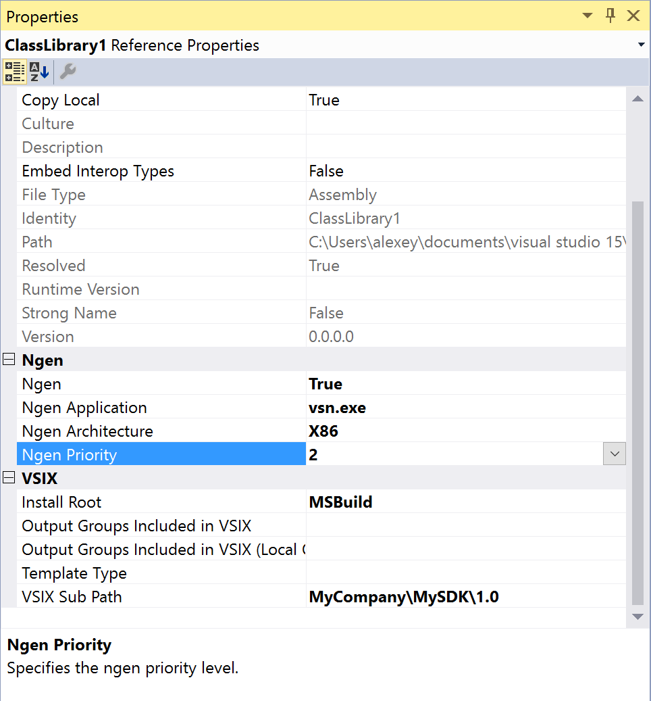

# Ngen support in VSIX v3

With Visual Studio 2017 and the new VSIX v3 (version 3) extension manifest format, extension developers can now "ngen" their assemblies at installation time.

Below is an excerpt from MSDN that explains what "ngen" does:

>The Native Image Generator (Ngen.exe) is a tool that improves the performance of managed applications. Ngen.exe creates native images, which are files containing compiled processor-specific machine code, and installs them into the native image cache on the local computer. The runtime can use native images from the cache instead of using the just-in-time (JIT) compiler to compile the original assembly.
>
>from [Ngen.exe (Native Image Generator)](https://msdn.microsoft.com/en-us/library/6t9t5wcf(v=vs.110).aspx)

In order to "ngen" an assembly, the VSIX must be installed "per-instance per-machine". This can be enabled by checking the "all-users" checkbox in the extension.vsixmanifest designer:


## How to enable Ngen

To enable ngen for an assembly, you can use the **Properties** window in Visual Studio.

There are 4 properties that can be set:

1. **Ngen** (Boolean) – If true, the Visual Studio installer will "ngen" the assembly.
2. **Ngen application** (string) – Ngen provides the opportunity to use an application's app.config file in order to resolve assembly dependencies. This value should be set to an application whose app.config you want to use (relative to the Visual Studio install directory).
3. **Ngen Architecture** (enum) – The architecture to natively compile your assembly. The options are:
        a. NotSpecified
        b. X86
        c. X64
        d. All
4. **Ngen Priority** (integer between 1 and 3) – The Ngen Priority level is documented at [Ngen.exe Priority Levels](https://msdn.microsoft.com/en-us/library/6t9t5wcf(v=vs.110).aspx#Anchor_3).

Here's a look at the **Properties** window in action:



This will add metadata to the project reference inside of the VSIX project's .csproj file:

```xml
 <ProjectReference Include="..\ClassLibrary1\ClassLibrary1.csproj">
    <Project>{69a979f1-eba2-43e7-9346-0e56e803508b}</Project>
    <Name>ClassLibrary1</Name>
    <Ngen>True</Ngen>
    <NgenApplication>vsn.exe</NgenApplication>
    <NgenArchitecture>X86</NgenArchitecture>
    <NgenPriority>2</NgenPriority>
</ProjectReference>
 ```

 >**Note:** You can edit the .csproj file directly, if you prefer.

## Extra information

The property designer changes apply to more than just project references; you can set the Ngen metadata for items inside of your project as well (using the same methods described above) as long as the items are .NET assemblies.