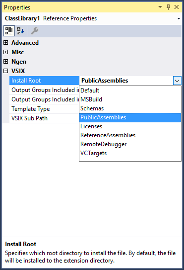
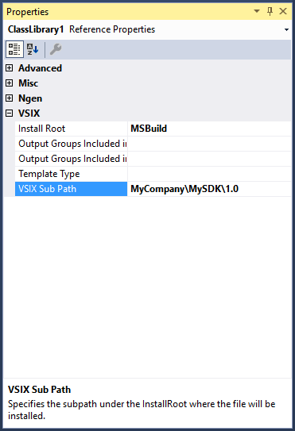

# Installing outside the extensions folder

>**Note:** This documentation is preliminary and based on the Visual Studio 2017 RC release.

Starting with Visual Studio 2017 and VSIX v3 (version 3), there is now support for installing extension assets outside of the extensions folder. Currently, the following locations are enabled as valid installation locations (where [installdir] is mapped to the Visual Studio instance’s installation directory):

* [installdir]\Common7\IDE\PublicAssemblies
* [installdir]\Common7\IDE\ReferenceAssemblies
* [installdir]\MSBuild
* [installdir]\Schemas
* [installdir]\Licenses
* [installdir]\RemoteDebugger
* [installdir]\VSTargets

>**Note:** The VSIX format does not allow you to install outside the VS install folder structure.

In order to support installing to these directories, the VSIX must be installed "per-instance per-machine". This can be enabled by checking the "all-users" checkbox in the extension.vsixmanifest designer:


## How to set the InstallRoot

To set the installation directories, you can use the **Properties** window in Visual Studio. For instance, you can set the `InstallRoot` property of a project reference to one of the above locations:



This will add some metadata to the corresponding `ProjectReference` property inside of the VSIX project’s .csproj file:

```xml
 <ProjectReference Include="..\ClassLibrary1\ClassLibrary1.csproj">
        <Project>{69a979f1-eba2-43e7-9346-0e56e803508b}</Project>
        <Name>ClassLibrary1</Name>
        <InstallRoot>PublicAssemblies</InstallRoot>
 </ProjectReference>
```

>**Note:** You can edit the .csproj file directly, if you prefer.

## How to set a subpath under the InstallRoot

If you’d like to install to a subpath underneath the `InstallRoot`, you can do so by setting the `VsixSubPath` property just like the `InstallRoot` property. For instance, say we want our project reference’s output to install to '[installdir]\MSBuild\MyCompany\MySDK\1.0'. We can do this easily with the property designer:



The corresponding .csproj changes will look like this:

```xml
<ProjectReference Include="..\ClassLibrary1\ClassLibrary1.csproj">
       <Project>{69a979f1-eba2-43e7-9346-0e56e803508b}</Project>
       <Name>ClassLibrary1</Name>
       <InstallRoot>MSBuild</InstallRoot>
       <VSIXSubPath>MyCompany\MySDK\1.0</VSIXSubPath>
</ProjectReference>
```

## Extra information

The property designer changes apply to more than just project references; you can set the `InstallRoot` metadata for items inside of your project as well (using the same methods described above).
