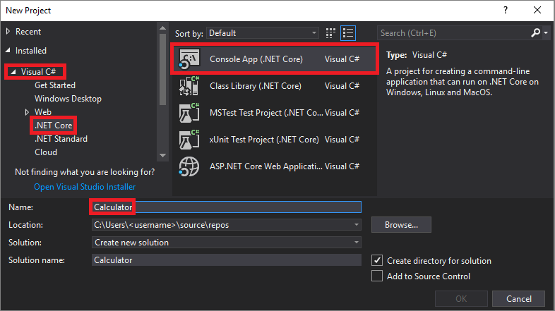
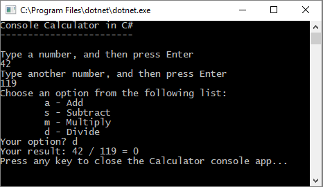
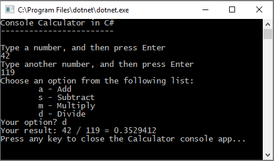
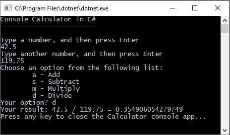
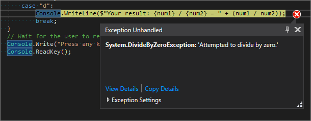
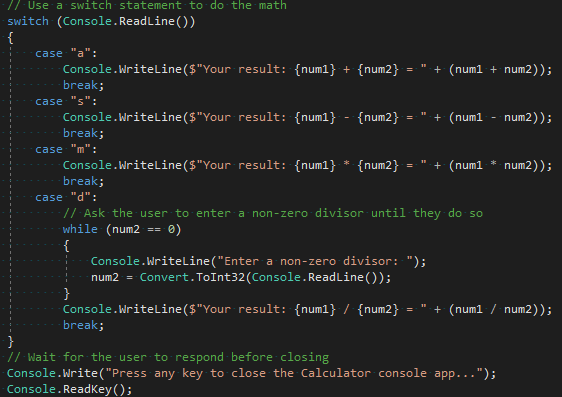
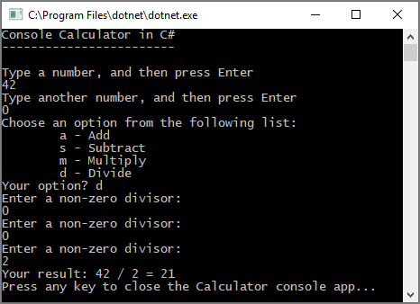
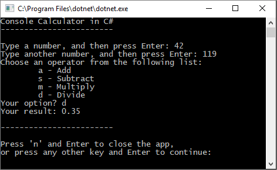

# Tutorial: Create a simple C# console app in Visual Studio

In this tutorial for C#, you'll use Visual Studio to create and run a console app and explore some features of the [Visual Studio integrated development environment (IDE)](../visual-studio-ide.md) while you do so.

If you haven't already installed Visual Studio, go to the [Visual Studio downloads](https://visualstudio.microsoft.com/downloads/?utm_medium=microsoft&utm_source=docs.microsoft.com&utm_campaign=button+cta&utm_content=download+vs2017) page to install it for free.

## Create a project

To start, we'll create a C# application project. The project type comes with all the template files you'll need, before you've even added anything!

1. Open Visual Studio 2017.

2. From the top menu bar, choose **File** > **New** > **Project**.

3. In the **New Project** dialog box in the left pane, expand **C#**, and then choose **.NET Core**. In the middle pane, choose **Console App (.NET Core)**. Then name the file *Calculator*.

   

### Add a workgroup (optional)

If you don't see the **Console App (.NET Core)** project template, you can get it by adding the **.NET Core cross-platform development** workload. To find out how to do this, see the "[What's a workload and how do I add one?](#workload)" section in the FAQ.

## Create the app

First, we'll explore some basic integer math in C#. Then, we'll add code to create a basic calculator. Next, we'll tweak the code to add functionality. After that, we'll debug the app to find and fix errors. And finally, we'll refine the code to make it more efficient.

Let's start with some integer math in C#.

1. In the code editor, delete the default "Hello World" code.

    

   Specifically, delete the line that says, `Console.WriteLine("Hello World!");`.

1. In its place, type the following code:

    ```csharp
            int a = 42;
            int b = 119;
            int c = a + b;
            Console.WriteLine(c);
            Console.ReadKey();
    ```
1. Choose **Calculator** to run your program, or press **F5**.

   

   A console window opens that reveals the sum of 42 + 119.

1. Now try changing the `int c = a + b;` line of code by using a different operator, such as `-` for subtraction, `*` for multiplication, or */* for division.

    Notice that when you change the operator and run the program, the result changes, too.

Let's continue by adding a more complex set of calculator code to your project.

1. Delete all the code you see in the code editor.

1. Enter or paste the following new code into the code editor:

    ```csharp
    using System;

    namespace Calculator
    {
        class Program
        {
            static void Main(string[] args)
            {
                // Declare variables and then initialize to zero
                int num1 = 0; int num2 = 0;

                // Display title as the C# console calculator app
                Console.WriteLine("Console Calculator in C#\r");
                Console.WriteLine("------------------------\n");

                // Ask the user to type the first number
                Console.WriteLine("Type a number, and then press Enter");
                num1 = Convert.ToInt32(Console.ReadLine());

                // Ask the user to type the second number
                Console.WriteLine("Type another number, and then press Enter");
                num2 = Convert.ToInt32(Console.ReadLine());

                // Ask the user to choose an option
                Console.WriteLine("Choose an option from the following list:");
                Console.WriteLine("\ta - Add");
                Console.WriteLine("\ts - Subtract");
                Console.WriteLine("\tm - Multiply");
                Console.WriteLine("\td - Divide");
                Console.Write("Your option? ");

                // Use a switch statement to do the math
                switch (Console.ReadLine())
                {
                    case "a":
                        Console.WriteLine($"Your result: {num1} + {num2} = " + (num1 + num2));
                        break;
                    case "s":
                        Console.WriteLine($"Your result: {num1} - {num2} = " + (num1 - num2));
                        break;
                    case "m":
                        Console.WriteLine($"Your result: {num1} * {num2} = " + (num1 * num2));
                        break;
                    case "d":
                        Console.WriteLine($"Your result: {num1} / {num2} = " + (num1 / num2));
                        break;
                }
                // Wait for the user to respond before closing
                Console.Write("Press any key to close the Calculator console app...");
                Console.ReadKey();
            }
        }
    }
    ```
1. Choose **Calculator** to run your program, or press **F5**.

   

   A console window opens.

1. View your app in the console window, and then follow the prompts to add the numbers **42** and **119**.

   Your app should look similar to the following screenshot:

    

### Add decimals

The calculator app currently accepts and returns whole numbers. But, it'll be more precise if we add code that allows for decimals.

As in the following screenshot, if you run the app and divide number 42 by the number 119, your result is 0 (zero), which isn't exact.



Let's fix the code so that it handles decimals.

1. Press **Ctrl** + **F** to open the **Find and Replace** control.

1. Change each instance of the `int` variable to `float`.

    

1. Run your calculator app again and divide the number **42** by the number **119**.

   Notice that the app now returns a decimal numeral instead of zero.

    

However, the app produces only a decimal result. Let's make a few more tweaks to the code so that the app can calculate decimals too.

1. Use the **Find and Replace** control (**Ctrl** + **F**) to change each instance of the `float` variable to `double`, and to change each instance of the `Convert.ToInt32` method to `Convert.ToDouble`.

1. Run your calculator app and divide the number **42.5** by the number **119.75**.

   Notice that the app now accepts decimal values and returns a longer decimal numeral as its result.

    

    (We'll fix the number of decimal places in the [Revise the code](#revise-the-code) section.)

## Debug the app

We've improved on our basic calculator app, but it doesn't yet have failsafes in place to handle exceptions, such as user input errors.

For example, if you try to divide a number by zero, or enter an alpha character when the app expects a numeric character (or vice versa), the app stops working and returns an error.

Let's walk through a few common user input errors, locate them in the [debugger](../../debugger/debugger-feature-tour.md), and fix them in the code.

### Fix the "divide by zero" error

When you try to divide a number by zero, the console app freezes. Visual Studio then shows you what's wrong in the code editor.

   

Let's change the code to handle this error.

1. Delete the code that appears directly between `case "d":` and the comment that says `// Wait for the user to respond before closing`.

1. Replace it with the following code:

   ```csharp
            // Ask the user to enter a non-zero divisor until they do so
                while (num2 == 0)
                {
                    Console.WriteLine("Enter a non-zero divisor: ");
                    num2 = Convert.ToInt32(Console.ReadLine());
                }
                Console.WriteLine($"Your result: {num1} / {num2} = " + (num1 / num2));
                break;
        }
    ```

   After you add the code, the section with the `switch` statement should look similar to the following screenshot:

   

Now, when you divide any number by zero, the app will ask for another number. Even better: It won't stop asking until you provide a number other than zero.

   

### Fix the "format" error

If you enter an alpha character when the app expects a numeric character (or vice versa), the console app freezes. Visual Studio then shows you what's wrong in the code editor.

   

To fix this error, we must refactor the code that we've previously entered.

#### Revise the code

Rather than rely on the `program` class to handle all the code, we'll divide our app into two classes: `calculator` and `program`.

The `calculator` class will handle the bulk of the calculation work, and the `program` class will handle the user interface and error-capturing work.

Let's get started.

1. Delete everything *after* the following code block:

    ```csharp

    using System;

    namespace Calculator
    {

    ```

1. Next, add a new `calculator` class, as follows:

    ```csharp
    class Calculator
    {
        public static double DoOperation(double num1, double num2, string op)
        {
            double result = double.NaN; // Default value is "not-a-number" which we use if an operation, such as division, could result in an error

            // Use a switch statement to do the math
            switch (op)
            {
                case "a":
                    result = num1 + num2;
                    break;
                case "s":
                    result = num1 - num2;
                    break;
                case "m":
                    result = num1 * num2;
                    break;
                case "d":
                    // Ask the user to enter a non-zero divisor
                    if (num2 != 0)
                    {
                        result = num1 / num2;
                    }
                    break;
                // Return text for an incorrect option entry
                default:
                    break;
            }
            return result;
        }
    }

    ```

1. Then, add a new  `program` class, as follows:

    ```csharp
    class Program
    {
        static void Main(string[] args)
        {
            bool endApp = false;
            // Display title as the C# console calculator app
            Console.WriteLine("Console Calculator in C#\r");
            Console.WriteLine("------------------------\n");

            while (!endApp)
            {
                // Declare variables and set to empty
                string numInput1 = "";
                string numInput2 = "";
                double result = 0;

                // Ask the user to type the first number
                Console.Write("Type a number, and then press Enter: ");
                numInput1 = Console.ReadLine();

                double cleanNum1 = 0;
                while (!double.TryParse(numInput1, out cleanNum1))
                {
                    Console.Write("This is not valid input. Please enter an integer value: ");
                    numInput1 = Console.ReadLine();
                }

                // Ask the user to type the second number
                Console.Write("Type another number, and then press Enter: ");
                numInput2 = Console.ReadLine();

                double cleanNum2 = 0;
                while (!double.TryParse(numInput2, out cleanNum2))
                {
                    Console.Write("This is not valid input. Please enter an integer value: ");
                    numInput2 = Console.ReadLine();
                }

                // Ask the user to choose an operator
                Console.WriteLine("Choose an operator from the following list:");
                Console.WriteLine("\ta - Add");
                Console.WriteLine("\ts - Subtract");
                Console.WriteLine("\tm - Multiply");
                Console.WriteLine("\td - Divide");
                Console.Write("Your option? ");

                string op = Console.ReadLine();

                try
                {
                    result = Calculator.DoOperation(cleanNum1, cleanNum2, op);
                    if (double.IsNaN(result))
                    {
                        Console.WriteLine("This operation will result in a mathematical error.\n");
                    }
                    else Console.WriteLine("Your result: {0:0.##}\n", result);
                }
                catch (Exception e)
                {
                    Console.WriteLine("Oh no! An exception occurred trying to do the math.\n - Details: " + e.Message);
                }

                Console.WriteLine("------------------------\n");

                // Wait for the user to respond before closing
                Console.Write("Press 'n' and Enter to close the app, or press any other key and Enter to continue: ");
                if (Console.ReadLine() == "n") endApp = true;

                Console.WriteLine("\n"); // Friendly linespacing
            }
            return;
        }
    }
    ```
1. Choose **Calculator** to run your program, or press **F5**.

1. Follow the prompts and divide the number **42** by the number **119**. Your app should look similar to the following:

    

    Notice that you have the option to enter more equations until you choose to close the console app. And, we've also reduced the number of decimal places in the result.

## Close the app

1. If you haven't already done so, close the calculator app.

1. Close the **Output** pane in Visual Studio.

   

1. In Visual Studio, press **Ctrl**+**S** to save your app.

1. Close Visual Studio.

## Code complete

During this tutortial, we've made a lot of changes to the calculator app. The app now handles computing resources more efficiently, and it handles most user input errors.

Here's the complete code, all in one place:

```csharp

using System;

namespace Calculator
{
    class Calculator
    {
        public static double DoOperation(double num1, double num2, string op)
        {
            double result = double.NaN; // Default value is "not-a-number" which we use if an operation, such as division, could result in an error

            // Use a switch statement to do the math
            switch (op)
            {
                case "a":
                    result = num1 + num2;
                    break;
                case "s":
                    result = num1 - num2;
                    break;
                case "m":
                    result = num1 * num2;
                    break;
                case "d":
                    // Ask the user to enter a non-zero divisor
                    if (num2 != 0)
                    {
                        result = num1 / num2;
                    }
                    break;
                // Return text for an incorrect option entry
                default:
                    break;
            }
            return result;
        }
    }

    class Program
    {
        static void Main(string[] args)
        {
            bool endApp = false;
            // Display title as the C# console calculator app
            Console.WriteLine("Console Calculator in C#\r");
            Console.WriteLine("------------------------\n");

            while (!endApp)
            {
                // Declare variables and set to empty
                string numInput1 = "";
                string numInput2 = "";
                double result = 0;

                // Ask the user to type the first number
                Console.Write("Type a number, and then press Enter: ");
                numInput1 = Console.ReadLine();

                double cleanNum1 = 0;
                while (!double.TryParse(numInput1, out cleanNum1))
                {
                    Console.Write("This is not valid input. Please enter an integer value: ");
                    numInput1 = Console.ReadLine();
                }

                // Ask the user to type the second number
                Console.Write("Type another number, and then press Enter: ");
                numInput2 = Console.ReadLine();

                double cleanNum2 = 0;
                while (!double.TryParse(numInput2, out cleanNum2))
                {
                    Console.Write("This is not valid input. Please enter an integer value: ");
                    numInput2 = Console.ReadLine();
                }

                // Ask the user to choose an operator
                Console.WriteLine("Choose an operator from the following list:");
                Console.WriteLine("\ta - Add");
                Console.WriteLine("\ts - Subtract");
                Console.WriteLine("\tm - Multiply");
                Console.WriteLine("\td - Divide");
                Console.Write("Your option? ");

                string op = Console.ReadLine();

                try
                {
                    result = Calculator.DoOperation(cleanNum1, cleanNum2, op);
                    if (double.IsNaN(result))
                    {
                        Console.WriteLine("This operation will result in a mathematical error.\n");
                    }
                    else Console.WriteLine("Your result: {0:0.##}\n", result);
                }
                catch (Exception e)
                {
                    Console.WriteLine("Oh no! An exception occurred trying to do the math.\n - Details: " + e.Message);
                }

                Console.WriteLine("------------------------\n");

                // Wait for the user to respond before closing
                Console.Write("Press 'n' and Enter to close the app, or press any other key and Enter to continue: ");
                if (Console.ReadLine() == "n") endApp = true;

                Console.WriteLine("\n"); // Friendly linespacing
            }
            return;
        }
    }
}

```

## Quick answers FAQ

Here's a quick FAQ to highlight some key concepts. The FAQ also includes answers to questions that might come up when you follow the procedures in the tutorial.

### What is C#?

C# is a type-safe programming language that runs on the .NET Framework and .NET Core. With C#, you can create Windows applications, client-server applications, database applications, XML Web services, distributed components, and more.

### What is Visual Studio?

Visual Studio is an integrated development suite of productivity tools for developers. Think of it as a program you can use to create programs and applications.

### What is a console app?

A console app takes input and displays output in a command-line window, a.k.a. a console.

### What is .NET Core?

.NET Core is the evolutionary next step of the .NET Framework. Where the .NET Framework allowed you to share code across programming languages, .NET Core adds the ability to share code across platforms. Even better, it's open source.

(Both the .NET Framework and .NET Core include libraries of prebuilt functionality. They also include a common language runtime (CLR), which acts as a virtual machine in which to run your code.)

### <a id="workload"></a>What's a workload and how do I add one?

A workload in Visual Studio represents a set of programming options and templates that you can use to customize your Visual Studio installation. A workload installs only the tools you need for the programming language and platform of your choice. Here's how to install them.

#### Option 1: Use the New Project dialog box

1. Choose the **Open Visual Studio Installer** link in the left pane of the **New Project** dialog box.

   

1. The Visual Studio Installer launches. Choose the **.NET Core cross-platform development** workload, and then choose **Modify**.

   

#### Option 2: Use the Tools menu bar

1. Cancel out of the **New Project** dialog box and from the top menu bar, choose **Tools** > **Get Tools and Features**.

1. The Visual Studio Installer launches. Choose the **.NET Core cross-platform development** workload, and then choose **Modify**.

## Next steps

Congratulations on completing this tutorial! To learn even more, continue with the following tutorials.

> [!div class="nextstepaction"]
> [C# Tutorials](/dotnet/csharp/tutorials/)

## See also

* [C# Fundamentals for Absolute Beginners video course](https://mva.microsoft.com/en-us/training-courses/c-fundamentals-for-absolute-beginners-16169)